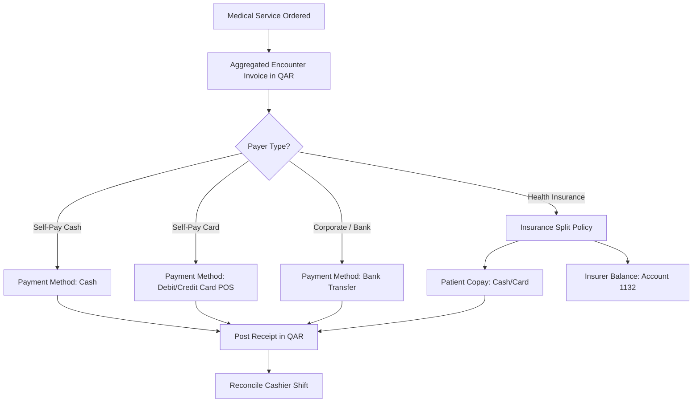

# CLINICAL & DEPARTMENTAL WORKFLOW IMPLEMENTATION PLAN

**Project**: GNU Health HMIS 5.0 / Tryton 7.0 Implementation  
**Document**: `CLINICAL_WORKFLOW_IMPLEMENTATION_PLAN.md`  
**Classification**: End-to-End Operational Workflow Architecture  
**Scope**: Primary Outpatient & Ambulatory Healthcare Facility (State of Qatar)  
**Status**: APPROVED BASELINE SPECIFICATION  

---

## 1. Master Outpatient Clinic Flowchart

```text
PATIENT ARRIVAL
       ↓
[STEP 01: REGISTRATION & INTAKE] (Front Desk)
       ↓
[STEP 02: APPOINTMENT / WALK-IN] (Front Desk)
       ↓
[STEP 03: CHECK-IN & QUEUEING] (Front Desk)
       ↓
[STEP 04: NURSING TRIAGE & VITALS] (Triage Nurse)
       ↓
[STEP 05: DOCTOR QUEUE & CONSULTATION] (Physician)
       ↓
[STEP 06: CLINICAL DIAGNOSIS (ICD-10)] (Physician)
       ↓
[STEP 07: ANCILLARY REQUISITIONS] (Physician)
 ┌──────────────┼──────────────┐
 ↓              ↓              ↓
[PHARMACY]   [LABORATORY]  [RADIOLOGY]
(Rx Dispense) (Specimen/Lab) (Scan/Report)
 └──────────────┼──────────────┘
                ↓
[STEP 08: DOCTOR REVIEW & SIGN-OFF] (Physician)
       ↓
[STEP 09: CHARGE AGGREGATION & INVOICING] (Cashier)
       ↓
[STEP 10: PAYMENT COLLECTION & RECEIPT] (Cashier)
       ↓
VISIT COMPLETE
```

---

## 2. Granular Step-by-Step Clinical Workflow Specification

### Step 01: Patient Registration & Intake
- **GNU Health Model**: `gnuhealth.patient` (linked to `party.party` and `party.address`).
- **Responsible Role**: Receptionist (`Health Front Desk`).
- **Required Master Data**: Country list (Qatar + GCC preloaded), ID document type (QID).
- **Configuration**: Automatic sequence `QAT-XXXXX` for Patient Medical Record Number (PUID).
- **Validation**: 11-digit QID validation; birthdate check (cannot be future date).
- **Output**: Active patient record with unique PUID and demographic profile.
- **Failure Condition**: Missing mandatory fields (Full Name, Gender, Birthdate, Phone); duplicate QID detection blocks save.

### Step 02: Appointment Scheduling / Walk-In
- **GNU Health Model**: `gnuhealth.appointment`.
- **Responsible Role**: Receptionist (`Health Front Desk`).
- **Required Master Data**: Doctor records (`gnuhealth.healthprofessional`), Specialties (`gnuhealth.specialty`).
- **Configuration**: Calendar working hours, 15/30-minute time slots.
- **Validation**: Physician availability; appointment time must be within doctor clinic hours.
- **Output**: Appointment record in `confirmed` status.
- **Failure Condition**: Double-booking conflict if physician already booked for requested slot.

### Step 03: Check-In & Arrival Queueing
- **GNU Health Model**: `gnuhealth.appointment`.
- **Responsible Role**: Receptionist (`Health Front Desk`).
- **Required Master Data**: Active appointment record.
- **Configuration**: Status transition workflow.
- **Validation**: Patient physical presence; insurance policy validity check.
- **Output**: Appointment transitioned to `checked_in`; arrival timestamp recorded; patient visible in Nursing Triage queue.
- **Failure Condition**: Attempting check-in before appointment scheduled date/time without walk-in override.

### Step 04: Nursing Triage & Vital Signs
- **GNU Health Model**: `gnuhealth.patient.ambulatory_care` and `gnuhealth.patient.rounding`.
- **Responsible Role**: Nurse (`Health Nursing`).
- **Required Master Data**: Metric units (mmHg, bpm, deg C, kg, cm, %).
- **Configuration**: Auto-calculation formula for BMI ($BMI = \frac{Weight_{kg}}{(Height_m)^2}$).
- **Validation**: Physiological range sanity checks (e.g. Heart Rate between 30 and 250 bpm; Temp between 34 and 42 °C).
- **Output**: Completed triage sheet; recorded vitals; triage priority level assigned (Routine, Urgent, Emergency); patient routed to Doctor's Waiting Room queue.
- **Failure Condition**: Blank mandatory vitals; height = 0 causing division by zero in BMI calculation.

### Step 05: Doctor Consultation & Clinical Examination
- **GNU Health Model**: `gnuhealth.patient.evaluation`.
- **Responsible Role**: Consulting Physician (`Health Doctor`).
- **Required Master Data**: Healthcare Professional ID, Patient ID, Medical Specialty.
- **Configuration**: Clinical SOAP notes interface; permanent record immutability (`perm_delete = False`).
- **Validation**: Consulting physician must match assigned appointment doctor; appointment must be in `checked_in` or `in_consultation` status.
- **Output**: Clinical encounter record capturing Subjective History, Objective Findings, and Physical Exam.
- **Failure Condition**: Attempting to edit or delete an evaluation after digital signature.

### Step 06: Clinical Diagnosis & ICD-10 Coding
- **GNU Health Model**: `gnuhealth.patient.disease` linked to `gnuhealth.pathology`.
- **Responsible Role**: Consulting Physician (`Health Doctor`).
- **Required Master Data**: 14,416 WHO ICD-10 pathology codes (preloaded and verified).
- **Configuration**: Primary vs Secondary diagnosis selector; chronic vs acute flag.
- **Validation**: At least one primary diagnosis must be selected from the official ICD-10 table.
- **Output**: Coded diagnosis attached to the clinical encounter.
- **Failure Condition**: Free-text unrecognized pathology string not matching WHO ICD-10 catalog.

### Step 07: Ancillary Requisitions (Lab, Radiology, Rx)
- **GNU Health Models**:
  - Prescriptions: `gnuhealth.prescription.order`
  - Laboratory: `gnuhealth.patient.lab.test`
  - Radiology: `gnuhealth.imaging.test.request`
- **Responsible Role**: Consulting Physician (`Health Doctor`).
- **Required Master Data**: Medication formulary (`gnuhealth.medicament`), Lab test types (`gnuhealth.lab.test_type`), Imaging modalities (`gnuhealth.imaging.test.type`).
- **Configuration**: Automated service billing trigger (`health_services`).
- **Validation**: Safety checks for drug allergies, pregnancy contraindications (`SM-CORE-0018`), and mandatory clinical indications for radiological studies.
- **Output**: Active orders dispatched to respective departmental worklists.
- **Failure Condition**: Prescribing a contraindicated drug without explicit clinical override documentation.

### Step 08: Physician Sign-Off & Patient Discharge
- **GNU Health Model**: `gnuhealth.patient.evaluation` and `gnuhealth.appointment`.
- **Responsible Role**: Consulting Physician (`Health Doctor`).
- **Required Master Data**: Active encounter.
- **Configuration**: Appointment status transition to `done`.
- **Validation**: All mandatory evaluation sections completed; orders signed.
- **Output**: Signed medical record; encounter closed; patient directed to Cashier/Pharmacy.
- **Failure Condition**: Unsigned pending orders.

### Step 09: Encounter Charge Aggregation & Invoicing
- **GNU Health Model**: `account.invoice` and `health_services`.
- **Responsible Role**: Billing Officer / Cashier (`Health Billing`).
- **Required Master Data**: Master service pricing in `product.product`, Revenue accounts in `account.account`.
- **Configuration**: **Open fiscal year in `account.fiscalyear` (MANDATORY PREREQUISITE)**.
- **Validation**: Active fiscal year covering invoice date; valid customer party.
- **Output**: Validated customer invoice with consolidated charges and insurance/copay splits.
- **Failure Condition**: **No open fiscal year causes immediate Tryton validation error, blocking invoice confirmation**.

### Step 10: Payment Collection & Receipt Issuance
- **GNU Health Model**: `account.payment` and `account.move`.
- **Responsible Role**: Billing Officer / Cashier (`Health Billing`).
- **Required Master Data**: Cash journal (`CSH`), Card POS journal (`POS`), QAR currency.
- **Configuration**: Double-entry ledger posting rules.
- **Validation**: Payment tender amount must match or exceed invoice total; card authorization code required for card payments.
- **Output**: Posted accounting move; printed official bilingual patient receipt; invoice marked as `paid`.
- **Failure Condition**: Attempting to post payment against an unposted or draft invoice.

---

## 3. Departmental Sub-Workflows

### 3.1 Pharmacy Dispensing Workflow
```text
[Doctor Prescription] (gnuhealth.prescription.order)
        ↓
[Pharmacist Review] (Verify dose, route, frequency, drug safety)
        ↓
[Dispensary Stock Check] (Check stock.move in Pharmacy location)
        ↓
[Dispensing Execution] (Assign stock.lot batch number & expiry date)
        ↓
[Stock Deduction] (Automatic stock reduction via stock.move)
        ↓
[Pharmacy Billing Handoff] (Generates account.invoice.line)
        ↓
[Patient Counseling & Completion] (Mark prescription as 'dispensed')
```
- **Native Support Status**: Natively supported in GNU Health and Tryton core modules (`health_crypto`, `stock`). Workflow verification required.
- **Operational Precondition**: Pharmacy formulary (`gnuhealth.medicament`) and initial inventory batches must be ingested.

### 3.2 Laboratory Workflow
```text
[Doctor Lab Order] (gnuhealth.patient.lab.test)
        ↓
[Specimen Collection] (Log accession #, collection timestamp, tube type)
        ↓
[Laboratory Worklist Queue] (Lab technician views pending specimens)
        ↓
[Diagnostic Processing] (Specimen analyzed on in-house analyzer / bench)
        ↓
[Results Entry] (Input numeric/text values in gnuhealth.lab)
        ↓
[Range Verification] (System flags abnormal low/high vs reference ranges)
        ↓
[Pathologist Formal Sign-Off] (Verified by lab director, locked against edits)
        ↓
[Automatic EHR Visibility] (Results visible in doctor consultation view)
```
- **Native Support Status**: Natively supported in GNU Health core modules. Workflow verification required.
- **Operational Precondition**: Specific in-house lab test parameter names and reference ranges must be ingested.

### 3.3 Radiology Workflow
```text
[Doctor Imaging Requisition] (gnuhealth.imaging.test.request)
        ↓
[Scheduling & Patient Prep] (Technician logs patient arrival and prep)
        ↓
[Radiological Scan Execution] (Procedure logged in gnuhealth.imaging.test.result)
        ↓
[Radiologist Diagnostic Reporting] (Detailed findings and impressions entered)
        ↓
[Report Digital Sign-Off] (Locked against modification)
        ↓
[PDF Report EHR Attachment] (Stored in ir.attachment attached to patient chart)
        ↓
[Billing Trigger] (Imaging procedure charge added to patient invoice)
```
- **Native Support Status**: RIS functionality is natively supported in GNU Health core modules. Workflow verification required.
- **PACS / DICOM Demarcation**: Native GNU Health RIS manages requisition, procedure logging, diagnostic text reporting, and PDF distribution. Full DICOM multi-frame image archiving requires external Orthanc DICOM server integration (optional Phase 2).

### 3.4 Billing & Invoicing Multi-Tender Paths

- **Native Support Status**: Natively supported in Tryton `account_invoice` and `account_payment`. Operational verification required.
- **Operational Precondition**: Accounting fiscal year opened in `account.fiscalyear`.
