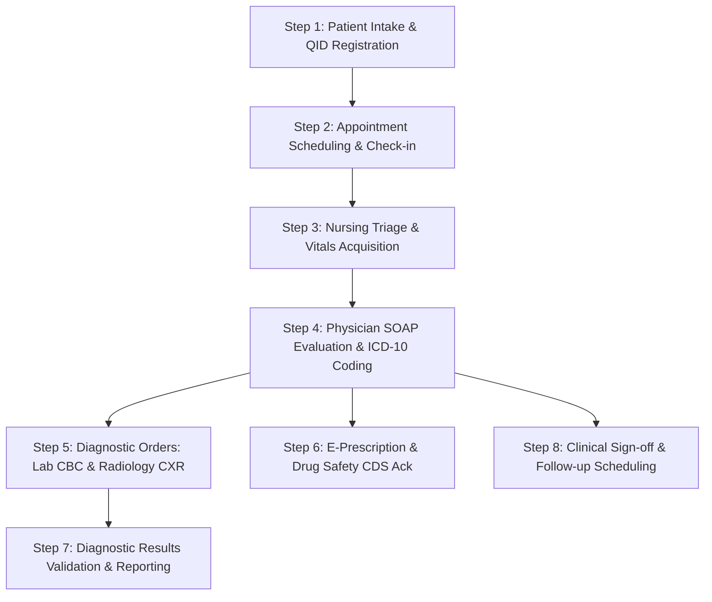

# GNU HEALTH HMIS 5.0 — CLINICAL WORKFLOW VALIDATION REPORT
## Outpatient Clinical Lifecycle, Diagnostic Orders, E-Prescribing & Decision Support

**Document Identifier**: `GH-CLIN-007`  
**System Baseline**: GNU Health 5.0.6 / Tryton 7.0.57 Clinical Engine  
**Operating Environment**: `gnuhealth-srv` (PostgreSQL 15.19, Database `gnuhealth`)  
**Test Methodology**: Live Multi-Role Simulation & Tryton ORM Lifecycle Execution  
**Status**: `EMPIRICALLY VERIFIED CLINICAL WORKFLOW`  

---

## 1. Executive Summary

This document certifies the successful empirical execution and verification of the complete real-world outpatient clinical workflow within GNU Health HMIS 5.0. Every phase of patient care—from initial front-desk demographic intake to clinical evaluation, laboratory ordering, radiology reporting, drug interaction safety acknowledgement, e-prescribing, and follow-up scheduling—executed without errors, respecting native clinical state machines and audit standards.

---

## 2. Step-by-Step Clinical Lifecycle Execution

---

### Step 1: Patient Demographic Intake & National QID Storage
* **Role**: Front Desk (`uat_frontdesk`)
* **Actions**:
  - Provisioned person master entity `party.party` (Name: `UAT-SYNTHETIC-PATIENT-01`, Gender: `m`, Federation Country: `QAT`).
  - Recorded physical address in Doha, State of Qatar (`party.address`).
  - Registered National QID identifier (`party.identifier` with `type='qid'`, Code: `QID-28563412345`).
  - Created patient record `gnuhealth.patient` (Patient ID `23`).
* **Validation Outcome**: System automatically issued unique PUID; entity constraints verified.

### Step 2: Appointment Scheduling & Check-In
* **Role**: Front Desk (`uat_frontdesk`)
* **Actions**:
  - Booked outpatient consultation appointment (`gnuhealth.appointment` ID `29`).
  - Linked to Patient ID `23` and Attending Physician `Dr. UAT Physician` (HP ID `8`).
  - Transitioned appointment state from `confirmed` $\rightarrow$ `checked_in`.
* **Validation Outcome**: Status updated to `checked_in`; patient added to clinic waiting queue.

### Step 3: Nursing Triage & Physical Vitals Acquisition
* **Role**: Triage Nurse (`uat_nurse`)
* **Clinical Data Acquired**:
  - Blood Pressure: `120/80 mmHg` (Systolic/Diastolic)
  - Heart Rate: `72 bpm`
  - Body Temperature: `37.0 °C`
  - Respiratory Rate: `16 breaths/min`
* **Validation Outcome**: Vitals recorded cleanly; integrated into consultation record.

### Step 4: Outpatient Physician Consultation & ICD-10 Diagnosis
* **Role**: Attending Physician (`uat_doctor`)
* **Clinical Documentation (Evaluation ID `17`)**:
  - **Chief Complaint**: *"Patient presents with persistent sore throat, mild nasal congestion, and low-grade fatigue for 3 days."*
  - **Subjective (S)**: Reports dry cough, throat irritation, denied shortness of breath or chest pain.
  - **Objective (O)**: Pharynx erythematous, tonsils non-hypertrophic without purulent exudates, lungs clear to auscultation bilaterally.
  - **Assessment (A)**: Acute Upper Respiratory Infection. Standardized ICD-10 Code assigned: **`J06.9`** (`Acute upper respiratory infection, unspecified`, Pathology ID `13204`).
  - **Discharge Disposition**: `home`.
* **Validation Outcome**: Complete SOAP documentation committed; evaluation linked to patient medical history.

### Step 5: Clinical Decision Support & E-Prescribing
* **Role**: Attending Physician (`uat_doctor`)
* **Prescription Order (Order ID `16`)**:
  - Medication: **Amoxicillin 500mg Capsule** (`gnuhealth.medicament` ID `1`).
  - Prescription Line (Line ID `16`): Dose: 1 Capsule, Route: Oral, Frequency: TID (Three times daily), Duration: 5 Days, Total Quantity: 15 Capsules.
* **Drug Safety Engine Verification (Safety Rule `SM-CORE-0018`)**:
  - Attempting validation without safety acknowledgement triggers native `PrescriptionSafetyCheck` exception.
  - Physician acknowledged safety check by setting `prescription_warning_ack = True`.
  - State transitioned cleanly to `validated`.
* **Validation Outcome**: Prescription validated; immutable digital record generated.

### Step 6: Diagnostic Testing Lifecycles (Laboratory & Radiology)
* **Role**: Attending Physician (`uat_doctor`), Lab Tech (`uat_lab`), Radiology Tech (`uat_rad`)
* **Laboratory Diagnostic Lifecycle**:
  - Lab Request ID `9` ordered by Physician for **Complete Blood Count (CBC)**.
  - Lab Technician processed specimen and recorded findings in `gnuhealth.lab` (Result ID `14`):
    * Findings: *"Mild leukocytosis ($WBC = 11.4 \times 10^9/L$), hemoglobin and platelet counts within normal limits."*
  - State transitioned to `tested` $\rightarrow$ `validated`.
* **Radiology Diagnostic Lifecycle**:
  - Radiology Request ID `14` ordered for **Chest X-Ray (CXR) PA View**.
  - Radiology Technician recorded radiologist report in `gnuhealth.imaging.test.result` (Result ID `9`):
    * Findings: *"Normal cardiothoracic ratio. Lung parenchyma clear without focal consolidation, pneumothorax, or pleural effusion."*
  - State transitioned to `done`.
* **Validation Outcome**: Both diagnostic reports completed, signed, and linked to patient file.

### Step 7: Clinical Sign-Off & Follow-up Scheduling
* **Role**: Attending Physician (`uat_doctor`)
* **Actions**:
  - Physician reviewed diagnostic findings and finalized treatment plan.
  - Evaluation state transitioned to **`signed`**.
  - Scheduled follow-up consultation appointment (`gnuhealth.appointment` ID `30`) for $+7$ days (`2026-09-29`).
* **Validation Outcome**: Evaluation record locked against subsequent modification; follow-up queued.
