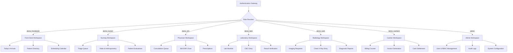

# FRONTEND INFORMATION ARCHITECTURE & NAVIGATION SPECIFICATION
## GNU Health HMIS Outpatient Clinic — Qatari Contemporary Experience

**Document Reference:** `FRONTEND_INFORMATION_ARCHITECTURE.md`  
**Target System:** GNU Health HMIS v5.0.6 / Tryton ERP v7.0.58  
**Scope:** 7 Clinical & Administrative Roles across Outpatient Workflows  
**Author:** Antigravity UX Research & Architecture  
**Date:** September 2026  

---

## 1. Executive Overview & Backend Alignment

This document defines the comprehensive Navigation and Information Architecture (IA) for the new outpatient clinic web frontend. It bridges the authoritative GNU Health / Tryton backend with a modern, Qatari-inspired user experience.

### 1.1 Core Architectural Principles
- **No Shadow Engines:** All data entities, state transitions, and validation rules map directly to existing Tryton models (`gnuhealth.*`, `party.*`, `account.*`).
- **Role-Centric Information Density:** Rather than exposing raw Tryton tree-views, each role receives a tailored operational dashboard with action-oriented worklists (e.g. Triage Queue for Nurses, Consultation Queue for Doctors).
- **Distinction of Native vs Proposed UX Enhancements:** Where Tryton requires manual step-by-step navigation (e.g., manually opening Prescriptions after finishing an Evaluation), the proposed frontend introduces **Guided Clinical Workflows** that prompt the next clinical action via native JSON-RPC dispatchers.

---

## 2. Role-Based Navigation & Workspace Architecture

The system provides 7 distinct role workspaces. Each role's workspace is partitioned into:
1. **Command Dashboard:** Live KPI tiles, active patient queues, and rapid action shortcuts.
2. **Operational Worklists:** High-density, sortable, filterable tabular data views.
3. **Detail & Transaction Views:** Split-pane or full-page master-detail views optimized for fast data entry.



---

## 3. Comprehensive Role Workspace Breakdown

### 3.1 Front Desk Workspace (`demo_frontdesk1`)
- **Primary Objective:** Rapid patient intake, demographic accuracy, appointment scheduling, and queue check-in.
- **Backend Model Binding:** `gnuhealth.patient`, `party.party`, `gnuhealth.appointment`.
- **Navigation Tree:**
  - `01 / Today's Queue` (Active appointments for today, status: `Confirmed`, `Checked In`).
  - `02 / Patient Directory` (Search master patient registry by Name, PUID, Qatar ID / National ID, Mobile).
  - `03 / New Registration` (Two-step guided registration: Party creation -> Patient demographic file).
  - `04 / Appointment Scheduler` (Daily/Weekly physician availability matrix, slot booking).
- **Native vs Proposed UX Behavior:**
  - *Native Backend:* Requires separate searches in Party and Patient models.
  - *Proposed UX:* Unified search bar with real-time fuzzy matching that checks existing parties to **strictly prevent duplicate patient registration** (`gnuhealth_patient_name_uniq`).

---

### 3.2 Nursing Triage Workspace (`demo_nurse1`)
- **Primary Objective:** Rapid vitals recording, anthropometric measurements, and pre-consultation risk assessment.
- **Backend Model Binding:** `gnuhealth.patient.evaluation`, `gnuhealth.appointment`.
- **Navigation Tree:**
  - `01 / Triage Queue` (Patients with appointment status = `Checked In` awaiting triage).
  - `02 / Active Evaluation` (Tabbed evaluation form: Anthropometry & Vitals, Allergies, Chief Complaint).
  - `03 / Evaluation History` (Historical evaluation worklist, filtered by date/nurse).
- **Native vs Proposed UX Behavior:**
  - *Native Backend:* Nurse expands `Health -> Patient Evaluations` and manually selects patient.
  - *Proposed UX:* "Start Triage" button directly on the Checked-In appointment card, pre-populating patient name, PUID, and assigned doctor.
  - *Automated Calculation:* Real-time client-side calculation of BMI (`weight / (height/100)^2`) with immediate color-coded classification badge (`Normal: 18.5 - 24.9`, `Overweight: 25.0 - 29.9`, etc.).

---

### 3.3 Physician Workspace (`demo_dr1`)
- **Primary Objective:** Comprehensive clinical consultation, diagnostic reasoning, ICD-10 coding, and prescription issuance.
- **Backend Model Binding:** `gnuhealth.patient.evaluation`, `gnuhealth.prescription.order`, `gnuhealth.lab`, `gnuhealth.imaging.test.request`.
- **Navigation Tree:**
  - `01 / Consultation Worklist` (Triaged patients ready for clinical encounter).
  - `02 / 360° Patient Chart` (Unified timeline: Vitals trend, past encounters, active prescriptions, lab/radiology history).
  - `03 / Clinical Encounter Form` (SOAP layout: Subjective Chief Complaint, Objective Examination, Assessment ICD-10 J06.9, Plan).
  - `04 / Prescriptions Hub` (Medication orders, Amoxicillin 500mg, dosage safety checks, duration).
  - `05 / Diagnostic Orders` (One-click order triggers for CBC and Chest X-Ray).
- **Native vs Proposed UX Behavior:**
  - *Native Backend:* Doctor must open separate top-level screens for Evaluations, Prescriptions, Lab Orders, and Imaging.
  - *Proposed UX:* **Unified Clinical Consultation Hub** where prescription, lab, and imaging orders are drafted within a single consultation drawer and committed via synchronized backend RPC transactions.

---

### 3.4 Laboratory Workspace (`demo_lab1`)
- **Primary Objective:** Order intake, specimen validation, analyte results entry, and pathologist sign-off.
- **Backend Model Binding:** `gnuhealth.lab`, `gnuhealth.lab.test.critearea`.
- **Navigation Tree:**
  - `01 / Pending Test Queue` (Requested lab orders awaiting processing).
  - `02 / Result Entry Workspace` (Enforcing `Health -> Laboratory -> Lab Results` Menu 229).
  - `03 / Completed Archive` (Signed-off lab tests in state `Done`).
- **Native vs Proposed UX Behavior:**
  - *Native Backend:* Technician must manually click `LOAD ANALYTES CRITERIA` button to populate rows.
  - *Proposed UX:* When opening a CBC test, the frontend automatically triggers `complete_criteareas` behind the scenes, displaying the pre-populated analyte table (Hemoglobin, RBC, WBC, Platelets) with normal reference ranges highlighted.

---

### 3.5 Radiology Workspace (`demo_rad1`)
- **Primary Objective:** Imaging study scheduling, procedure verification, and formal diagnostic findings entry.
- **Backend Model Binding:** `gnuhealth.imaging.test.request`, `gnuhealth.imaging.test.result`.
- **Navigation Tree:**
  - `01 / Imaging Queue` (Pending imaging requests).
  - `02 / Study Documentation` (Chest X-Ray PA/Lateral findings form).
  - `03 / Verified Results` (Signed radiological diagnostic reports).
- **Native vs Proposed UX Behavior:**
  - *Native Backend:* Findings field is named `comment` in DB and labeled `Additional Information` on screen.
  - *Proposed UX:* Clear form field labeled **"Radiological Diagnostic Findings"** (mapping directly to backend `comment`), preventing previous confusion.
  - *Automated Workflow:* Single "Complete & Verify Study" button that sequences `Request` -> `Generate Results` in one atomic UX step.

---

### 3.6 Cashier Workspace (`demo_cashier1`)
- **Primary Objective:** Service invoice generation, payment receipt collection, and daily till reconciliation.
- **Backend Model Binding:** `account.invoice`, `account.voucher` / payment wizard.
- **Navigation Tree:**
  - `01 / Billing Queue` (Patients with completed consultations ready for checkout).
  - `02 / Invoices Ledger` (Draft, Posted, and Paid customer invoices).
  - `03 / Quick Settlement Terminal` (Invoice line items, Consultation service $50.00, Cash payment dialog).
  - `04 / Daily Till Report` (Summary of cash receipts collected).
- **Native vs Proposed UX Behavior:**
  - *Native Backend:* Cashier opens invoice form, adds line item, clicks Save, clicks Post, opens separate payment wizard, enters amount, clicks OK.
  - *Proposed UX:* **Streamlined Point-of-Sale Checkout Drawer** displaying consultation fee ($50.00), one-click Cash tender button, and instant receipt generation.

---

### 3.7 Administrator / HIM Workspace (`admin`)
- **Primary Objective:** User management, role assignment, database auditing, general ledger verification, and system health monitoring.
- **Backend Model Binding:** `res.user`, `res.group`, `account.move`, `account.move.line`.
- **Navigation Tree:**
  - `01 / Operations Overview` (Active sessions, server latency, database status).
  - `02 / Role & Security Management` (User accounts, security group memberships).
  - `03 / General Ledger Audit` (Full Account Moves ledger, verifying Debit A/R $50 = Credit Revenue $50).
  - `04 / Audit Trail & Forensics` (Record creation UIDs, timestamps, system changelogs).

---

## 4. Shared Application Shell & Design Tokens

Every authenticated screen utilizes the unified **Institutional Application Shell**:

```text
+---------------------------------------------------------------------------------------------------+
|  [TFSF/QATAR BRAND]  GNU Health Outpatient Clinic | Doha, Qatar             [GLOBAL SEARCH] [USER] |
+-----------+---------------------------------------------------------------------------------------+
| SIDEBAR   | BREADCRUMBS: Health / Outpatient Clinic / Patient Registration                       |
| (Nav)     |---------------------------------------------------------------------------------------|
| 01 Queue  |                                                                                       |
| 02 Direct |  PRIMARY WORKSPACE AREA                                                                |
| 03 Reg    |  - High-density data tables                                                           |
| 04 Vitals |  - Clean forms with generous whitespace                                               |
| 05 Consult|  - Monospace metadata headers (PUID: P00088)                                          |
| 06 Lab    |  - Clear action button bar (Save, Confirm, Check In)                                  |
| 07 Rad    |                                                                                       |
| 08 Bill   |                                                                                       |
+-----------+---------------------------------------------------------------------------------------+
| STATUS    | System: ONLINE | Database: gnuhealth | Session: SECURE [146]           v1.0 (Qatari)      |
+-----------+---------------------------------------------------------------------------------------+
```

### 4.1 Shared UI Components
1. **Global Header:** Frosted warm ivory backdrop blur (`rgba(244, 246, 241, 0.90)`), clinic wordmark, instant global patient search shortcut (`Ctrl+K`), role indicator, language toggle (`EN` / `AR`), and user profile avatar.
2. **Left Navigation Rail:** Obsidian slate background (`#121916`), sequential chapter numbers (`01 / ARRIVALS`, `02 / DIRECTORY`), active indicator line in Qatari Maroon (`#8A1538`).
3. **Data Tables:** Fine 1px borders (`#E1E5DC`), monospaced ID columns, uppercase column headers with subtle tracking (`0.8px`), zebra-striping with `#FAFBF8`, and hover highlights.
4. **Form Inputs:** 1px borders with 2px micro-radii, warm white field background (`#FFFFFF`), focus ring in subtle maroon (`#8A1538`), and helper text in muted sage (`#4A5B53`).
5. **Status Badges:** Pill-shaped badges with soft tinted background and bold border (e.g. `Checked In` in Emerald Green, `Critical Allergy` in Qatari Maroon).

---

## 5. Bilingual English / Arabic & RTL Architecture

To serve the sovereign healthcare market in Doha, Qatar, the frontend architecture includes a comprehensive **Right-to-Left (RTL) & Localization Strategy**:

### 5.1 Technical Implementation Strategy
- **Directional Attribute:** Application shell sets `<html dir="ltr" lang="en">` or `<html dir="rtl" lang="ar">` dynamically based on user preference.
- **CSS Logical Properties:** All layout styles must use CSS Logical Properties rather than directional declarations:
  - Use `margin-inline-start` instead of `margin-left`.
  - Use `padding-inline-end` instead of `padding-right`.
  - Use `border-inline-start` instead of `border-left`.
- **Typography Pairings:**
  - English: `Geist` (Body/UI) + `Geist Mono` (Data/IDs) + `Bodoni Moda` (Executive Titles).
  - Arabic: `Noto Sans Arabic` (Body/UI) + `Noto Naskh Arabic` (Executive Titles/Official Reports).
- **Clinical Data Formatting in RTL:**
  - Blood pressure (`120/80 mmHg`), heart rate (`72 bpm`), and drug dosages (`500 mg TID`) remain formatted left-to-right (LTR) with Latin numerals to maintain medical safety and international pharmacopeia standards.
