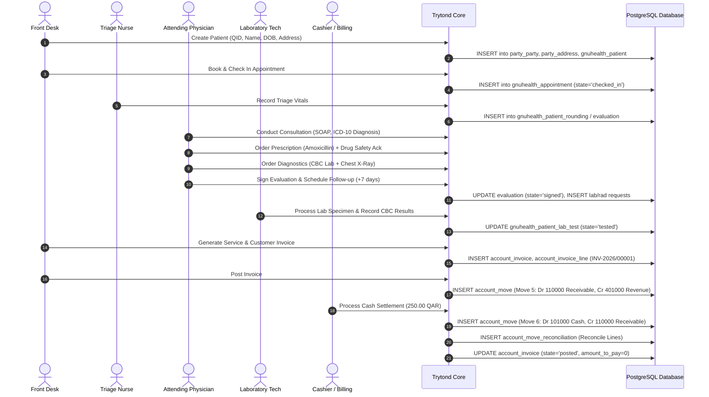

# GNU HEALTH HMIS 5.0 / TRYTON 7.0 — BACKEND ARCHITECTURE SPECIFICATION
## Authoritative System of Record & Clinical/Financial Business Process Engine

**Document Identifier**: `GH-ARCH-001`  
**System Version**: GNU Health HMIS 5.0.6 / Tryton Framework 7.0.57  
**Operating Environment**: `gnuhealth-srv` (Debian 12.15 Bookworm, Linux 6.1.0-53-cloud-amd64)  
**Hosting Infrastructure**: Google Cloud Platform (`gnu-health-509307`, Zone `europe-west4-a`, Static Public IP `34.7.237.8`)  
**Deployment Context**: Outpatient Specialist & Primary Care Clinic (Doha, State of Qatar)  
**Status**: `AUTHORITATIVE ARCHITECTURAL SPECIFICATION`  

---

## 1. System Role and Scope

GNU Health HMIS, built upon the enterprise-grade Tryton application framework and PostgreSQL relational database management system, serves as the **exclusive operational backend, authoritative system of record, and clinical/financial transactional engine** for the outpatient clinic.

### 1.1 Non-Negotiable Architectural Principles
1. **Zero Reinvention**: No replacement or forking of GNU Health core or Tryton framework components. All workflows, data structures, validation rules, and transactional logic execute via native Tryton ORM and PostgreSQL transactions.
2. **Authoritative System of Record**: All clinical encounters, diagnoses (ICD-10), electronic prescriptions, laboratory and radiology diagnostic orders, service accounting, and general ledger moves reside natively within the GNU Health database.
3. **Frontend Decoupling**: Any future web or mobile patient/staff portal is strictly a presentation-tier client interfacing exclusively through authenticated, role-constrained Tryton JSON-RPC / REST endpoints. Frontend development is strictly out of scope for this backend qualification phase.
4. **Strict Localization**: Operational currency is strictly Qatari Riyal (`QAR`, `ر.ق`, ISO 4217 code `634`). Fiscal year accounting adheres to the 2026 calendar year (12 monthly periods).
5. **Zero Data Fabrication**: Master data adheres to strict cryptographic and audit provenance. Unconfirmed clinic commercial registrations, physician medical licenses, and commercial service prices are explicitly tagged `PENDING CLINIC INPUT` or `PENDING FINANCE APPROVAL`.

---

## 2. Multi-Tier Technology Stack

```
+-----------------------------------------------------------------------------------+
|                              EXTERNAL PERIMETER                                   |
|   GCP VPC Network Firewall: TCP 22 (SSH Hardened), TCP 80 (HTTP), TCP 443 (HTTPS) |
+-----------------------------------------+-----------------------------------------+
                                          |
                                          v
+-----------------------------------------------------------------------------------+
|                         REVERSE PROXY & SECURITY TIER                             |
|   Nginx 1.22.1 (Debian Reverse Proxy)                                             |
|   - Port 80: HTTP Redirect / Temporary Verification                               |
|   - Port 443: TLS 1.3 / Strict-Transport-Security (Staged for Clinic FQDN)        |
|   - Request Rate Limiting & Buffer Hardening                                      |
|   - Reverse proxy pass to 127.0.0.1:8000 (Tryton WSGI)                            |
+-----------------------------------------+-----------------------------------------+
                                          |
                                          v
+-----------------------------------------------------------------------------------+
|                           APPLICATION ENGINE TIER                                 |
|   Tryton Application Server (trytond 7.0.57) / Python 3.11.2 Virtualenv           |
|   Location: /home/gnuhealth/venv/bin/trytond                                      |
|   Configuration: /home/gnuhealth/trytond.conf (Bound strictly to 127.0.0.1:8000)  |
|   Systemd Service: gnuhealth.service (Sandboxed service account: gnuhealth)       |
|   - Transaction Manager (ACID, Table/Record Locking, Retry Protocol)              |
|   - Object-Relational Mapping (Pool, ModelSQL, ModelView, Function fields)        |
|   - Role-Based Access Control (ir.model.access, ir.rule, Field Permissions)      |
|   - Safety Engines: Drug Interaction & Contraindication Check (SM-CORE-0018)     |
+-----------------------------------------+-----------------------------------------+
                                          |
                                          v
+-----------------------------------------------------------------------------------+
|                            DATABASE STORAGE TIER                                  |
|   PostgreSQL 15.19 (Debian 15.19-0+deb12u1)                                       |
|   Configuration: /etc/postgresql/15/main/postgresql.conf (Bound to 127.0.0.1:5432)|
|   Authentication: /etc/postgresql/15/main/pg_hba.conf (Peer / SCRAM-SHA-256)      |
|   Database: gnuhealth (306 public schema tables, 123 MB base storage)            |
|   - Relational Constraints: Strict Foreign Keys, CHECK constraints, Unique Indexes|
|   - Storage Engine: Write-Ahead Logging (WAL), Point-in-Time Recovery (PITR)      |
|   - Sequences: Non-strict (ir_sequence) and Gapless Strict (ir_sequence_strict)   |
+-----------------------------------------------------------------------------------+
```

---

## 3. Installed Native Module Topology

GNU Health 5.0 is organized into modular subsystems. All installed modules are loaded into the Tryton Pool during server initialization:

| Subsystem | Module Technical Name | Architectural Responsibility |
| :--- | :--- | :--- |
| **Core Healthcare** | `health` | Core clinical data models: `gnuhealth.patient`, `gnuhealth.healthprofessional`, `gnuhealth.appointment`, `gnuhealth.patient.evaluation`, `gnuhealth.medicament`, `gnuhealth.prescription.order`. |
| **Diagnostics** | `health_lab` | Laboratory orders (`gnuhealth.patient.lab.test`), test types, diagnostic units, and result entry (`gnuhealth.lab`). |
| **Imaging** | `health_imaging` | Radiology orders (`gnuhealth.imaging.test.request`) and result reports (`gnuhealth.imaging.test.result`). |
| **Financial Engine** | `account` | Double-entry general ledger, chart of accounts, fiscal years, periods, account moves (`account.move`), and journal entries. |
| **Billing Engine** | `account_invoice` | Customer invoices (`account.invoice`), payment terms, tax calculations, and cashier settlement tracking. |
| **Services** | `health_services` | Links clinical consultations, diagnostics, and procedures to billable products and invoices. |
| **Medical Coding** | `health_icd10` | International Classification of Diseases (10th Revision) standardized pathology catalog. |
| **Clinical Specialties**| `health_pediatrics`, `health_gyneco` | Specialized clinical evaluation forms, growth charts, obstetrics, and history. |
| **Socioeconomics** | `health_socioeconomics`, `health_lifestyle` | Living conditions, habits, diet, and occupational health indicators. |
| **System Security** | `health_crypto`, `health_archives` | Digital signatures, cryptographic record verification, and document archives. |
| **Parties & Identity**| `party` | Patient identities, health professionals, insurance companies, addresses, and identifiers (QID). |

---

## 4. Operational Data Flow & Transaction Integrity

### 4.1 Outpatient Clinical & Financial Lifecycle
The backend architecture enforces a strictly coupled clinical and financial lifecycle:



---

## 5. Security & Isolation Architecture

1. **Service Sandboxing**: Tryton daemon runs under the unprivileged system account `gnuhealth` with home directory `/home/gnuhealth`. No write permissions are granted to system binaries or Nginx configuration.
2. **Database Isolation**: PostgreSQL binds strictly to `127.0.0.1:5432`. No external network exposure. Authentication utilizes Unix Domain Sockets (`peer`) for local system accounts and `scram-sha-256` for database passwords.
3. **Session Management**: Native Tryton HTTP sessions enforce SHA-256 password hashing with salting. Session tokens expire automatically and are invalidated upon logout.
4. **Access Control Matrices**: Tryton RBAC (`ir.model.access` and `ir.rule`) operates at the ORM layer. Access evaluation occurs server-side prior to executing any SQL query. Front-desk personnel cannot access clinical evaluation notes; medical doctors cannot modify financial ledger moves.

---

## 6. High Availability, Backup & Disaster Recovery Architecture

1. **Automated Backup Engine**: Systemd timer `gnuhealth-backup.timer` triggers `/usr/local/bin/gnuhealth-backup.sh` daily at 02:00 UTC. Backups generate:
   - PostgreSQL Custom-Format compressed archive (`.dump`) using `pg_dump -Fc`.
   - File attachment tarball (`.tar.gz`).
   - SHA-256 cryptographic verification digests.
2. **Isolated Restoration Verification**: Regular DR validation scripts restore dumps into clean isolated databases (`gnuhealth_restore_test`) to verify schema integrity, sequence alignment, and data consistency before dropping the test database.
3. **Point-in-Time Recovery**: PostgreSQL WAL archiving is supported for zero-loss recovery in enterprise clustering deployments.
