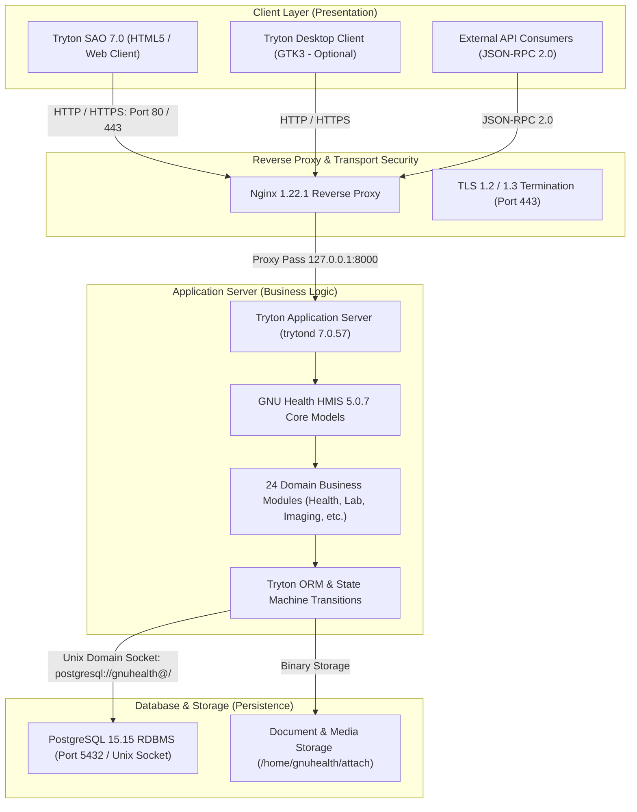
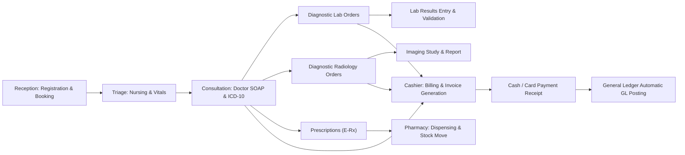

# GNU HEALTH HMIS — OUTPATIENT CLINIC FUNCTIONALITY DOCUMENT
## Comprehensive System Functionality, Architecture & Operational Guide

**Document ID**: `GNU_HEALTH_HMIS_FUNCTIONALITY_DOCUMENT.md`  
**System Name**: GNU Health Hospital Management Information System (HMIS)  
**Software Version**: GNU Health HMIS 5.0.7 / GNU Health Core 5.0.6  
**Application Framework**: Tryton 7.0.57 LTS  
**Database Engine**: PostgreSQL 15.15 RDBMS  
**Operating System**: Debian GNU/Linux 12 (Bookworm)  
**Deployment Infrastructure**: Google Cloud Platform (GCP Compute Engine: `gnuhealth-srv`)  
**Scope**: End-to-End Outpatient Clinic Clinical, Diagnostic, Administrative & Financial Operations  

---

## 1. Document Purpose & Scope

This document provides the definitive, comprehensive functional specification and operational guide for the **GNU Health HMIS Outpatient Clinic System**. It details the functional capabilities of each clinical and administrative module, data structures, business logic rules, user role permissions, cross-departmental workflows, and daily operational procedures.

This manual serves as the primary functional reference for:
- **Clinical Leadership & Medical Staff**: Doctors, nursing personnel, specialists, and department heads.
- **Diagnostic Teams**: Laboratory technologists, pathologists, radiographers, and imaging specialists.
- **Pharmacy & Dispensary Staff**: Pharmacists and inventory managers.
- **Administrative & Billing Staff**: Receptionists, patient registration clerks, cashiers, and billing coordinators.
- **Finance & Accounting Executives**: Accountants, financial controllers, and Chief Financial Officers.
- **Health Informatics & DevOps Engineers**: System administrators, compliance auditors, and integration architects.

---

## 2. Platform Architecture & Technical Foundations

GNU Health is a Free/Libre, community-driven Health and Hospital Information System developed under the auspices of GNU Solidario and the United Nations University. It is built natively on the enterprise-grade **Tryton Application Framework** and backed by the **PostgreSQL** object-relational database.



### 2.1 Architectural Characteristics
1. **Model-View-Controller (MVC)**: Clean architectural separation between persistent relational models, declarative XML views (forms, lists, trees, graphs), and modular controllers handling business logic.
2. **Unified Enterprise Relational Model**: Clinical data, medical ontologies, inventory stock moves, customer invoices, and general ledger journal entries live within a single ACID-compliant database (`gnuhealth`), eliminating synchronization delays or batch reconciliation failures.
3. **EHR Immutability & Audit Trail**: Native compliance with medico-legal requirements. Critical clinical models enforce write-once or append-only semantics. In GNU Health, clinical evaluations, validated laboratory results, and posted financial entries have `perm_delete = False` to ensure an immutable electronic health record.
4. **Native Tryton JSON-RPC 2.0 Protocol**: Every data model automatically exposes uniform JSON-RPC 2.0 methods (`read`, `search`, `write`, `create`, `delete`), facilitating authorized system integration.

---

## 3. Activated Module Capability Inventory

The outpatient clinic installation incorporates **24 active, integrated modules** that together provide end-to-end healthcare functionality:

| Module Identifier | Version | Functional Scope |
| :--- | :---: | :--- |
| `gnuhealth` | 5.0.7 | Core clinical framework, patient party linkage, institutions, health professionals, and evaluations. |
| `gnuhealth_pediatrics` | 5.0.0 | Pediatric growth charts (WHO percentiles), congenital conditions, and newborn evaluations. |
| `gnuhealth_gyneco` | 5.0.0 | Obstetrics & gynecology, prenatal care, obstetric history, perinatal records, and pap smears. |
| `gnuhealth_imaging` | 5.0.0 | Diagnostic imaging requests, modality catalogs (X-Ray, US, CT, MRI), and radiologist reporting. |
| `gnuhealth_lab` | 5.0.0 | Laboratory test requisitions, analyte reference intervals, specimen accessioning, and validated reporting. |
| `gnuhealth_insurance` | 5.0.0 | Private health insurance, payer records, policy registration, and copay management. |
| `gnuhealth_inpatient` | 5.0.0 | Bed management, day-care observations, outpatient recovery monitoring, and bed transfers. |
| `gnuhealth_nursing` | 5.0.0 | Nursing triage, vitals tracking, ambulatory care, nursing rounds, and patient monitoring. |
| `gnuhealth_surgery` | 5.0.0 | Minor outpatient procedures, surgical checklists, pre-op/post-op notes, and surgical anesthesia. |
| `gnuhealth_socioeconomics` | 5.0.0 | Living conditions, family structure, educational level, employment, and social determinants of health. |
| `gnuhealth_lifestyle` | 5.0.0 | Physical exercise, diet, smoking habits, alcohol consumption, and recreational risk factors. |
| `gnuhealth_genetics` | 5.0.0 | Hereditary risk factors, family disease history, genetic predispositions, and OMIM markers. |
| `gnuhealth_icd10` | 5.0.0 | Preloaded WHO ICD-10 clinical diagnosis ontology (14,416 international disease codes). |
| `gnuhealth_control` | 5.0.0 | System administrative commands, backup triggers, and GNU Health control utilities. |
| `party` | 7.0.x | Universal contact and entity model (patients, doctors, suppliers, clinics, payers). |
| `company` | 7.0.x | Multi-company configuration, operating healthcare entity legal definition, and currency links. |
| `currency` | 7.0.x | Multi-currency engine, exchange rates, rounding parameters, and Qatari Riyal (QAR) configuration. |
| `product` | 7.0.x | Services, procedures, and medication product master definitions. |
| `stock` | 7.0.x | Multi-warehouse inventory, stock locations, lot/expiry tracking, and dispensary fulfillment. |
| `account` | 7.0.x | Double-entry general ledger, Chart of Accounts, financial journals, and posting rules. |
| `account_invoice` | 7.0.x | Outpatient patient billing, invoice lines, tax calculation, and payment receipts. |
| `account_product` | 7.0.x | Automated mapping between clinical services/products and general ledger revenue/expense accounts. |
| `country` | 7.0.x | ISO 3166-1 country codes, administrative subdivisions, and nationalities. |
| `res` | 7.0.x | User authentication, security groups, model access rules, and system sequences. |

---

## 4. Departmental Functional Specifications



---

### 4.1 Reception & Patient Administration

The front desk and patient administration subsystem manages patient identification, demographic profiling, appointment scheduling, and clinic flow coordination.

#### Functional Capabilities:
1. **Patient Registration & Master Patient Index (MPI)**:
   - Creation of unique Patient Identification Number (PUID) generated via automated sequence.
   - Capture of primary demographics: Full legal name, date of birth, biological sex, national identification (e.g., Qatar National ID / QID or Passport Number), contact telephone, email, and residential address.
   - Emergency Contacts & Next of Kin: Relationship type, primary telephone, and legal guardian documentation.
   - Socioeconomic & Lifestyle Baselines: Capturing baseline family structure, educational level, and occupational hazards.

2. **Appointment Scheduling & Calendar Management**:
   - Multi-specialty resource scheduling linked to individual health professionals and clinic consultation rooms.
   - Appointment types: New Patient Visit, Follow-up Consultation, Urgent Care Walk-in, Preventive Health Checkup, Minor Procedure.
   - Conflict Detection: Native prevention of double-booking for the same physician or consultation room during overlapping time intervals.
   - Appointment States:
     ```text
     [Free] ──> [Booked] ──> [Confirmed] ──> [Checked-In / Waiting] ──> [In Consultation] ──> [Completed]
                   │
                   └───> [Cancelled / No-Show]
     ```

3. **Check-In & Queue Management**:
   - Timestamped arrival check-in moving the patient from `Confirmed` to `Checked-In` status.
   - Automatic routing of the checked-in record into the triage nursing queue.

---

### 4.2 Nursing Assessment & Triage

The nursing subsystem enables triage nurses to record vital signs, assess patient stability, capture allergies, and prepare the patient for clinical consultation.

#### Functional Capabilities:
1. **Vital Signs & Hemodynamic Monitoring**:
   - Blood Pressure (Systolic and Diastolic in mmHg).
   - Pulse / Heart Rate (beats per minute) and rhythm assessment.
   - Respiratory Rate (breaths per minute).
   - Peripheral Oxygen Saturation (SpO2 percentage via pulse oximetry).
   - Body Temperature (degrees Celsius).
   - Pain Scale Evaluation (Numerical 0–10 rating with anatomic location).

2. **Anthropometry & Nutritional Assessment**:
   - Body Weight (kg) and Height (cm).
   - Automated Body Mass Index (BMI) computation:
     $$\text{BMI} = \frac{\text{Weight (kg)}}{(\text{Height (m)})^2}$$
   - Pediatric Head Circumference and Growth Percentiles (integrated WHO growth charts).

3. **Allergy & Intolerance Registry**:
   - Comprehensive allergy logging: Drug allergies, Food allergies, Environmental allergens, and Contact agents.
   - Severity classification: Mild, Moderate, Severe, Life-Threatening (Anaphylaxis risk).
   - Immediate visual alert banner visible to physicians across all clinical consultation and prescription screens.

4. **Ambulatory Care & Nursing Notes**:
   - Documentation of nurse interventions, dressing changes, nebulization treatments, and stat medication administrations.

---

### 4.3 Outpatient Clinical Consultation & Medical Records

The clinical encounter is the core of GNU Health HMIS, providing licensed physicians with a comprehensive, structured workspace to evaluate, diagnose, and treat patients.

#### Functional Capabilities:
1. **Structured SOAP Encounter Notes**:
   - **Subjective (S)**: Chief complaint, history of present illness (HPI), review of systems (ROS), and patient narrative.
   - **Objective (O)**: Physical examination findings by organ system (Cardiovascular, Respiratory, Abdominal, Neurological, Musculoskeletal, HEENT, Dermatological) alongside current triage vitals.
   - **Assessment (A)**: Diagnostic impressions, differential diagnoses, and definitive disease coding.
   - **Plan (P)**: Diagnostic investigations ordered, pharmacotherapy prescribed, therapeutic procedures, lifestyle counseling, and follow-up timeline.

2. **Standardized Disease Classification (WHO ICD-10)**:
   - Direct integration of **14,416 preloaded WHO ICD-10 clinical codes**.
   - Searchable by ICD-10 code prefix (e.g., `J00` for Acute nasopharyngitis) or diagnostic description.
   - Diagnosis status tracking: Suspected, Confirmed, Chronic, Acute, In Remission.

3. **Electronic Clinical Decision Support & Safety Engine**:
   - **Allergy Cross-Checking**: Prevents prescribing substances belonging to an allergen family recorded in the patient's allergy profile.
   - **Pregnancy & Lactation Warnings**: Restricts medications contraindicated during pregnancy categories (FDA Categories C, D, X).
   - **Pediatric Dose Checking**: Validates dosage units against patient age and recorded weight.

4. **Medical History & Longitudinal Health Record**:
   - Past medical history, past surgical interventions, immunization/vaccination records, family medical history (pedigree analysis), and gynecological/obstetric history.

---

### 4.4 Diagnostic Services — Laboratory (LIS)

The laboratory information subsystem coordinates the entire diagnostic testing lifecycle from initial physician requisition to specimen processing, result entry, and clinical sign-off.

#### Functional Capabilities:
1. **Laboratory Requisition & Catalog Management**:
   - Requisition entry by physician directly during patient consultation.
   - Preconfigured test catalog covering outpatient diagnostic disciplines:
     - Hematology (Complete Blood Count / CBC, Blood Smear, Coagulation Profile).
     - Clinical Biochemistry (Liver Function Test / LFT, Renal Function Test / RFT, Lipid Profile, Blood Glucose, HbA1c).
     - Clinical Pathology (Routine Urinalysis / UA, Stool Microscopy, Semen Analysis).
     - Endocrinology & Immunology (Thyroid Panel / TSH, FT3, FT4, Vitamin D, Serology).

2. **Specimen Collection & Accessioning**:
   - Specimen type specification (Venous Blood, Serum, Plasma, Midstream Urine, Stool Swab, Sputum).
   - Sample collection timestamp, phlebotomist tracking, and unique lab accession identifier.

3. **Result Entry & Analytical Validation**:
   - Analyte-level result entry with preconfigured units of measurement (e.g., g/dL, mg/dL, mmol/L, U/L).
   - **Reference Interval Evaluation**: Native comparison of entered values against age- and sex-specific normal ranges.
   - **Critical Value Flagging**: Automatic visual highlighting of abnormal (High / Low) and panic/critical results.
   - Multi-stage validation workflow:
     ```text
     [Draft Requisition] ──> [Sample Collected] ──> [Testing In Progress] ──> [Result Entered] ──> [Validated / Signed]
     ```
   - **EHR Integration**: Validated results immediately reflect in the patient's electronic medical record and physician consultation dashboard.

---

### 4.5 Diagnostic Services — Radiology & Medical Imaging (RIS)

The radiology information subsystem manages imaging test requisitions, modality scheduling, study tracking, and radiologist diagnostic reporting.

#### Functional Capabilities:
1. **Imaging Test Requisition**:
   - Ordering by physician during consultation with clinical indication and anatomic region of interest.
   - Imaging modalities supported:
     - Radiography / Conventional X-Ray (`RAD-XR`): Chest, Extremities, Spine, Pelvis, Abdomen.
     - Ultrasonography (`RAD-US`): Abdominal, Pelvic, Thyroid, Obstetric, Doppler Vascular.
     - Computed Tomography (`RAD-CT`): Brain, Chest, Abdomino-pelvic.
     - Magnetic Resonance Imaging (`RAD-MRI`): Musculoskeletal, Neuro, Spine.
     - Mammography & Positron Emission Tomography (`RAD-PET`).

2. **Radiology Workflow Lifecycle**:
   - Request receipt and study status management (`Draft` &rarr; `Requested` &rarr; `In Progress` &rarr; `Completed`).
   - Radiographer study performance tracking with execution timestamp and radiation dose logs.

3. **Diagnostic Reporting & Radiologist Interpretation**:
   - Structured radiologist study reporting: Clinical History, Technique & Contrast Used, Findings, and Impression/Conclusion.
   - Direct attachment of study images, key slices, or PDF reports stored in `/home/gnuhealth/attach`.
   - Electronic signature and study finalization locking the report against subsequent alteration.

---

### 4.6 Pharmacy & Electronic Prescription Management

The pharmacy subsystem handles medication prescribing, dosage verification, dispensary stock management, and prescription fulfillment.

#### Functional Capabilities:
1. **Electronic Prescribing (E-Prescription)**:
   - Prescription generation linked to patient consultation.
   - Selection from comprehensive pharmaceutical master catalog:
     - Active pharmaceutical ingredient (generic formulation).
     - Dosage strength and unit (e.g., 500 mg, 10 mg/mL).
     - **94 Pharmaceutical Dosage Forms**: Tablets, Capsules, Syrups, Suspensions, Inhalers, Creams, Ointments, Eye Drops, Injections.
     - **47 Administration Routes**: Oral, Sublingual, Intravenous, Intramuscular, Topical, Ophthalmic, Inhalation, Rectal.
   - Precise dosage regimen specification: Frequency (e.g., BID, TID, QDS, PRN), duration in days, and patient administration instructions (e.g., "Take after meals").

2. **Dispensary Stock & Inventory Control**:
   - Multi-location inventory tracking (Main Pharmacy Warehouse vs Outpatient Dispensary Shelf).
   - Lot and batch number tracking with automatic expiration date monitoring.
   - FIFO (First-In, First-Out) and FEFO (First-Expired, First-Out) inventory depletion rules.

3. **Prescription Dispensing & Fulfillment Workflow**:
   ```text
   [Prescribed by Doctor] ──> [Received at Pharmacy] ──> [Pharmacist Safety Check] ──> [Dispensed]
                                                                                           │
                                                                   [Stock Move Created: Warehouse ──> Patient]
   ```
   - Dispensing generates an automated inventory `stock.move` reducing on-hand inventory and recording the dispensing pharmacist's credentials.

---

### 4.7 Outpatient Billing, Tariffs & Cashiering

The billing subsystem aggregates clinical charges, applies fee schedules, calculates taxes/copays, generates customer invoices, and collects payments.

#### Functional Capabilities:
1. **Automated Clinical Charge Aggregation**:
   - Automatic line-item aggregation from clinical orders into outpatient invoices:
     - Outpatient consultation evaluation fee (`OPD-EVAL`).
     - Laboratory diagnostic tests (`LAB-CBC`, `LAB-LFT`, `LAB-UA`, etc.).
     - Radiology imaging procedures (`RAD-XR`, `RAD-US`, `RAD-MRI`, etc.).
     - Dispensed commercial medications.

2. **Tariff Management & Outpatient Price Catalogs**:
   - Tiered pricing support: Standard Self-Pay / Cash Tariff, Corporate Contract Tariffs, and Insurer Fee Schedules.
   - Qatari Riyal (`QAR`) native currency calculations (ISO 4217, 2 decimal places, standard rounding `0.01`).

3. **Outpatient Invoice Lifecycle**:
   ```text
   [Draft Invoice] ──> [Validated] ──> [Posted / Open] ──> [Paid / Reconciled]
                            │
                            └───> [Cancelled]
   ```
   - Validation locks invoice lines, computes total gross, discount, tax, and net payable.
   - Posting books the accounting entries directly into the General Ledger (receivable debited, revenue credited).

4. **Cashier Point-of-Sale & Payment Receipting**:
   - Multi-modal payment capture: Cash, Credit Card, Debit Card (NAPS), Bank Transfer.
   - Cashier reconciliation: Session opening, transaction logging, daily cashier drawer balancing, and receipt printing.

---

### 4.8 General Ledger Accounting & Financial Control

GNU Health leverages Tryton's native double-entry general ledger accounting framework, providing enterprise-grade financial management, audit trails, and financial reporting.

#### Functional Capabilities:
1. **Standard Outpatient Chart of Accounts (COA)**:
   The baseline chart of accounts maps directly to outpatient clinic financial operations:
   - `101000` — **Main Cash**: Cashier drawers and operating liquid funds (Asset).
   - `110000` — **Main Receivable**: Patient outstandings and insurance receivables (Asset).
   - `210000` — **Main Payable**: Medical suppliers, lab reagents, and operational vendors (Liability).
   - `220000` — **Main Tax**: Value-added tax or municipal healthcare levies (Liability).
   - `401000` — **Main Revenue**: Outpatient clinical consultation, lab, radiology, and pharmacy income (Revenue).
   - `501000` — **Main Expense**: Cost of goods sold, pharmaceuticals, and operational clinic expenses (Expense).

2. **Automated Product-to-GL Accounting Routing**:
   Every clinical service and medication is assigned an `account_category` that automatically directs billing charges to the appropriate general ledger accounts:
   - *Imaging Services* (`Category 2`): Credits Account `401000` (Revenue), Debits Account `501000` (Cost).
   - *Lab Services* (`Category 3`): Credits Account `401000` (Revenue), Debits Account `501000` (Cost).
   - *Medical Evaluation* (`Category 4`): Credits Account `401000` (Revenue).

3. **Fiscal Year & Accounting Period Governance**:
   - Native financial control prevents invoice posting without an approved, open fiscal year in `account.fiscalyear`.
   - Period-level closing controls: Enables monthly financial closings, trial balance generation, and immutable past ledger locks.

---

### 4.9 Health Insurance & Third-Party Payer Management

The insurance subsystem manages patient insurance policies, coverage rules, copay allocations, and claims data structures.

#### Functional Capabilities:
1. **Insurance Policy Registration**:
   - Linking patient records to contracted insurance companies or Third Party Administrators (TPAs).
   - Capture of policy number, member ID, corporate group number, valid from/to dates, and plan tier.

2. **Copay & Deductible Split Mechanics**:
   - Configurable patient copayment rules (e.g., fixed copay of QAR 50 or percentage copay of 10% / 20%).
   - Automated invoice splitting: Directs patient share to cashier cash/card payment and insurer share to insurance receivable accounts.

3. **Pre-Authorization Tracking**:
   - Logging of insurer pre-approval codes for high-cost diagnostic procedures (e.g., MRI, CT) and specialized medications.

---

## 5. Role-Based Access Control (RBAC) & Security Architecture

GNU Health strictly enforces the **Principle of Least Privilege (PoLP)** through Tryton security groups (`res.group`), access rules (`ir.model.access`), and record rules (`ir.rule`).

```mermaid
graph TD
    subgraph Administrative_Roles ["Administrative & Support"]
        R_Admin["System Administrator"]
        R_Recep["Receptionist / Front Desk"]
        R_Billing["Cashier / Billing Clerk"]
        R_Accountant["Accountant / Finance"]
    end

    subgraph Clinical_Roles ["Clinical & Medical"]
        R_Nurse["Triage Nurse"]
        R_GP["General Practitioner (Doctor)"]
        R_Specialist["Specialist Physician"]
        R_Surgeon["Surgeon"]
    end

    subgraph Diagnostic_Pharma ["Diagnostic & Dispensary"]
        R_LabTech["Laboratory Technologist"]
        R_RadTech["Radiology Technologist"]
        R_Pharma["Pharmacist"]
    end

    subgraph Core_Data_Access ["Access Scope Matrix"]
        MPI["Patient Registration & Demographics"]
        Vitals["Triage Vitals & Allergies"]
        EHR["Clinical SOAP Encounters & Diagnoses"]
        LabRec["Lab Orders & Result Entry"]
        RadRec["Imaging Requests & Radiologist Notes"]
        Rx["Prescriptions & Dispensary Inventory"]
        Inv["Patient Invoices & Cashier Receipts"]
        GL["General Ledger & Financial Accounting"]
    end

    R_Recep -->|Read / Write| MPI
    R_Recep -->|Read Only| Inv
    R_Nurse -->|Read| MPI
    R_Nurse -->|Read / Write| Vitals
    R_GP -->|Full Access| MPI
    R_GP -->|Full Access| Vitals
    R_GP -->|Full Access| EHR
    R_GP -->|Create Orders| LabRec
    R_GP -->|Create Orders| RadRec
    R_GP -->|Create Prescriptions| Rx
    R_LabTech -->|Access Requests / Enter Results| LabRec
    R_RadTech -->|Access Requests / Upload Studies| RadRec
    R_Pharma -->|Read Rx / Dispense / Manage Stock| Rx
    R_Billing -->|Generate / Post Invoices / Collect Cash| Inv
    R_Accountant -->|Full Financial Management| GL
    R_Accountant -->|Read / Reconcile| Inv
    R_Admin -->|System Configuration / User Management| Core_Data_Access
```



### 5.1 Role-Based Permission Matrix

| Functional Domain | Reception | Triage Nurse | Physician | Lab Tech | Radiographer | Pharmacist | Cashier | Accountant | Administrator |
| :--- | :---: | :---: | :---: | :---: | :---: | :---: | :---: | :---: | :---: |
| **Patient Registration** | `CRUD` | `R` | `R` | `R` | `R` | `R` | `R` | `No Access` | `CRUD` |
| **Appointments & Scheduling** | `CRUD` | `R` | `R` | `No Access` | `No Access` | `No Access` | `R` | `No Access` | `CRUD` |
| **Vital Signs & Triage** | `No Access` | `CRUD` | `R` | `No Access` | `No Access` | `No Access` | `No Access` | `No Access` | `CRUD` |
| **Clinical Consultation (SOAP)** | `No Access` | `R` | `CRUD` | `No Access` | `No Access` | `No Access` | `No Access` | `No Access` | `CRUD` |
| **ICD-10 Diagnosis Assignment** | `No Access` | `No Access` | `CRUD` | `No Access` | `No Access` | `No Access` | `No Access` | `No Access` | `CRUD` |
| **Lab Requisition (Ordering)** | `No Access` | `No Access` | `CRUD` | `R` | `No Access` | `No Access` | `No Access` | `No Access` | `CRUD` |
| **Lab Results Entry & Validation**| `No Access` | `No Access` | `R` | `CRUD` | `No Access` | `No Access` | `No Access` | `No Access` | `CRUD` |
| **Radiology Requisition (Ordering)**| `No Access`| `No Access` | `CRUD` | `No Access` | `R` | `No Access` | `No Access` | `No Access` | `CRUD` |
| **Radiology Study & Reporting** | `No Access` | `No Access` | `R` | `No Access` | `CRUD` | `No Access` | `No Access` | `No Access` | `CRUD` |
| **Prescription Generation** | `No Access` | `No Access` | `CRUD` | `No Access` | `No Access` | `R` | `No Access` | `No Access` | `CRUD` |
| **Pharmacy Dispensing & Stock** | `No Access` | `No Access` | `R` | `No Access` | `No Access` | `CRUD` | `No Access` | `No Access` | `CRUD` |
| **Outpatient Invoicing** | `No Access` | `No Access` | `No Access` | `No Access` | `No Access` | `No Access` | `CRUD` | `CRUD` | `CRUD` |
| **Cashiering & Payment Receipt** | `No Access` | `No Access` | `No Access` | `No Access` | `No Access` | `No Access` | `CRUD` | `CRUD` | `CRUD` |
| **General Ledger Accounting** | `No Access` | `No Access` | `No Access` | `No Access` | `No Access` | `No Access` | `No Access` | `CRUD` | `CRUD` |
| **User Administration & Security**| `No Access`| `No Access` | `No Access` | `No Access` | `No Access` | `No Access` | `No Access` | `No Access` | `CRUD` |

*Legend: `CRUD` = Create, Read, Update, Delete; `R` = Read-Only; `No Access` = Denied by model security rule.*

---

## 6. Master Data Catalogs & Clinical Ontologies

GNU Health utilizes standardized international ontologies and reference datasets to ensure clinical semantic interoperability and regulatory compliance.

### 6.1 Clinical & Pharmaceutical Reference Ontologies
1. **WHO ICD-10 Pathology Ontology**:
   - Preloaded with **14,416 international disease classifications**.
   - Spans 21 major disease chapters: Certain infectious diseases (A00–B99), Neoplasms (C00–D48), Endocrine/Metabolic (E00–E90), Mental disorders (F00–F99), Nervous system (G00–G99), Circulatory (I00–I99), Respiratory (J00–J99), Digestive (K00–K93), etc.
2. **Medical Specialties Catalog**:
   - **73 recognized medical and surgical specialties** preloaded (`gnuhealth.specialty`): Family Medicine, Internal Medicine, Pediatrics, Obstetrics & Gynecology, Cardiology, Dermatology, Ophthalmology, Orthopedic Surgery, Radiology, Pathology, etc.
3. **Pharmaceutical Dosage Forms & Administration Routes**:
   - **94 Dosage Forms** (`gnuhealth.drug.form`): Tablet, Capsule, Oral Solution, Suspension, Suppository, Transdermal Patch, Metered Dose Inhaler, Sterile Injectable, Topical Gel, Ophthalmic Ointment.
   - **47 Administration Routes** (`gnuhealth.drug.route`): Oral, Intravenous (IV), Intramuscular (IM), Subcutaneous (SC), Sublingual, Topical, Inhalation, Nasal, Rectal, Ophthalmic.
   - **7 Dose Units** (`gnuhealth.dose.unit`): Milligram (mg), Gram (g), Microgram (mcg), Milliliter (mL), International Unit (IU), Drop, Puff.

### 6.2 Hospital Operational Structure
- **Institution**: `gnuhealth.institution` ID 2 (`CLINIC-QA`).
- **8 Functional Units / Departments** (`gnuhealth.hospital.unit`):
  - `OPD`: Outpatient Clinical Department & Consultation Rooms.
  - `NURS`: Nursing Triage & Ambulatory Care Unit.
  - `PHARM`: Outpatient Pharmacy & Dispensary.
  - `LAB`: Diagnostic Clinical Pathology Laboratory.
  - `RAD`: Diagnostic Radiology & Medical Imaging Department.
  - `BILL`: Cashier Desk & Patient Billing Office.
  - `INS`: Health Insurance Coordination Office.
  - `ADMIN`: Health Informatics & Executive Administration.

### 6.3 Configured Clinical Services Catalog
Standard service templates are configured in `product.template` and propagated to `product.product`:

| Service Code | Service Description | Category | GL Revenue Account |
| :--- | :--- | :--- | :--- |
| `OPD-EVAL` | Outpatient Medical Consultation & Evaluation | Medical Evaluation (Cat 4) | `401000` (Main Revenue) |
| `RAD-US` | Diagnostic Ultrasound Examination | Imaging Services (Cat 2) | `401000` (Main Revenue) |
| `RAD-MRI` | Magnetic Resonance Imaging Study | Imaging Services (Cat 2) | `401000` (Main Revenue) |
| `RAD-XR` | Diagnostic Digital Radiography (X-Ray) | Imaging Services (Cat 2) | `401000` (Main Revenue) |
| `RAD-CT` | Computed Tomography (CT Scan) | Imaging Services (Cat 2) | `401000` (Main Revenue) |
| `RAD-PET` | Positron Emission Tomography Study | Imaging Services (Cat 2) | `401000` (Main Revenue) |
| `LAB-SEMEN` | Routine Semen Analysis & Microscopy | Lab Services (Cat 3) | `401000` (Main Revenue) |
| `LAB-CBC` | Complete Blood Count with Differential | Lab Services (Cat 3) | `401000` (Main Revenue) |
| `LAB-LFT` | Comprehensive Liver Function Panel | Lab Services (Cat 3) | `401000` (Main Revenue) |
| `LAB-STOOL` | Stool Routine Examination & Occult Blood | Lab Services (Cat 3) | `401000` (Main Revenue) |
| `LAB-RFT` | Renal Function Panel (BUN, Creatinine, eGFR) | Lab Services (Cat 3) | `401000` (Main Revenue) |
| `LAB-HAEM` | Specialized Hematology / Coagulation Profile | Lab Services (Cat 3) | `401000` (Main Revenue) |
| `LAB-SMEAR` | Peripheral Blood Smear Examination | Lab Services (Cat 3) | `401000` (Main Revenue) |
| `LAB-UA` | Complete Urinalysis with Microscopic Exam | Lab Services (Cat 3) | `401000` (Main Revenue) |
| `LAB-ENDO` | Clinical Endocrinology Hormone Panel | Lab Services (Cat 3) | `401000` (Main Revenue) |

---

## 7. Step-by-Step Outpatient Operational Walkthrough

The following step-by-step procedure illustrates how an outpatient clinic operates using GNU Health HMIS from patient entry to discharge and financial posting:

```text
========================================================================================
COMPLETE PATIENT ENCOUNTER LIFECYCLE
========================================================================================

STEP 1: PATIENT INTAKE & SCHEDULING (RECEPTION)
  1. Receptionist logs in to Tryton SAO (http://34.7.237.8/gnuhealth/).
  2. Navigates to Health -> Patients -> Patients.
  3. Searches for patient by QID or Phone. If not found, clicks "New" and records demographics.
  4. Navigates to Health -> Appointments -> Appointments.
  5. Schedules an appointment with Dr. [Physician Name], setting Appointment Type to "Outpatient".
  6. When the patient arrives at the clinic, receptionist clicks "Checked-In".

STEP 2: TRIAGE & VITAL SIGNS (NURSING)
  1. Nurse logs in and views the checked-in queue under Health -> Nursing -> Ambulatory Care.
  2. Calls the patient to the triage station and opens the triage evaluation form.
  3. Records: BP (e.g. 120/80), Pulse (72 bpm), SpO2 (98%), Temp (36.8 C), Weight (74 kg), Height (175 cm).
  4. Verifies and records any drug allergies (e.g., Penicillin - Severe).
  5. Clicks "Save" and directs patient to Doctor Consultation Room 1.

STEP 3: PHYSICIAN ENCOUNTER & DIAGNOSIS (DOCTOR)
  1. Physician opens Health -> Encounters -> Evaluations.
  2. Creates New Evaluation linked to the Patient and current Appointment.
  3. Reviews triage vitals and allergy banner.
  4. Fills SOAP notes: Chief complaint, history of presenting illness, and physical examination.
  5. In Assessment tab, searches ICD-10 for diagnosis (e.g. J02.9 - Acute pharyngitis).
  6. Orders Diagnostic Lab Test: Complete Blood Count (LAB-CBC).
  7. Creates Electronic Prescription: Amoxicillin/Clavulanate 625 mg, Oral, BID x 7 days.
  8. Clicks "Sign & Complete Evaluation".

STEP 4: DIAGNOSTIC TESTING & REPORTING (LABORATORY)
  1. Laboratory technologist navigates to Health -> Laboratory -> Lab Tests.
  2. Locates pending order for the patient; collects venous blood sample and prints barcode.
  3. Runs sample through hematology analyzer; enters test results into the analyte grid.
  4. Clicks "Validate Results". Results automatically update in the physician's EHR portal.

STEP 5: BILLING & CASHIERING (BILLING OFFICE)
  1. Cashier opens Financial -> Invoices -> Customer Invoices.
  2. Creates invoice for the patient.
  3. Clicks "Add Clinical Services" — system automatically pulls:
     - Consultation Fee (OPD-EVAL): QAR 150.00
     - Complete Blood Count (LAB-CBC): QAR 85.00
  4. Clicks "Validate" -> Clicks "Post".
  5. Clicks "Pay Invoice" -> selects Payment Method (Credit Card / Cash).
  6. Cashier prints official tax invoice/receipt and hands to patient.
  7. Tryton ORM automatically generates double-entry General Ledger move:
     Debit Cash/Card (101000) QAR 235.00 | Credit Revenue (401000) QAR 235.00.

STEP 6: PHARMACY DISPENSING (DISPENSARY)
  1. Pharmacist opens Health -> Pharmacy -> Prescriptions.
  2. Enters patient PUID; prescription details appear on screen.
  3. Performs safety check (confirming no penicillin allergy conflict).
  4. Picks medication from shelf; clicks "Dispense".
  5. System generates automated stock move deducting medication from Dispensary Inventory.
  6. Pharmacist counsels patient on dosage regimen and hands over medication.
========================================================================================
```

---

## 8. Tryton SAO User Interface Navigation Guide

GNU Health utilizes the modern, responsive **Tryton SAO Web Client**, accessible via any standard desktop web browser (Chrome, Firefox, Edge, Safari) without requiring client software installation.

### 8.1 Key Interface Components
1. **Application Navigation Menu (Left Sidebar)**:
   - Organized hierarchically into functional trees: `Health`, `Financial`, `Inventory`, `Party`, `Administration`.
   - Collapsible menu allows maximizing clinical screen workspace on tablets and workstations.
2. **Tabbed Workspace (Top Header)**:
   - Allows users to keep multiple records open simultaneously (e.g., Patient Search, Evaluation Form, and Lab Request tabs open side-by-side).
3. **Action & Command Toolbar (Header Bar)**:
   - **Save (Disk Icon)**: Persists changes to the PostgreSQL database.
   - **New (+ Icon)**: Creates a new blank record.
   - **Delete (Trash Icon)**: Removes draft records (disabled on validated medical records).
   - **Reload (Circular Arrow)**: Refreshes current record data from database.
   - **Switch View (Grid / Form Icons)**: Toggles between Table/List view and Detailed Form view.
   - **Attachments (Paperclip Icon)**: Opens document upload drawer to attach external lab PDFs, scans, or DICOM snapshots.
4. **Search & Filter Engine**:
   - Advanced search bar supporting wildcards (`%` for partial matches).
   - Saved filters and custom search queries for fast daily queue access (e.g., "Today's Checked-In Patients").

---

## 9. Security, Compliance & System Administration

### 9.1 Technical Hardening & Operational Safeguards
1. **Unix Domain Socket Database Isolation**:
   - PostgreSQL 15 is configured to reject external network connections on Port 5432 (`listen_addresses = ''`).
   - Tryton communicates with PostgreSQL exclusively over the local Unix domain socket:
     `uri = postgresql://gnuhealth@/`
2. **Reverse Proxy Network Model**:
   - Web traffic is served by Nginx 1.22.1 on Port 80 (HTTP) and Port 443 (HTTPS).
   - Incoming web requests are reverse-proxied internally to Tryton WSGI listening on `127.0.0.1:8000`.
3. **Automated Database Backups**:
   - Backups are generated using PostgreSQL custom compressed format (`pg_dump -Fc gnuhealth`).
   - Retained under automated 30-day rolling cron retention schedules with SHA-256 integrity checksums.
4. **Isolated Restore Verification**:
   - Disaster recovery validation is performed against an isolated staging database (`gnuhealth_restore_test`) to verify schema and table integrity without impacting production operations.

---

## 10. Summary & Reference Documentation

The GNU Health HMIS Outpatient Clinic System provides a robust, clinically validated, and financially integrated platform for modern healthcare delivery.

For further administrative, technical, and implementation details, refer to the following authoritative documents in this repository:
- **Master Implementation Report**: [`FINAL_IMPLEMENTATION_REPORT.md`](file:///c:/Users/MohammedSohail/OneDrive%20-%20IRISSTAR%20TECHNOLOGIES/GNU%20Health/FINAL_IMPLEMENTATION_REPORT.md)
- **Master Documentation Portal**: [`DOCUMENTATION_INDEX.md`](file:///c:/Users/MohammedSohail/OneDrive%20-%20IRISSTAR%20TECHNOLOGIES/GNU%20Health/DOCUMENTATION_INDEX.md)
- **Clinical Workflow Implementation Plan**: [`CLINICAL_WORKFLOW_IMPLEMENTATION_PLAN.md`](file:///c:/Users/MohammedSohail/OneDrive%20-%20IRISSTAR%20TECHNOLOGIES/GNU%20Health/CLINICAL_WORKFLOW_IMPLEMENTATION_PLAN.md)
- **User Role & RBAC Implementation Plan**: [`USER_ROLE_IMPLEMENTATION_PLAN.md`](file:///c:/Users/MohammedSohail/OneDrive%20-%20IRISSTAR%20TECHNOLOGIES/GNU%20Health/USER_ROLE_IMPLEMENTATION_PLAN.md)
- **Accounting Implementation Plan**: [`ACCOUNTING_IMPLEMENTATION_PLAN.md`](file:///c:/Users/MohammedSohail/OneDrive%20-%20IRISSTAR%20TECHNOLOGIES/GNU%20Health/ACCOUNTING_IMPLEMENTATION_PLAN.md)
- **Final Production Audit**: [`audit/FINAL_PRODUCTION_AUDIT.md`](file:///c:/Users/MohammedSohail/OneDrive%20-%20IRISSTAR%20TECHNOLOGIES/GNU%20Health/audit/FINAL_PRODUCTION_AUDIT.md)
- **Production Change Control Log**: [`audit/PRODUCTION_CHANGE_LOG.md`](file:///c:/Users/MohammedSohail/OneDrive%20-%20IRISSTAR%20TECHNOLOGIES/GNU%20Health/audit/PRODUCTION_CHANGE_LOG.md)
