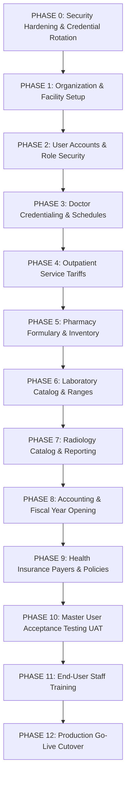

# IMPLEMENTATION MASTER PLAN & EXECUTION ROADMAP

**Project**: GNU Health HMIS 5.0 / Tryton 7.0 Implementation  
**Document**: `IMPLEMENTATION_MASTER_PLAN.md`  
**Classification**: Master Phased Implementation Blueprint  
**Scope**: Primary Outpatient & Ambulatory Healthcare Facility (State of Qatar)  
**Status**: Current implementation blueprint pending formal clinic stakeholder sign-off  

---

## 1. Executive Implementation Strategy

This master plan provides the single definitive roadmap for transitioning the GNU Health outpatient clinic implementation from its current verified configuration baseline to a fully operational, tested, and accredited production healthcare facility.

### Fundamental Implementation Principles:
1. **No Implementation Ahead of Blueprint**: Changes are executed strictly phase-by-phase upon formal stakeholder sign-off.
2. **Zero Code Forking**: The implementation relies on upstream GNU Health 5.0 and Tryton 7.0 native capabilities. No unnecessary custom modules or replacement frontends shall be built.
3. **Evidence-Based Verification**: Every phase must produce verifiable terminal, database, or UI evidence before advancing to the subsequent phase.
4. **Security First**: Phase 0 (Security & Credential Rotation) is a mandatory hard blocker before operational user onboarding.

---

## 2. Phased Implementation Roadmap (Phases 0 through 12)

---

### PHASE 0 — Infrastructure & Credential Security
- **Objective**: Eliminate critical security vulnerabilities, rotate compromised administrative credentials, encrypt in-transit traffic, and harden the cloud perimeter.
- **Key Tasks**:
  1. Rotate Tryton `admin` provisioning password to a 24-character enterprise passphrase via `trytond-admin`.
  2. Permanently delete `/home/gnuhealth/admin_password.txt`.
  3. Bind clinic domain (e.g. `his.clinic.qa`) via DNS A-record to APPLICATION SERVER / PRODUCTION HOST.
  4. Install TLS certificate on Nginx reverse proxy; configure Port 443 with TLS 1.3 and automatic HTTP (Port 80) redirection.
  5. Update GCP VPC firewall rule `allow-gnuhealth-web` to remove Port 8000; restrict Tryton daemon to `127.0.0.1:8000`.
  6. Enforce file permissions `chmod 600` on `/home/gnuhealth/trytond.conf`.
- **Status**: `BLOCKING`
- **Owner**: DevOps Engineer & System Administrator.
- **Exit Gate**: Verified HTTPS padlock on domain; Port 8000 blocked externally; admin password rotated.

---

### PHASE 1 — Organization & Facility Master Data
- **Objective**: Replace generic `<CLINIC_NAME>` placeholders with legal entity records and establish physical facility hierarchies.
- **Key Tasks**:
  1. Ingest official clinic trade name (English & Arabic) into `party.party` (ID: 2).
  2. Ingest Commercial Registration (CR) and MoPH facility license number into `gnuhealth.institution` (Code: `CLINIC-QA`).
  3. Record official Blue Plate address (Building, Street, Zone) and contact telephone/email.
  4. Verify 8 operational hospital units (OPD, Triage, Pharmacy, Lab, Radiology, Billing, Insurance, Administration).
  5. Configure clinic operating shifts (Sat–Thu 08:00–22:00, Fri 14:00–22:00).
- **Status**: `MASTER_DATA / BUSINESS_INPUT`
- **Owner**: Operations Manager & System Administrator.
- **Exit Gate**: Clinic legal identity visible on system reports; facility structure verified.

---

### PHASE 2 — Users & Role Provisioning
- **Objective**: Create individualized staff user accounts mapped strictly to least-privilege functional roles.
- **Key Tasks**:
  1. Receive approved staff enrollment list from Clinic HR / Operations.
  2. Create named accounts in `res.user` for Receptionists, Nurses, Pharmacists, Lab Techs, Radiology Techs, Billing Cashiers, and Accountants.
  3. Map users strictly to functional `res.group` security groups as specified in `USER_ROLE_IMPLEMENTATION_PLAN.md`.
  4. Enforce mandatory password change upon first login (minimum 12 characters).
- **Status**: `MASTER_DATA / SECURITY`
- **Owner**: System Administrator.
- **Exit Gate**: All operational staff possess individual credentials; demo accounts remain disabled (`active = False`).

---

### PHASE 3 — Doctor Credentialing & Rostering
- **Objective**: Onboard licensed physicians into the clinical system to enable appointment booking and consultations.
- **Key Tasks**:
  1. Ingest physician names and map them to their registered `res.user` accounts.
  2. Create records in `gnuhealth.healthprofessional`.
  3. Record verified Qatar Council for Healthcare Practitioners (QCHP) license numbers in `license_number`.
  4. Link physicians to their primary medical specialties (`gnuhealth.hp_specialty`) from the 73 preloaded specialties.
  5. Assign consultation rooms and weekly clinic calendar availability.
- **Status**: `MASTER_DATA`
- **Owner**: Medical Director & Operations Lead.
- **Exit Gate**: Doctors visible in appointment booking selector; QCHP licenses verified.

---

### PHASE 4 — Outpatient Service Catalog & Tariffs
- **Objective**: Establish the official outpatient fee schedule in Qatari Riyal (`QAR`).
- **Key Tasks**:
  1. Review proposed consultation, procedural, and nursing fees with Clinic Management.
  2. Set approved `list_price` in `product.product` for GP consultations, Specialist consultations, and follow-ups.
  3. Assign standard duration (e.g. 15 or 30 minutes) per service code.
  4. Ensure base currency is locked to `QAR` (ID: 3).
- **Status**: `MASTER_DATA / BUSINESS_APPROVAL`
- **Owner**: Clinic Manager & Finance Lead.
- **Exit Gate**: All billable outpatient services contain approved prices in QAR; zero blank price fields.

---

### PHASE 5 — Pharmacy Formulary & Inventory Setup
- **Objective**: Ingest approved commercial medications and configure dispensary stock.
- **Key Tasks**:
  1. Ingest Qatar National Formulary (QNF) approved commercial drug products into `gnuhealth.medicament`.
  2. Link medications to preloaded dosage forms (94 forms), administration routes (47 routes), and dosage units (7 units).
  3. Ingest manufacturer barcodes, retail selling prices, and cost prices.
  4. Establish initial dispensary physical inventory via `stock.inventory` with lot/batch numbers and expiry dates.
  5. Test allergy contraindication alerts (`SM-CORE-0018`).
- **Status**: `MASTER_DATA / MEDICAL_APPROVAL`
- **Owner**: Chief Pharmacist & Medical Director.
- **Exit Gate**: E-prescriptions able to search and select commercial medicines; stock levels tracked.

---

### PHASE 6 — Laboratory Catalog & Diagnostic Ranges
- **Objective**: Configure clinic-specific laboratory test panels, units, and normal reference ranges.
- **Key Tasks**:
  1. Ingest in-house laboratory test catalog into `gnuhealth.patient.lab.test` under the 9 preloaded categories.
  2. Define quantitative units of measurement (e.g. g/dL, mmol/L) and reference intervals (age/sex specific).
  3. Set lab test retail prices in QAR.
  4. Test technician result entry, abnormal value flagging, and pathologist verification sign-off.
- **Status**: `MASTER_DATA / MEDICAL_APPROVAL`
- **Owner**: Laboratory Director & Lead Pathologist.
- **Exit Gate**: Lab worklist operational; reference ranges flag abnormal findings accurately.

---

### PHASE 7 — Radiology Catalog & Reporting Protocols
- **Objective**: Configure imaging exam catalog and structured reporting templates.
- **Key Tasks**:
  1. Ingest clinic radiology exam menu under the 8 preloaded modalities (X-Ray, Ultrasound, etc.).
  2. Set radiology study retail prices in QAR.
  3. Configure structured diagnostic reporting templates for interpreting radiologists.
  4. Test technician procedure logging and PDF report attachment to patient EHR.
- **Status**: `MASTER_DATA / MEDICAL_APPROVAL`
- **Owner**: Radiology Director & Lead Radiologist.
- **Exit Gate**: Imaging requisitions generate worklists; signed reports attach cleanly to patient charts.

---

### PHASE 8 — Accounting & Fiscal Year Opening
- **Objective**: Unlock financial ledger posting by opening the accounting fiscal year and configuring revenue mappings.
- **Key Tasks**:
  1. Chief Financial Officer / Lead Accountant approves proposed Chart of Accounts.
  2. In Tryton Financial Management: Create Fiscal Year 2026 (`FY2026`, 2026-01-01 to 2026-12-31) in `account.fiscalyear`.
  3. Generate 12 monthly accounting periods (`P01-2026` through `P12-2026`).
  4. Map Cash (`CSH`), POS (`POS`), Revenue (`REV`), and Insurance (`INS`) journals to FY2026.
  5. Link medical service categories to departmental revenue accounts (`4100`–`4500`).
- **Status**: `ACCOUNTING_APPROVAL`
- **Owner**: Chief Financial Officer & Lead Accountant.
- **Exit Gate**: `account.fiscalyear` count = 1; customer invoices post to General Ledger without error.

---

### PHASE 9 — Health Insurance Payers & Policy Configuration
- **Objective**: Configure private health insurance payers, policy templates, and copayment split logic.
- **Key Tasks**:
  1. Create Party records for contracted private insurers and TPAs (CONTRACTED INSURANCE PAYERS — PENDING CLINIC INPUT).
  2. Configure standard copayment policies (e.g. 20% patient copay / 80% insurer receivable) in `gnuhealth.insurance`.
  3. Test dual-line invoicing split during cashier checkout.
  4. Establish manual claim batch export workflow.
- **Status**: `BUSINESS / INTEGRATION`
- **Owner**: Insurance Officer & Finance Lead.
- **Exit Gate**: Copayment calculated accurately; insurance receivable balances tracked under insurer parties.

---

### PHASE 10 — Master User Acceptance Testing (UAT)
- **Objective**: Execute end-to-end clinical and administrative validation across all 17 UAT scenarios.
- **Key Tasks**:
  1. Execute scenarios `UAT-001` through `UAT-017` as defined in `MASTER_UAT_PLAN.md`.
  2. Record actual results, evidence screenshots, and defect logs.
  3. Resolve any identified functional defects.
  4. Obtain formal stakeholder sign-off on UAT completion.
  5. Safely extract and purge all synthetic UAT test records via native Tryton ORM, returning the database to a clean operational state.
- **Status**: `TESTING_REQUIRED`
- **Owner**: QA / Test Lead & Clinical Lead.
- **Exit Gate**: All P0/P1 scenarios marked PASS; zero open Sev-1 defects; database cleaned of test records.

---

### PHASE 11 — Staff Training & Role Simulation
- **Objective**: Train all operational clinic staff on their respective Tryton SAO workflows.
- **Key Tasks**:
  1. Conduct role-specific hands-on training sessions:
     - Reception: Registration, search, appointments, queueing.
     - Nursing: Triage, vitals entry, queue forwarding.
     - Doctors: SOAP charting, ICD-10 search, e-prescriptions, ordering.
     - Pharmacy: Dispensing, stock check, batch logging.
     - Lab & Radiology: Worklists, result entry, diagnostic reports.
     - Billing: Cash/card receipting, split invoicing, shift closeout.
  2. Issue Quick-Reference laminated SOP cards for each desk.
  3. Conduct full-clinic simulated dry-run encounter.
- **Status**: `OPERATIONAL_READINESS`
- **Owner**: Operations Manager & Department Leads.
- **Exit Gate**: All operational staff certified on their respective workflows.

---

### PHASE 12 — Production Go-Live Cutover
- **Objective**: Final authorization and transition to live clinical outpatient operations.
- **Key Tasks**:
  1. Convene Go-Live Gating Committee.
  2. Execute and sign off all items in `GO_LIVE_CHECKLIST.md`.
  3. Execute final pre-production database backup snapshot.
  4. Enable production web access on official clinic domain.
  5. Declare system LIVE for patient intake.
- **Status**: `MANAGEMENT_APPROVAL`
- **Owner**: Executive Committee & Implementation Lead.
- **Exit Gate**: All mandatory gates in `GO_LIVE_CHECKLIST.md` verified PASS; clinical operations active.
