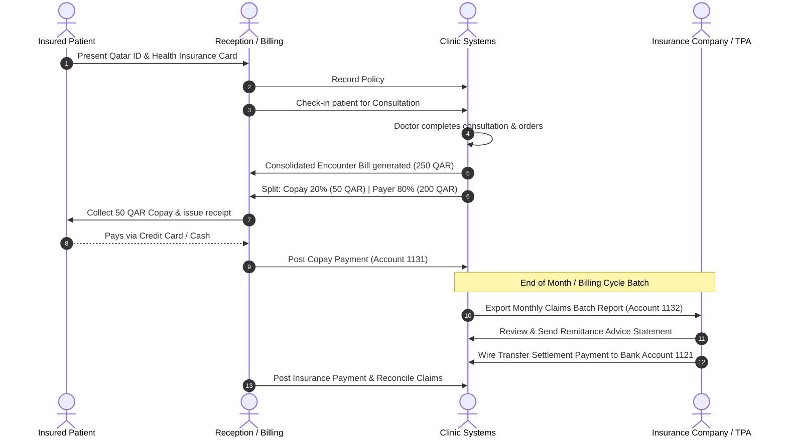

# HEALTH INSURANCE IMPLEMENTATION PLAN

**Project**: GNU Health HMIS 5.0 / Tryton 7.0 Implementation  
**Document**: `INSURANCE_IMPLEMENTATION_PLAN.md`  
**Classification**: Health Insurance Configuration & Integration Architecture  
**Scope**: Primary Outpatient & Ambulatory Healthcare Facility (State of Qatar)  
**Status**: INTERNAL CONFIGURATION READY — EXTERNAL INTEGRATION PENDING REQUIREMENTS  

---

## 1. Executive Summary & Strategy

The management of third-party private health insurance requires a clear division between **native internal GNU Health insurance workflows** and **external clearinghouse electronic claim interfaces**.

1. **Phase 1 (Day-1 Go-Live Baseline)**: Implement internal GNU Health insurance tracking. Patients present insurance cards; front-desk records policy data; billing calculates patient copays (e.g., 20%) and generates insurance receivable claims internally. Claims are reconciled via manual payer remittance statements.
2. **Phase 2 (Post Go-Live Advanced Integration)**: Connect GNU Health to a national electronic claims clearinghouse (such as NPHIES or private payer web APIs) via custom middleware **only when formal technical specifications, vendor credentials, and business contracts are established**.

---

## 2. Internal GNU Health Insurance Configuration

Native GNU Health provides full support for outpatient insurance policy tracking, copay calculation, and claim generation.

### 2.1 Payer & TPA Master Data
Insurance companies and Third-Party Administrators (TPAs) are modeled in `party.party` and categorized under `gnuhealth.insurance.company`.

```text
CONTRACTED INSURANCE PAYERS — PENDING CLINIC INPUT
```

Currently, 0 insurance payer records exist in `gnuhealth.insurance.company` and `party.party`. Payer master records shall only be created upon receipt of verified insurance contracts and billing agreements supplied by clinic management.

### 2.2 Patient Insurance Policy Model (`gnuhealth.insurance`)
When an insured patient registers at reception, the front-desk officer creates a policy linked to the patient PUID:
- **Policy Number**: Member identification number on insurance card.
- **Group / Plan Name**: Corporate employer or family plan tier (e.g., Gold, VIP, Standard).
- **Validity Dates**: Policy Start Date and Expiration Date.
- **Primary Insurer**: Foreign key to `party.party` (Insurer/TPA).
- **Copay Terms**:
  - `copay_type`: Percentage (e.g. 20%) or Fixed Flat Fee (e.g. 50 QAR).
  - `copay_max_limit`: Maximum out-of-pocket ceiling per consultation (e.g., max 100 QAR).
  - `deductible`: Annual deductible balance (if applicable).

### 2.3 Outpatient Dual-Line Invoicing & Copay Split
When a doctor consultation or diagnostic procedure is billed:
1. Tryton evaluates the active insurance policy on the patient encounter.
2. The gross price (e.g., 250.00 QAR for Specialist Consultation) is split into two accounting lines:
   - **Line A (Patient Copay)**: 20% = `50.00 QAR` (Assigned to Account `1131 Patient Receivables`, payable immediately at cashier).
   - **Line B (Insurer Claim)**: 80% = `200.00 QAR` (Assigned to Account `1132 Insurance Receivables`, batched for claim submission).

### 2.4 Prior Authorization Tracking
For high-cost diagnostic exams (e.g., MRI, CT, specialized blood panels):
- Model `gnuhealth.insurance` captures the **Prior Authorization Request (PAR) Number**.
- Approval status tracking (`Draft`, `Requested`, `Approved`, `Rejected`).
- Required medical justification attachment uploaded to patient encounter.

---

## 3. External Integration Requirements

```text
POTENTIAL / OPTIONAL INTEGRATION

External integration has not yet been formally confirmed as a clinic
requirement. Technical assessment should occur only after the clinic
provides the required business and integration specifications.
```

> [!WARNING]
> **Implementation Prerequisite Notice**:  
> External insurance API integration **CANNOT PROCEED** until the following technical assets are provided:
> 1. Formally signed Data Sharing Agreement with the insurance clearinghouse / TPA.
> 2. Official REST / SOAP / HL7 FHIR API documentation and schema specifications.
> 3. Payer Sandbox / Staging endpoint URLs and TLS client certificates.
> 4. Assigned Clinic Facility ID and API Authentication Keys.
> 
> Proceeding without these specifications is strictly prohibited. Core outpatient operations will launch with native internal GNU Health insurance workflows (Phase 1).

---

## 4. Insurance Claims Settlement Workflow


