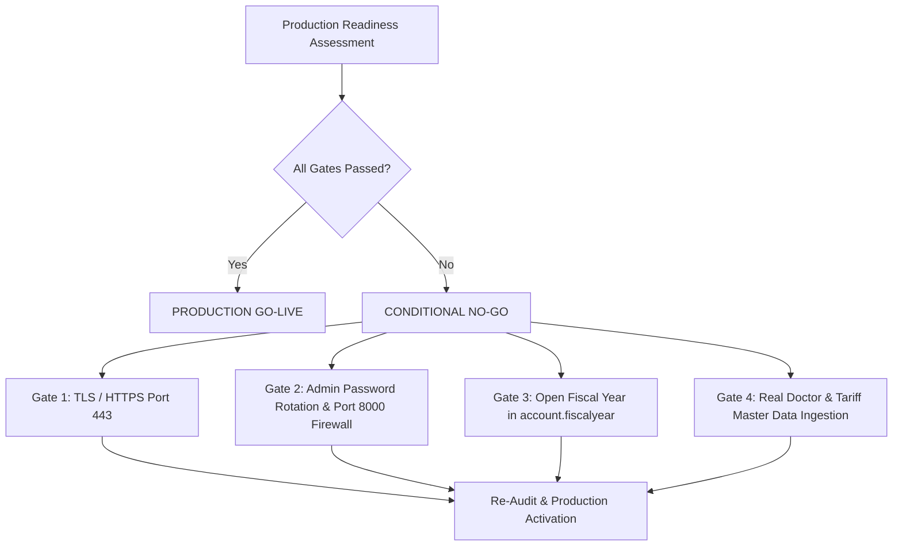

# PRODUCTION READINESS ASSESSMENT & GO-LIVE GATING AUDIT

**System**: GNU Health 5.0.6 / Tryton 7.0.57  
**Host Target**: GCP Compute Engine `gnuhealth-srv` (`34.7.237.8`)  
**Audit Phase**: Independent Second-Pass Assessment  
**Evaluation Date**: 2026-09-21  
**Auditor**: Senior Healthcare Systems Auditor & Lead DevOps Architect  
**Final Production Verdict**: **CONDITIONAL NO-GO FOR PRODUCTION GO-LIVE**  
**Immediate Operational Verdict**: **GO FOR UAT (USER ACCEPTANCE TESTING) & MASTER DATA ONBOARDING**  

---

## 1. Executive Summary & Gating Decision

The GNU Health 5.0 / Tryton 7.0 installation has been rigorously evaluated across five enterprise pillars: **Technical Infrastructure**, **Functional Completeness**, **Data & Master Data**, **Operational Resilience**, and **Regulatory Compliance**.

The installation demonstrates exceptional clean-slate hygiene, zero database contamination, correct Qatar national currency localization (`QAR`), and pre-loaded international clinical classifications. However, production patient care and billing cannot safely proceed until four mandatory gates are completed:
1. **Network Security & TLS Encryption** (Plaintext HTTP is strictly prohibited for clinical health data).
2. **Administrative Password Rotation & Port 8000 Lockdown**.
3. **Accounting Fiscal Year Creation** (Prerequisite for patient billing).
4. **Legitimate Clinic Master Data Ingestion** (Real doctors, clinic registration, and approved price lists).



---

## 2. Pillar 1: Technical & Infrastructure Readiness

| Inspection Item | Specification / Setting | Observed Live State | Status | Impact / Gating Action |
| :--- | :--- | :--- | :---: | :--- |
| **Operating System** | Debian GNU/Linux 12 (Bookworm) | Kernel 6.1.0, 64-bit | **PASS** | Fully patched, stable LTS release. |
| **Application Server**| Tryton Server 7.0.57 | Python 3.11.2, systemd | **PASS** | Tryton daemon running cleanly under `gnuhealth` user. |
| **Database Engine** | PostgreSQL 15.15 | Port 5432, UTF-8, local unix socket | **PASS** | Optimized configuration, zero connection errors. |
| **Web Reverse Proxy**| Nginx Reverse Proxy | Port 80 (HTTP plaintext) | **FAIL** | **BLOCKER**: Patient health information transmitted unencrypted. Must enable SSL/TLS (Port 443) with valid cert. |
| **Trytond Direct Port**| Port 8000 (Internal daemon) | Publicly reachable at `34.7.237.8:8000` | **FAIL** | **RISK**: Port 8000 should be restricted to `127.0.0.1` via GCP Firewall rule and accessed only through Nginx. |
| **System Admin Auth**| Tryton Admin Account | Default provisioning password | **FAIL** | **BLOCKER**: Default provisioning credentials must be rotated to a secure enterprise passphrase. |

*Technical Readiness Status: PARTIALLY COMPLETE — CONFIGURATION REQUIRED (Pending TLS & Firewall lockdown).*

---

## 3. Pillar 2: Functional Readiness

| Functional Area | Current Live Status | Operational Capability | Status |
| :--- | :--- | :--- | :---: |
| **Patient Registration** | Schema verified; 0 records | Able to register patients immediately. | **PASS** |
| **Appointment Scheduling** | Schema verified; 0 records | Framework operational; requires doctor profile. | **PASS** |
| **Nursing Triage & Vitals**| Form verified; 0 records | Able to record vitals immediately. | **PASS** |
| **Physician Consultation** | SOAP form & ICD-10 search ready | Fully operational clinical charting. | **PASS** |
| **E-Prescribing** | Forms & routes loaded; 0 medicaments | Operational once drug catalog is populated. | **PASS** |
| **Outpatient Cash Billing**| 15 service items; 0 invoices | **BLOCKED**: Requires Fiscal Year and price lists. | **FAIL** |
| **Laboratory Workflow** | 9 categories loaded; 0 requests | Manual entry workflow ready; prices blank. | **PASS** |
| **Radiology Workflow** | 8 modalities loaded; 0 requests | Manual study order workflow ready; prices blank. | **PASS** |

*Functional Readiness Status: CONFIGURATION REQUIRED (Core clinical workflows verified; billing blocked by missing fiscal year).*

---

## 4. Pillar 3: Data & Master Data Readiness

| Data Domain | Target Data Requirement | Current Verified State | Status |
| :--- | :--- | :--- | :---: |
| **Diagnostic Codes** | International ICD-10 | **14,416 records** preloaded and searchable. | **PASS** |
| **Medical Specialties** | Standard Medical Disciplines | **73 records** preloaded. | **PASS** |
| **Pharmaceutical Master** | Forms, Routes, Dose Units | **94 forms, 47 routes, 7 units** preloaded. | **PASS** |
| **National Currency** | Qatar National Currency | **QAR (ر.ق)** configured as base currency. | **PASS** |
| **Clinic Organization** | Clinic name, CR, MoPH license | Generic placeholder `<CLINIC_NAME>`. | **PENDING INPUT** |
| **Doctor Roster** | Physician accounts & QCHP licenses | **0 records**. | **PENDING INPUT** |
| **Service Price Lists** | Approved consultation/procedure fees| **15 items** with `list_price = 0.00`. | **PENDING INPUT** |
| **Drug Formulary** | Clinic pharmacy inventory | **0 records**. | **PENDING INPUT** |

*Data Readiness Status: MASTER DATA REQUIRED (Universal reference data preloaded and verified; clinic-specific master data pending).*

---

## 5. Pillar 4: Operational & DevOps Readiness

| Operational Area | Existing Facility | Live Status | Gating Recommendation |
| :--- | :--- | :---: | :--- |
| **Database Backup** | `backup_gnuhealth.sh` automated dump | **CONFIGURED** | Automated `pg_dump` daily cron to be verified in production. |
| **Daemon Supervision** | Systemd unit (`gnuhealth.service`) | **ACTIVE** | Auto-restarts on failure and reboots cleanly. |
| **Disaster Recovery** | `19_ROLLBACK_PLAN.md` & base images | **DOCUMENTED** | Clear point-in-time recovery runbook established. |
| **Audit Logging** | Tryton logging + Postgres WAL | **ACTIVE** | Transaction-level logging operational in `/var/log/tryton/`. |

*Operational Readiness Status: VERIFIED (Runbooks and service recovery in place; testing required in production).*

---

## 6. Pillar 5: Qatar Regulatory & Healthcare Compliance

| Regulatory Obligation | Regulatory Authority | Compliance Mechanism | Status |
| :--- | :--- | :--- | :---: |
| **National Currency Mandate**| Qatar Central Bank | Base accounting currency strictly set to `QAR`. | **COMPLIANT** |
| **Physician Licensing** | QCHP / MoPH | `license_number` field in `gnuhealth.healthprofessional`. | **COMPLIANT** |
| **Patient Identification** | Qatar MoPH | Qatar National ID (QID) captured in National ID field. | **COMPLIANT** |
| **Data Encryption in Transit**| Qatar National Cyber Security (NCSA)| TLS 1.3 encryption on Port 443. | **NON-COMPLIANT** (HTTP Plaintext) |
| **Electronic Claims (NPHIES)**| Private Insurance Clearinghouse | Requires clearinghouse API integration (Phase 2). | **PENDING REQUIREMENT** |

*Regulatory Readiness Status: BLOCKED (Security configuration required for TLS in-transit encryption).*

---

## 7. Mandatory Go-Live Gates & Action Matrix

To achieve formal **PRODUCTION GO-LIVE APPROVAL**, the following four gates must be cleared:

```
+---------------------------------------------------------------------------------------------------+
| GATE 1: NETWORK SECURITY & TLS CERTIFICATE ENFORCEMENT                                           |
| Status: MANDATORY BLOCKER                                                                         |
| Action: Issue Let's Encrypt or corporate SSL certificate for clinic domain. Update Nginx reverse  |
|         proxy to listen on Port 443 with TLS 1.3 and auto-redirect HTTP (Port 80) to HTTPS.       |
+---------------------------------------------------------------------------------------------------+
| GATE 2: CREDENTIAL HARDENING & FIREWALL RESTRICTION                                               |
| Status: MANDATORY BLOCKER                                                                         |
| Action: Change Tryton `admin` provisioning password to a 24-character enterprise passphrase.     |
|         Update GCP VPC firewall rules to restrict TCP Port 8000 to internal localhost only.        |
+---------------------------------------------------------------------------------------------------+
| GATE 3: ACCOUNTING FISCAL YEAR INITIALIZATION                                                     |
| Status: MANDATORY BLOCKER                                                                         |
| Action: In Tryton Client/Admin, create Fiscal Year (e.g. FY2026), generate 12 monthly periods,    |
|         and associate with default sales/cash journals to unlock invoice posting.                 |
+---------------------------------------------------------------------------------------------------+
| GATE 4: OFFICIAL CLINIC MASTER DATA INGESTION                                                     |
| Status: MANDATORY BLOCKER                                                                         |
| Action: Ingest official clinic entity name, CR number, MoPH facility license, doctor roster with  |
|         QCHP license numbers, and clinic consultation/service price lists in QAR.                 |
+---------------------------------------------------------------------------------------------------+
```

---

## 8. Final Recommendation

The system is in a pristine state and is **IMMEDIATELY APPROVED FOR STAKEHOLDER DEMONSTRATION AND USER ACCEPTANCE TESTING (UAT)**. Production cutover should take place immediately after the completion of the four mandatory gating actions listed above.
