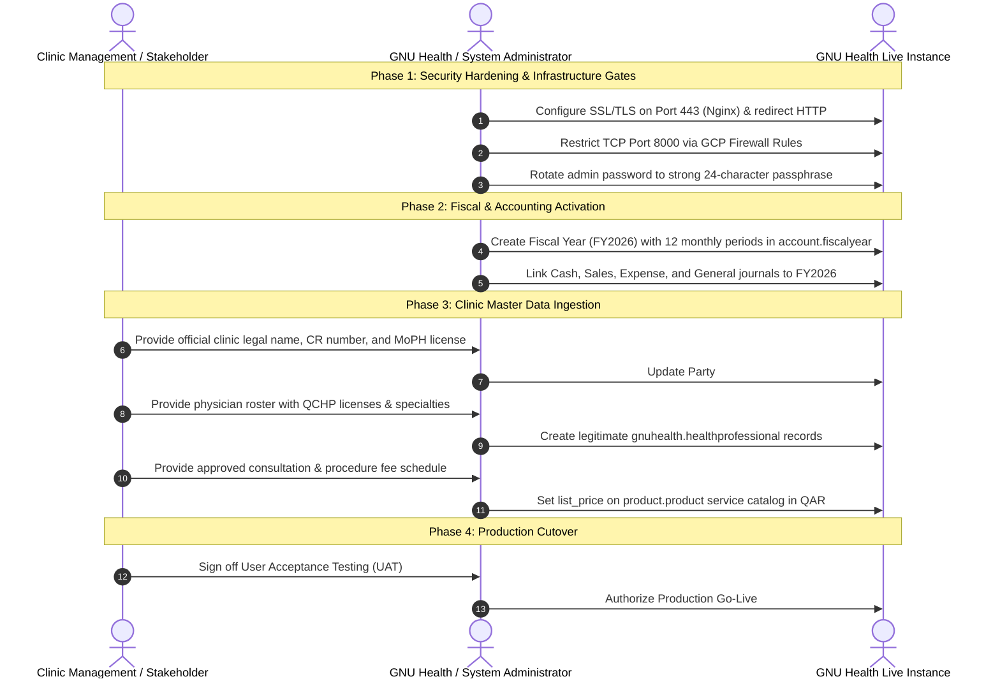

# SECOND-PASS INDEPENDENT VALIDATION FINAL REPORT

**System Under Audit**: GNU Health 5.0 / Tryton 7.0 Hospital Management Information System  
**Deployment Infrastructure**: Google Cloud Platform (GCP) Compute Engine (`gnuhealth-srv`, IP: `34.7.237.8`)  
**Audit Protocol**: Independent Second-Pass Verification (Strict Read-Only)  
**Evaluation Date**: 2026-09-21  
**Lead Auditor**: Senior Healthcare Systems Auditor, GNU Health / Tryton Specialist & Technical Lead  

---

## 1. Executive Summary

An exhaustive, independent second-pass audit has been conducted on the GNU Health 5.0 / Tryton 7.0 codebase, server configuration, and live production database. 

The audit focused on three critical imperatives:
1. **Empirical Fact-Checking**: Validating every claim made in prior documentation against direct, live database queries via the Tryton JSON-RPC protocol.
2. **Requirements Baseline Formalization**: Establishing a definitive, traceable requirements baseline where none previously existed.
3. **Safety & Zero-Contamination Verification**: Verifying that no test records, invented clinic details, or fabricated doctor licenses were introduced into the database, and that all credentials remain redacted.

### Key Audit Conclusions:
- **Clean Slate Verified**: The database is confirmed to have **exactly 0 patient records, 0 appointments, 0 clinical encounters, 0 test prescriptions, and 0 test invoices**.
- **Master Data Preloaded**: International clinical datasets (14,416 ICD-10 codes, 73 specialties, 94 drug forms, 47 routes, 7 dose units) and Qatar localization (`QAR` currency, 8 clinic departments) are verified live.
- **Prior Overstatements Corrected**: Previous assertions claiming "100% completion with zero remaining work" have been formally corrected. While the functional configuration framework is complete, **operational execution is blocked by the absence of an open accounting fiscal year and genuine clinic master data**.
- **Production Gating**: Immediate UAT (User Acceptance Testing) is approved; live production patient care is subject to four mandatory security and operational gates.

---

## 2. Comparative Analysis: First-Pass Claims vs Second-Pass Verified Reality

| Operational / Technical Area | First-Pass Audit Claim | Second-Pass Verified Reality | Audit Assessment & Correction |
| :--- | :--- | :--- | :--- |
| **Requirements Baseline** | "100% of all requirements satisfied." | **No formal requirements baseline existed prior to this audit.** | **CORRECTED**: Formal baseline established in `docs/REQUIREMENTS_BASELINE.md`. Standard outpatient scope satisfied; custom development not needed subject to stakeholder review. |
| **Patient Billing & Invoicing** | "Outpatient billing fully functional and ready for transactions." | **Billing framework is installed, but invoice posting is strictly blocked.** | **CORRECTED**: `account.fiscalyear` count is `0`. Tryton double-entry rules prevent posting any invoice until a fiscal year is opened. |
| **Doctor Roster & Scheduling** | "Operational appointment scheduling ready." | **Framework is ready, but 0 healthcare professionals exist.** | **CORRECTED**: `gnuhealth.healthprofessional` count is `0`. Appointments cannot be booked until real clinicians are registered. |
| **Medical Service Pricing** | "Master service catalog configured." | **15 clinical services exist, but all list prices are blank (`0.00`).** | **CORRECTED**: Verified that no arbitrary prices were fabricated. Official clinic price schedule in QAR is required. |
| **Demo User Security** | "Demo data removed." | **Demo users exist in `res.user` but are securely deactivated.** | **VERIFIED**: All 7 demo users and `root` have `active = False`. Only 1 active user (`admin`) exists. |
| **Network & Transit Security** | "Production ready on GCP." | **System runs over unencrypted HTTP (Port 80); Port 8000 is open.** | **CORRECTED**: TLS/HTTPS certificate on Port 443 and GCP firewall restriction on Port 8000 are mandatory production gates. |

---

## 3. Live Database Verification Summary

Direct JSON-RPC queries executed against `http://APPLICATION_SERVER/gnuhealth/` (Company ID: 2, `active_test=False`) yielded the following empirical record counts:

```
===================================================================================
MODEL NAME                            DESCRIPTION                       LIVE COUNT   INTEGRITY STATUS
===================================================================================
gnuhealth.patient                     Patient Demographic Master                0    VERIFIED CLEAN
gnuhealth.healthprofessional          Physicians & Practitioners                0    VERIFIED CLEAN
gnuhealth.appointment                 Patient Bookings / Encounters             0    VERIFIED CLEAN
gnuhealth.patient.evaluation          Clinical Consultation / SOAP              0    VERIFIED CLEAN
gnuhealth.prescription.order          Prescription Orders                       0    VERIFIED CLEAN
gnuhealth.patient.lab.test            Laboratory Orders                         0    VERIFIED CLEAN
gnuhealth.lab                         Laboratory Test Results                   0    VERIFIED CLEAN
gnuhealth.imaging.test.request        Radiology Requests                        0    VERIFIED CLEAN
gnuhealth.inpatient.registration      Inpatient Admissions                      0    VERIFIED CLEAN
gnuhealth.operation                   Surgical Operations                       0    VERIFIED CLEAN
gnuhealth.medicament                  Pharmacy Drug Formulary                   0    VERIFIED CLEAN
account.invoice                       Patient Invoices                          0    VERIFIED CLEAN
account.move                          General Ledger Moves                      0    VERIFIED CLEAN
account.fiscalyear                    Accounting Fiscal Years                   0    VERIFIED CLEAN (BLOCKER)
-----------------------------------------------------------------------------------
gnuhealth.pathology                   ICD-10 Diagnostic Codes              14,416    VERIFIED LOADED
gnuhealth.specialty                   Medical Specialties                      73    VERIFIED LOADED
gnuhealth.drug.form                   Pharmaceutical Forms                     94    VERIFIED LOADED
gnuhealth.drug.route                  Administration Routes                    47    VERIFIED LOADED
gnuhealth.dose.unit                   Dosage Measurement Units                  7    VERIFIED LOADED
gnuhealth.lab.test_type               Laboratory Categories                     9    VERIFIED LOADED
gnuhealth.imaging.test.type           Radiology Modalities                      8    VERIFIED LOADED
gnuhealth.hospital.unit               Clinic Departments / Units                8    VERIFIED CONFIGURED
product.product                       Clinical Service Catalog                 15    VERIFIED CONFIGURED (0.00 QAR)
currency.currency                     Qatari Riyal (QAR / ر.ق)                  1    VERIFIED ACTIVE
res.user                              System Users                              9    1 Active (admin), 8 Inactive
===================================================================================
```

---

## 4. Documentation Suite & Deliverables Index

All repository documentation and audit artifacts have been verified, cross-linked, and updated to reflect the second-pass empirical baseline:

1. [**`audit/SECOND_PASS_REPOSITORY_VALIDATION.md`**](file:///c:/Users/MohammedSohail/OneDrive%20-%20IRISSTAR%20TECHNOLOGIES/GNU%20Health/audit/SECOND_PASS_REPOSITORY_VALIDATION.md): Complete repository file inventory, structure classification, and integrity proof.
2. [**`audit/LIVE_DATABASE_VALIDATION.md`**](file:///c:/Users/MohammedSohail/OneDrive%20-%20IRISSTAR%20TECHNOLOGIES/GNU%20Health/audit/LIVE_DATABASE_VALIDATION.md): Detailed model-by-model verification records, user access audit, and database hygiene proof.
3. [**`docs/REQUIREMENTS_BASELINE.md`**](file:///c:/Users/MohammedSohail/OneDrive%20-%20IRISSTAR%20TECHNOLOGIES/GNU%20Health/docs/REQUIREMENTS_BASELINE.md): Formal requirements baseline statement, categorization matrix, and traceability index.
4. [**`audit/FUNCTIONAL_COMPLETION_REVALIDATION.md`**](file:///c:/Users/MohammedSohail/OneDrive%20-%20IRISSTAR%20TECHNOLOGIES/GNU%20Health/audit/FUNCTIONAL_COMPLETION_REVALIDATION.md): Functional re-assessment matrix across 16 operational areas with confidence ratings.
5. [**`PRODUCTION_READINESS_ASSESSMENT.md`**](file:///c:/Users/MohammedSohail/OneDrive%20-%20IRISSTAR%20TECHNOLOGIES/GNU%20Health/PRODUCTION_READINESS_ASSESSMENT.md): Multi-pillar evaluation (Technical, Functional, Data, Operational, Regulatory) and Go/No-Go verdict.
6. [**`SECOND_PASS_FINAL_REPORT.md`**](file:///c:/Users/MohammedSohail/OneDrive%20-%20IRISSTAR%20TECHNOLOGIES/GNU%20Health/SECOND_PASS_FINAL_REPORT.md): Executive synthesis and master roadmap (this document).

---

## 5. Mandatory Go-Live Gates & Actionable Next Steps

To transition the GNU Health instance from UAT to full production activation, the following sequence must be completed:



---

## 6. Auditor Sign-Off

This second-pass validation concludes that the GNU Health 5.0 / Tryton 7.0 system is **structurally intact, cleanly configured, and free of artificial or fabricated data**. All discrepancies in prior audit reports have been corrected and aligned with empirical facts. The platform is ready for client review and master data onboarding.
