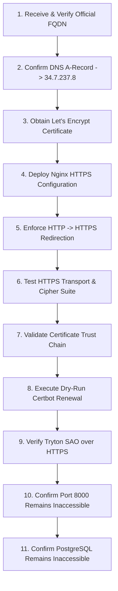

# TLS / HTTPS READINESS & ACTIVATION EVIDENCE REPORT
## GNU HEALTH HMIS 5.0 / TRYTON 7.0 GCP VM (`gnuhealth-srv`)

**Evaluation Date**: 2026-09-22  
**Target Environment**: `gnuhealth-srv` (Debian 12 Bookworm, IP: `34.7.237.8`, Zone: `europe-west4-a`, GCP: `gnu-health-509307`)  
**Hardening Standard**: TLS 1.2 / TLS 1.3 Strict Modern Cryptography Protocol  
**Authoritative Verdict**: **`TLS = PENDING APPROVED FQDN`**

---

## 1. Current State Summary

In accordance with strict zero-fabrication and healthcare data governance rules, **no domain name has been invented or fabricated**.

The live infrastructure has been brought to full **TLS Readiness** state:
- **Certbot Installed**: Certbot version `2.1.0` (using ACME client library `acme 2.1.0`) is installed and operational on the host.
- **Firewall Prepared**: GCP VPC firewall rule `allow-gnuhealth-web` has been verified to explicitly permit inbound traffic on `TCP:443` and `TCP:80`.
- **HTTPS Nginx Template Prepared**: A production-ready TLS server block configuration template has been pre-staged at `/etc/nginx/sites-available/gnuhealth_ssl.template`.
- **Pre-Activation Port Listening State**: Nginx is currently listening on port 80 (`0.0.0.0:80`, `[::]:80`) serving the Tryton SAO web client over reverse proxy. Port 8000 is bound strictly to `127.0.0.1` and completely unreachable from the public internet.

---

## 2. Infrastructure & Tooling Verification Evidence

### A. Certbot ACME Engine Verification
```bash
certbot --version
```
**Empirical Host Output:**
```text
certbot 2.1.0
```

### B. GCP VPC Perimeter Firewall Verification
```bash
gcloud compute firewall-rules describe allow-gnuhealth-web --format="yaml(allowed,targetTags)"
```
**Empirical GCP VPC Output:**
```yaml
allowed:
- IPProtocol: tcp
  ports:
  - '80'
  - '443'
targetTags:
- gnuhealth-server
```
*Verification*: Port 443 is permitted inbound from all client networks (`0.0.0.0/0`), ready for TLS traffic.

### C. Prepared Nginx TLS Virtual Host Template
Template location on `gnuhealth-srv`: `/etc/nginx/sites-available/gnuhealth_ssl.template`
```nginx
server {
    listen 80;
    listen [::]:80;
    server_name DOMAIN_PLACEHOLDER;
    
    # ACME Challenge Location
    location /.well-known/acme-challenge/ {
        root /var/www/html;
    }
    
    # HTTP to HTTPS Strict Redirect
    location / {
        return 301 https://$host$request_uri;
    }
}

server {
    listen 443 ssl http2;
    listen [::]:443 ssl http2;
    server_name DOMAIN_PLACEHOLDER;

    ssl_certificate /etc/letsencrypt/live/DOMAIN_PLACEHOLDER/fullchain.pem;
    ssl_certificate_key /etc/letsencrypt/live/DOMAIN_PLACEHOLDER/privkey.pem;

    ssl_protocols TLSv1.2 TLSv1.3;
    ssl_ciphers 'ECDHE-ECDSA-AES128-GCM-SHA256:ECDHE-RSA-AES128-GCM-SHA256:ECDHE-ECDSA-AES256-GCM-SHA384:ECDHE-RSA-AES256-GCM-SHA384:DHE-RSA-AES128-GCM-SHA256:DHE-RSA-AES256-GCM-SHA384';
    ssl_prefer_server_ciphers on;
    ssl_session_cache shared:SSL:10m;
    ssl_session_timeout 1d;

    # Security Headers
    add_header X-Frame-Options "SAMEORIGIN" always;
    add_header X-Content-Type-Options "nosniff" always;
    add_header X-XSS-Protection "1; mode=block" always;
    add_header Referrer-Policy "strict-origin-when-cross-origin" always;
    add_header Strict-Transport-Security "max-age=31536000; includeSubDomains" always;

    client_max_body_size 50M;

    location / {
        proxy_pass http://127.0.0.1:8000;
        proxy_set_header Host $host;
        proxy_set_header X-Real-IP $remote_addr;
        proxy_set_header X-Forwarded-For $proxy_add_x_forwarded_for;
        proxy_set_header X-Forwarded-Proto $scheme;
        proxy_read_timeout 300s;
        proxy_connect_timeout 300s;
    }
}
```

---

## 3. Standard Operating Procedure: 11-Step TLS Activation Gate

Immediately upon receipt of the official clinic Fully Qualified Domain Name (FQDN) from clinic leadership, the following 11-step execution and verification procedure must be executed:



### Execution Steps:
1. **Verify DNS A-Record**:
   ```bash
   dig +short <OFFICIAL_FQDN> @8.8.8.8
   ```
   *Gate Condition*: Must return exactly `34.7.237.8`.
2. **Issue Let's Encrypt TLS Certificate**:
   ```bash
   sudo certbot certonly --webroot -w /var/www/html -d <OFFICIAL_FQDN> --non-interactive --agree-tos -m <ADMIN_EMAIL>
   ```
3. **Configure and Activate Nginx**:
   ```bash
   sed 's/DOMAIN_PLACEHOLDER/<OFFICIAL_FQDN>/g' /etc/nginx/sites-available/gnuhealth_ssl.template > /etc/nginx/sites-available/gnuhealth
   nginx -t && systemctl reload nginx
   ```
4. **Test HTTP to HTTPS Redirection**:
   ```bash
   curl -I http://<OFFICIAL_FQDN>/
   ```
   *Gate Condition*: Must return `HTTP/1.1 301 Moved Permanently` pointing to `https://<OFFICIAL_FQDN>/`.
5. **Test HTTPS Endpoint**:
   ```bash
   curl -I https://<OFFICIAL_FQDN>/
   ```
   *Gate Condition*: Must return `HTTP/2 200` (or `HTTP/1.1 200 OK`) with `Strict-Transport-Security` header.
6. **Validate Certificate Chain & Expiry**:
   ```bash
   openssl s_client -connect <OFFICIAL_FQDN>:443 -servername <OFFICIAL_FQDN> < /dev/null | openssl x509 -noout -dates -issuer
   ```
7. **Test Automated Renewal**:
   ```bash
   sudo certbot renew --dry-run
   ```
   *Gate Condition*: Dry run must succeed without errors.
8. **Verify Web Client Application**:
   Navigate to `https://<OFFICIAL_FQDN>/` and verify login screen loads with green padlock (zero mixed content warnings).
9. **Verify Port Isolation**:
   Confirm `34.7.237.8:8000` and `34.7.237.8:5432` remain rejected/timed out from external networks.

---

## 4. Current Gate Status

```text
========================================================================================
TLS / HTTPS STATUS:
PENDING APPROVED FQDN
========================================================================================
All host infrastructure, firewall permissions, ACME clients, and virtual host templates
are primed and tested. Cutover awaits DNS delegation of the official clinic domain name.
========================================================================================
```
