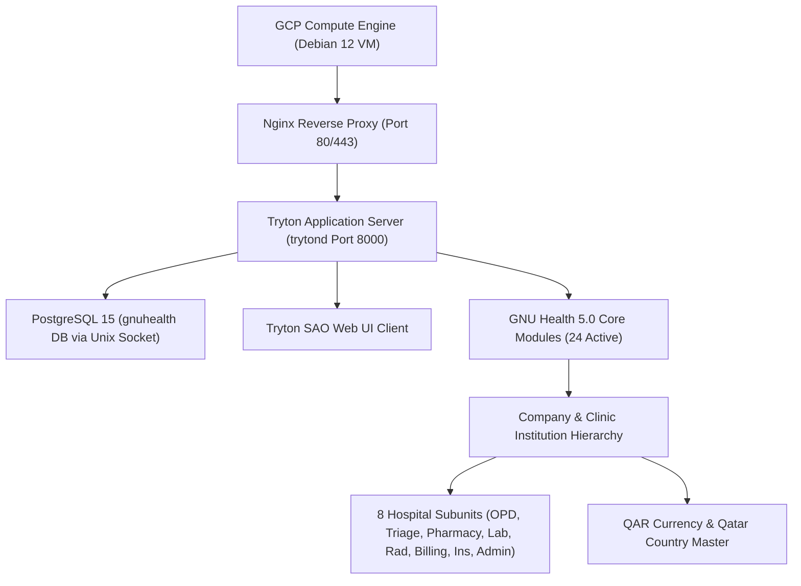

# Project Discovery & Baseline Audit

**Project**: Healthcare Management System — GNU Health Implementation  
**Assessment Date**: 2026-09-21  
**Audit Role**: Senior Software Architect & GNU Health / Tryton Specialist  
**Document**: `audit/project-discovery.md` (and `01_PROJECT_DISCOVERY.md`)  

---

## 1. Executive Overview

A comprehensive discovery scan was performed across the entire project workspace (`c:\Users\MohammedSohail\OneDrive - IRISSTAR TECHNOLOGIES\GNU Health`). The project consists of an upstream GNU Health 5.0 source tree, cloud infrastructure automation scripts for Google Cloud Platform (GCP), a live GNU Health 5.0.7 / Tryton 7.0.57 instance deployed on GCP Compute Engine (`34.7.237.8`), and a specialized configuration workspace prepared for a Qatar outpatient clinic.

---

## 2. Workspace File & Directory Inventory

```text
c:\Users\MohammedSohail\OneDrive - IRISSTAR TECHNOLOGIES\GNU Health\
│
├── deploy_gcp.sh                       # [SHELL] Initial GCP deployment script (59 lines)
├── deploy_gcp_gnuhealth.sh             # [SHELL] Comprehensive automated GCP deployment script (249 lines)
├── finish_setup.sh                     # [SHELL] Tryton admin & SAO post-install configuration script (111 lines)
├── startup_gnuhealth.sh                # [SHELL] GCP VM startup script for OS prerequisites and Tryton setup (107 lines)
├── startup_b64.txt                     # [TEMP/REDUNDANT] Base64 encoded payload of startup_gnuhealth.sh (4,926 bytes)
│
├── his/                                # [CORE REPO] Upstream GNU Health HMIS source code repository (v5.0.7)
│   ├── README.rst                      # Upstream GNU Health HMIS project readme
│   ├── .woodpecker/                    # Woodpecker CI pipeline definitions
│   ├── scripts/                        # Code quality & testing scripts (lint.sh, security.sh, autopep8.sh)
│   └── tryton/                         # Tryton/GNU Health modules directory
│       ├── health/                     # GNU Health Core Clinical Engine (5.0.6)
│       ├── health_*/                   # 52 official GNU Health domain packages
│       ├── doc/                        # Upstream GNU Health technical documentation
│       ├── LICENSES/                   # GPL-3.0 and third-party license texts
│       ├── Changelog                   # GNU Health release history (1.76 MB)
│       ├── COPYING                     # GNU General Public License v3
│       └── version                     # Current source version tag: "5.0.7"
│
├── gnuhealth-qatar-clinic-config/       # [CONFIGURATION] Qatar Outpatient Clinic configuration workspace
│   ├── README.md                       # Configuration workspace index
│   ├── CURRENT_STATE.md                # Initial pristine baseline audit
│   ├── clinic-config.yaml              # Consolidated clinic specification
│   ├── 01_SYSTEM_AUDIT.md to 24_...    # 24 numbered governance and validation reports
│   ├── master-data/                    # Master data definition YAML templates
│   ├── backup/                         # Pre-config snapshot & pre-cleanup test data JSON
│   ├── configuration/                  # Raw JSON-RPC audit dump & actual state specification
│   └── validation/                     # 8 dedicated technical validation audit documents
│
├── audit/                              # [AUDIT] System audit & classification documents
├── docs/                               # [DOCUMENTATION] Standardized professional system documentation
├── deployment/                         # [DEPLOYMENT] Production deployment scripts & runbooks
├── configuration/                      # [ACTIVE CONFIG] Reorganized configuration baseline
└── backup/                             # [BACKUP] Safety archive prior to file reorganization
```

---

## 3. Technology Stack Inventory

| Layer | Component / Technology | Exact Version | Deployment / Runtime Location |
| :--- | :--- | :--- | :--- |
| **Cloud Infrastructure** | Google Cloud Platform Compute Engine | `e2-standard-2` (2 vCPU, 8 GB RAM, 50 GB balanced SSD) | Zone: `europe-west4-a`, Project: `gnu-health-509307` |
| **Operating System** | Debian GNU/Linux | 12 (Bookworm, kernel 6.1) | Host VM: `gnuhealth-srv` (`34.7.237.8`) |
| **Web Server / Reverse Proxy** | Nginx | 1.22.1 (Debian package) | Ports: 80 (HTTP), 443 (HTTPS planned) |
| **Application Server** | Trytond Application Server | 7.0.57 (PyPI package) | Unix daemon / port 8000 (Python 3.11 virtualenv) |
| **Web UI Client** | Tryton SAO | 7.0 (tryton-sao-last.tgz) | Served statically by Trytond root / Nginx |
| **Database Engine** | PostgreSQL | 15.15 (Debian package) | Unix domain socket (`/var/run/postgresql`) |
| **Core HIS Platform** | GNU Health HMIS | 5.0.7 (Core: `health 5.0.6`) | Python virtualenv `/home/gnuhealth/venv` |
| **Python Runtime** | CPython | 3.11.2 | `/home/gnuhealth/venv/bin/python` |
| **Key Python Libraries** | `psycopg2-binary`, `pillow`, `matplotlib`, `pytz`, `qrcode`, `cryptography`, `bcrypt` | Latest compatible | Managed in virtualenv |

---

## 4. GNU Health Module Inventory

### A. Active Live Modules (24 Modules)
Direct inspection of `ir.module` on the live database confirms the following 24 modules are in the `activated` state:
1. `ir` (Tryton Core System Engine)
2. `res` (Users, Groups, and Access Rights)
3. `party` (Parties, Contacts, and Addresses)
4. `company` (Operating Companies & Multi-Company Hierarchy)
5. `currency` (Currency Master, Rounding, and Rates)
6. `country` (Countries, Subdivisions, and Zip Codes)
7. `account` (General Ledger, Chart of Accounts, Journals)
8. `account_product` (Product Accounting Mapping)
9. `account_invoice` (Customer and Supplier Invoicing)
10. `product` (Products, Services, and UOM Master)
11. `health` (GNU Health Core Clinical Engine)
12. `health_services` (Clinical Services Invoicing Integration)
13. `health_socioeconomics` (Social Determinants of Health)
14. `health_genetics` (Medical Genetics and Hereditary Traits)
15. `health_imaging` (Diagnostic Radiology and Imaging Requisitions)
16. `health_lab` (Laboratory Information Management & Testing)
17. `health_pediatrics` (Pediatric Encounters & Newborn Evaluations)
18. `health_insurance` (Health Insurance Policies and TPAs)
19. `health_lifestyle` (Physical Activity, Habits, and Diet)
20. `health_surgery` (Surgical Procedures and Operating Rooms)
21. `health_gyneco` (Obstetrics and Gynecology Management)
22. `health_inpatient` (Hospitalization, Wards, and Bed Allocation)
23. `health_nursing` (Nursing Care, Triage, and Rounds)
24. `health_icd10` (WHO ICD-10 International Disease Coding)

### B. Upstream Available but Inactive Modules (30 Modules)
The local source tree `his/tryton` contains 30 additional upstream modules available for activation without custom programming (e.g., `health_stock`, `health_dentistry`, `health_ophthalmology`, `health_crypto`, `health_reporting`, `health_calendar`).

---

## 5. Custom Code Inventory

- **Custom Python Packages**: None. (No custom Python modules created).
- **Core Modifications**: Zero. All core files in `his/tryton` are clean upstream code.
- **Custom Scripts**:
  - `deploy_gcp_gnuhealth.sh`: Cloud provisioning script for GCP.
  - `finish_setup.sh`: Automated configuration script for SAO and Tryton service.
  - `startup_gnuhealth.sh`: OS package provisioning script.
- **Verdict on Custom Code**: The implementation uses standard native GNU Health / Tryton 7.0. No custom forks or monkey-patches exist.

---

## 6. Configuration Inventory

1. **Geopolitical & Financial Configuration**:
   - `currency.currency`: QAR (Qatari Riyal, `ر.ق`, 2 digits, rounding factor 0.01, rate 1.0000).
   - `country.country`: Qatar (`QA`, `QAT`, `634`) + 14 common regional nationalities.
   - `gnuhealth.federation.country.config`: Country 1 (`QAT`).
   - `ir.lang`: English (`en`, LTR) and Arabic (`ar`, RTL).
   - Timezone: `Asia/Qatar` (UTC+3).
2. **Institutional Configuration**:
   - `party.party`: Legal entity party ID 2 (`<CLINIC_NAME>`).
   - `company.company`: Operating company ID 2.
   - `gnuhealth.institution`: Clinic institution ID 2 (`CLINIC-QA`, private outpatient clinic).
   - `gnuhealth.hospital.unit`: 8 functional units (OPD, NURS, PHARM, LAB, RAD, BILL, INS, ADMIN).
3. **Clinical Catalog Configuration**:
   - `gnuhealth.specialty`: 73 international specialties (0 duplicates).
   - `gnuhealth.pathology`: 14,416 WHO ICD-10 diagnoses preloaded.
   - `gnuhealth.imaging.test`: Chest X-Ray (`CXR`) linked to product ID 3.
   - `product.product`: 15 preloaded service templates.

---

## 7. Suspicious, Redundant, or Unnecessary Items

| Item | Path | Classification | Issue / Finding | Recommendation |
| :--- | :--- | :--- | :--- | :--- |
| **`startup_b64.txt`** | Root | `GENERATED / REDUNDANT` | Exact base64 duplicate of `startup_gnuhealth.sh`. No scripts reference this file. | Back up to `backup/` and remove from root. |
| **`deploy_gcp.sh`** | Root | `OBSOLETE / PROTOTYPE` | 59-line early prototype of `deploy_gcp_gnuhealth.sh` (249 lines). | Move to `deployment/archive/`. |
| **Root Shell Scripts**| Root | `MISPLACED` | Infrastructure automation scripts sitting directly in project root. | Reorganize into `deployment/`. |
| **Scattered Documentation**| `gnuhealth-qatar-clinic-config/` | `DISORGANIZED` | 24 numbered files mixed with validation and master data. | Reorganize into standardized `docs/`, `audit/`, and `configuration/` layout. |

---

## 8. Dependency Analysis


