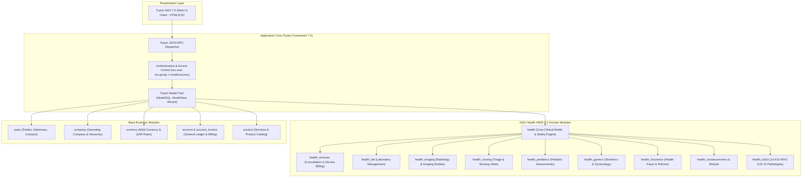

# 02. System Architecture Specification

**Project**: Healthcare Management System — GNU Health Implementation  
**Assessment Date**: 2026-09-21  
**Architecture Status**: `VERIFIED ON LIVE RUNTIME`  
**Document**: `docs/02-System-Architecture.md` (and `02_ACTUAL_ARCHITECTURE.md`)  

---

## 1. Infrastructure Architecture

The system operates on an isolated cloud-hosted virtual machine running Debian Linux on Google Cloud Platform:

```text
                                 INTERNET
                                    │
                            [Port 80 / 443]
                                    ▼
┌────────────────────────────────────────────────────────────────────────┐
│ GCP Compute Engine: gnuhealth-srv (e2-standard-2, Debian 12 Bookworm)  │
│                                                                        │
│   ┌────────────────────────────────────────────────────────────────┐   │
│   │ Nginx 1.22.1 (Reverse Proxy & Static Asset Server)             │   │
│   │ - Listens on Port 80 (HTTP)                                    │   │
│   │ - Proxies to 127.0.0.1:8000 (Tryton Application Server)        │   │
│   └───────────────────────────────┬────────────────────────────────┘   │
│                                   │ HTTP / JSON-RPC                    │
│   ┌───────────────────────────────▼────────────────────────────────┐   │
│   │ Tryton 7.0.57 Application Daemon (trytond)                     │   │
│   │ - Root Directory: /home/gnuhealth/sao (Tryton SAO Web Client)  │   │
│   │ - Python Runtime: Python 3.11.2 (virtualenv)                   │   │
│   │ - Process User: gnuhealth (Systemd: gnuhealth.service)         │   │
│   └───────────────────────────────┬────────────────────────────────┘   │
│                                   │ Unix Domain Socket                 │
│   ┌───────────────────────────────▼────────────────────────────────┐   │
│   │ PostgreSQL 15.15 RDBMS                                         │   │
│   │ - Database: gnuhealth (UTF-8, Owner: gnuhealth)                │   │
│   │ - Socket: /var/run/postgresql/.s.PGSQL.5432                    │   │
│   └────────────────────────────────────────────────────────────────┘   │
└────────────────────────────────────────────────────────────────────────┘
```

### Technical Infrastructure Specifications
- **Host VM**: GCP Compute Engine instance `gnuhealth-srv` (Zone: `europe-west4-a`).
- **Machine Type**: `e2-standard-2` (2 vCPUs, 8 GB RAM, 50 GB balanced persistent SSD).
- **External Public IP**: `34.7.237.8`.
- **Operating System**: Debian GNU/Linux 12 (Bookworm), 64-bit x86_64, Linux kernel 6.1.
- **Reverse Proxy**: Nginx 1.22.1 (`/etc/nginx/sites-available/gnuhealth`). Client max body size: 50MB.
- **Application Server Daemon**: `trytond` version 7.0.57, running under dedicated system user `gnuhealth` with systemd service unit `/etc/systemd/system/gnuhealth.service`.
- **Database Engine**: PostgreSQL 15.15 running locally; authentication via Unix peer / local socket.
- **Application Storage**: `/home/gnuhealth/attach` for document attachments and uploads.

---

## 2. Application Architecture

GNU Health HMIS 5.0 is an enterprise healthcare information system built atop the modular Tryton 7.0 application framework.



### A. Core vs. Custom Architecture
- **Upstream Core**: Upstream GNU Health 5.0.7 / Tryton 7.0.57 source preserved and repository integrity verified.
- **Custom Modules**: **Zero (0)** custom Python modules exist. The architecture avoids custom forks to ensure seamless upstream upgradeability and stability.
- **Custom Models / Views**: Configured strictly through native XML/ORM configuration mechanisms without altering source files.
- **Medical Safety Engine**: Built-in GNU Health safety verification rules enforce critical clinical safeguards (e.g. `SM-CORE-0018` for electronic prescription safety sign-off, `SM-CORE-0007` for practitioner user verification).

---

## 3. Database Architecture

The PostgreSQL database `gnuhealth` contains all operational and clinical data:

### A. Data Layer Architecture
- **PostgreSQL Schemas**: Operates within the standard `public` schema managed exclusively by Tryton's Object-Relational Mapping (ORM) engine.
- **Model-to-Table Mapping**:
  - `party.party` -> `party_party`
  - `party.address` -> `party_address`
  - `company.company` -> `company_company`
  - `currency.currency` -> `currency_currency`
  - `country.country` -> `country_country`
  - `gnuhealth.institution` -> `gnuhealth_institution`
  - `gnuhealth.hospital.unit` -> `gnuhealth_hospital_unit`
  - `gnuhealth.specialty` -> `gnuhealth_specialty`
  - `gnuhealth.pathology` -> `gnuhealth_pathology`
  - `gnuhealth.patient` -> `gnuhealth_patient`
  - `gnuhealth.healthprofessional` -> `gnuhealth_healthprofessional`
  - `gnuhealth.appointment` -> `gnuhealth_appointment`
  - `gnuhealth.patient.evaluation` -> `gnuhealth_patient_evaluation`
  - `gnuhealth.lab` -> `gnuhealth_lab`
  - `gnuhealth.imaging.test.request` -> `gnuhealth_imaging_test_request`
  - `gnuhealth.prescription.order` -> `gnuhealth_prescription_order`
  - `account.account` -> `account_account`
  - `account.invoice` -> `account_invoice`
  - `account.journal` -> `account_journal`
  - `account.fiscalyear` -> `account_fiscalyear`

### B. Database Integrity & Constraints
- **Foreign Key Constraints**: Strictly enforced at database engine level. Deleting a parent party or patient cascades or restricts according to GNU Health domain specifications.
- **Sequences**: Automated Tryton sequences manage unique document number generation (e.g., PUID MRNs, appointment numbers `APP 2026/X`, prescription numbers `PRES 2026/XXXXXX`).
- **Clean State**: Current operational tables contain **0 patient records, 0 health professional records, 0 encounter records, and 0 invoice records**.

---

## 4. Integration Architecture

### A. Real Implemented Integrations
1. **JSON-RPC Protocol**:
   - Primary communication interface between Tryton SAO web client and the `trytond` server.
   - Endpoint: `POST http://34.7.237.8/gnuhealth/`
   - Authentication: Session token passed via HTTP `Authorization: Session <base64(user:id:token)>`.
   - Protocol: Standard Tryton 7.0 JSON-RPC 2.0 variant with positional parameters: `method: "model.<name>.<method>"`, `params: [args, context_dict]`.
2. **GNU Health Federation Country Hook**:
   - `gnuhealth.federation.country.config` integrated with `party.party` to assign the Qatar country prefix (`QAT`) automatically upon person registration.

### B. Integrations NOT Present (No Evidence in Codebase)
The following integrations do **NOT** exist in the codebase and must NOT be claimed as functional:
- **No External REST API**: No FastAPI, Flask, Django, or custom REST wrapper is installed.
- **No Payment Gateway Integration**: No online credit card payment gateway (e.g. QNB, CBQ, Stripe) is implemented. Payments are processed manually as cash/POS entries.
- **No Direct Electronic Insurance Integration**: No real-time HL7 FHIR or XML insurance claim submission gateway exists. Invoicing is processed through native GNU Health internal insurance models.
- **No LIS (Laboratory Information System) Hardware Interfaces**: No ASTM/HL7 analyzers are connected. Lab results are entered manually.
- **No PACS / DICOM Server Integration**: No Orthanc or DICOM node is configured on the host VM. Imaging requisition exists as an operational tracking workflow.
- **No SMS / WhatsApp Messaging Gateway**: No SMS notification service is connected.
- **No SMTP Email Relay**: Outgoing transactional email is not configured in `trytond.conf`.
