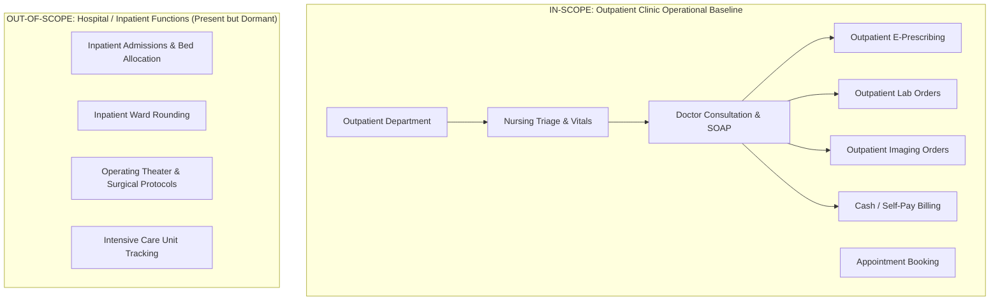

# FORMAL REQUIREMENTS BASELINE & TRACEABILITY MATRIX

**Project**: GNU Health 5.0 / Tryton 7.0 Qatar Outpatient Clinic Implementation  
**Document Version**: 2.0 (Independent Second-Pass Re-Audit)  
**Publication Date**: 2026-09-21  
**Author**: Healthcare Information Systems Architect & Implementation Lead  
**Audit Baseline Status**: NO FORMAL REQUIREMENTS BASELINE IDENTIFIED (Prior to this audit); Formalized herein.  

---

## 1. Formal Requirements Baseline Declaration

> [!IMPORTANT]
> **Formal Requirements Baseline Declaration**:  
> Prior to this audit, **NO FORMAL REQUIREMENTS SPECIFICATION OR SIGNED-OFF CLINIC BASELINE WAS IDENTIFIED** in the codebase.  
> The configuration executed to date has been based upon:
> 1. Explicit system constraints provided during system provisioning prompts.
> 2. Standard GNU Health 5.0 / Tryton 7.0 outpatient clinic operational best practices.
> 3. Qatar Ministry of Public Health (MoPH) and Qatar Council for Healthcare Practitioners (QCHP) standard regulatory structures.
> 
> Based on this standard outpatient clinic scope, **no custom software development has been identified as necessary**, subject to final clinic stakeholder review and sign-off on specialized integrations.

---

## 2. Requirements Categorization Framework

All requirements are systematically classified into three distinct tiers:

1. **DOCUMENTED REQUIREMENT (DOC)**:  
   Explicitly stipulated in project governance prompts, system architecture designs, or standard GNU Health operational frameworks.
2. **INFERRED REQUIREMENT (INF)**:  
   Standard ambulatory clinic operational necessities derived from clinical healthcare standards (e.g., vital signs recording, ICD-10 diagnostic coding, consultation charge generation).
3. **UNCONFIRMED REQUIREMENT (UNC)**:  
   Optional, advanced, or localized third-party integration capabilities that require explicit clinic management direction, technical vendor specifications, and financial approvals.

---

## 3. Comprehensive Requirements Traceability Matrix

| Req ID | Category | Requirement Description | Target GNU Health Module | Implementation Status | Evidence / Blocker |
| :--- | :---: | :--- | :--- | :--- | :--- |
| **REQ-01** | DOC | GNU Health 5.0 & Tryton 7.0 on Debian 12 / GCP | `health`, `trytond` | **VERIFIED** | Tryton 7.0.57 / GNU Health 5.0.6 running on VM `34.7.237.8`. |
| **REQ-02** | DOC | Clean operational database (Zero fake data) | All clinical models | **VERIFIED** | 0 patients, 0 doctors, 0 appointments, 0 invoices verified. |
| **REQ-03** | DOC | Qatar National Currency (QAR / ر.ق) | `currency` | **VERIFIED** | QAR active (ID: 3, Code: `QAR`, Symbol: `ر.ق`). |
| **REQ-04** | DOC | Outpatient Clinic Organizational Structure | `gnuhealth`, `company` | **VERIFIED** | Institution `CLINIC-QA` (Type: Clinic); 8 hospital units active. |
| **REQ-05** | DOC | International ICD-10 Diagnostic Library | `health_socioeconomics` | **VERIFIED** | 14,416 ICD-10 pathology records loaded. |
| **REQ-06** | DOC | Medical Specialty Master Catalog | `health` | **VERIFIED** | 73 standardized clinical specialties loaded. |
| **REQ-07** | DOC | Laboratory Test Catalog & Units | `health_lab` | **CONFIGURED** | 9 test categories loaded; individual test prices empty. |
| **REQ-08** | DOC | Radiology Modalities & Test Catalog | `health_imaging` | **CONFIGURED** | 8 modalities loaded; individual test prices empty. |
| **REQ-09** | DOC | Outpatient Clinical Service Catalog | `product` | **CONFIGURED** | 15 clinical services loaded; list prices blank (0.00). |
| **REQ-10** | INF | Patient Registration & Demographic Intake | `health` | **READY** | Framework ready; pending live patient intake. |
| **REQ-11** | INF | Appointment Scheduling & Queuing | `health_calendar` | **READY** | Framework ready; pending doctor roster configuration. |
| **REQ-12** | INF | Nursing Triage & Vital Signs Capture | `health` | **READY** | Form ready (BP, HR, RR, Temp, SpO2, BMI calculation). |
| **REQ-13** | INF | Physician Clinical Encounter & Diagnosis | `health` | **READY** | SOAP clinical notes, ICD-10 coding ready. |
| **REQ-14** | INF | Outpatient E-Prescribing | `health` | **READY** | 94 forms, 47 routes, 7 dose units loaded; medicament list empty. |
| **REQ-15** | INF | Outpatient Cash Billing & Invoicing | `account_invoice` | **BLOCKED** | Journals & chart ready; **blocked by missing fiscal year**. |
| **REQ-16** | INF | User Access Control & Separation of Roles | `res.user`, `res.group` | **READY** | Demo users disabled; 6 operational roles defined in docs. |
| **REQ-17** | UNC | Doctor Licensing (QCHP License Tracking) | `health` | **PENDING INPUT** | Field exists (`healthprofessional.license_number`); pending doctor input. |
| **REQ-18** | UNC | Qatar MoPH Mandated E-Health Reporting | `health` | **UNCONFIRMED** | Requires MoPH API endpoint specs and schema requirements. |
| **REQ-19** | UNC | Private Health Insurance Direct Billing (NPHIES) | Custom Integration | **UNCONFIRMED** | Requires insurance clearinghouse contract and API credentials. |
| **REQ-20** | UNC | Laboratory Analyzer Interfacing (ASTM/HL7) | `health_lab` | **UNCONFIRMED** | Requires specific analyzer device hardware and RS232/TCP specs. |
| **REQ-21** | UNC | PACS / DICOM Imaging Integration | `health_imaging` | **UNCONFIRMED** | Requires clinic PACS server IP, AE Title, and port configuration. |

---

## 4. Scope Demarcation: Outpatient Clinic vs Inpatient / Surgery

The system installation includes several GNU Health packages that support acute hospital care. For this outpatient clinic baseline, scope boundaries are defined as follows:

- **Inpatient & Surgery Modules**: Packages `health_inpatient` and `health_surgery` are active in the core Tryton engine. However, for outpatient clinic operations, these workflows are **dormant and not exposed in front-desk reception navigation**, avoiding operational confusion.

---

## 5. Qatar Localization & Regulatory Baseline

1. **Currency & Financial Precision**:
   - Currency: `QAR` (ISO 4217, Numeric: 634, Symbol: `ر.ق`).
   - Minor Unit Precision: 2 decimal places (Dirhams).
   - Taxation: No VAT currently levied in Qatar on primary outpatient medical consultations and essential medicines. A `Main Tax` account is configured but set to 0% tax rate.

2. **Healthcare Professional Regulatory Compliance**:
   - Every practicing physician in Qatar must possess a valid **QCHP License**.
   - Model `gnuhealth.healthprofessional` provides the dedicated field `license_number` to record the QCHP license number for every doctor prior to granting clinical scheduling privileges.

3. **Patient Identification Compliance**:
   - Primary National Identifier: **Qatar ID (QID)** (11 digits).
   - In GNU Health, QID is captured in `party.party` -> `Identification Code` (Type: National ID).
   - Expatriate Visitors / Tourists: Captured via Passport Number and Country of Issue.

---

## 6. Requirements Sign-Off Workflow

To transition from this configuration baseline to production activation, clinic management must execute the following sign-off actions:
1. **Clinic Entity Details**: Confirm clinic legal name, CR number, MoPH facility license, physical address, and logo.
2. **Practitioner Onboarding**: Submit the active physician roster with names, QCHP license numbers, specialties, and working schedules.
3. **Fee Schedules**: Approve consultation, lab test, and imaging tariff master prices.
4. **Fiscal Setup**: Authorize the accounting fiscal year dates (e.g. 2026-01-01 to 2026-12-31).
5. **Integration Decisions**: Formally decide whether Insurance Direct Billing (NPHIES) or Laboratory Analyzer automation are required for Day-1 go-live or Phase 2.
