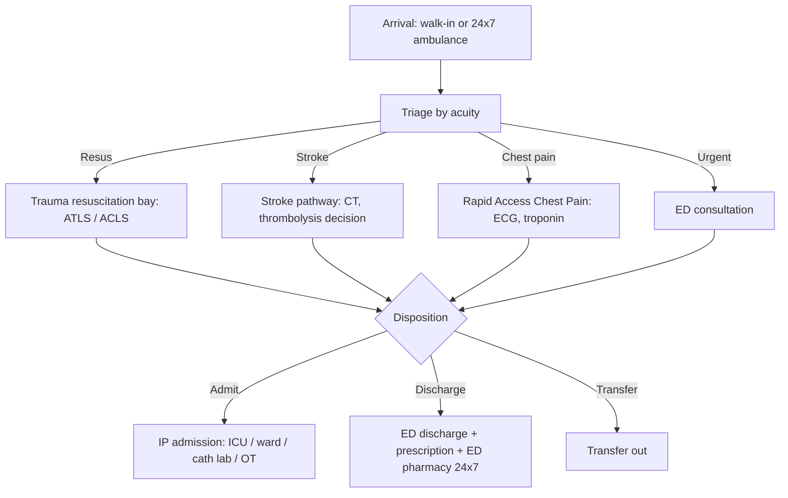
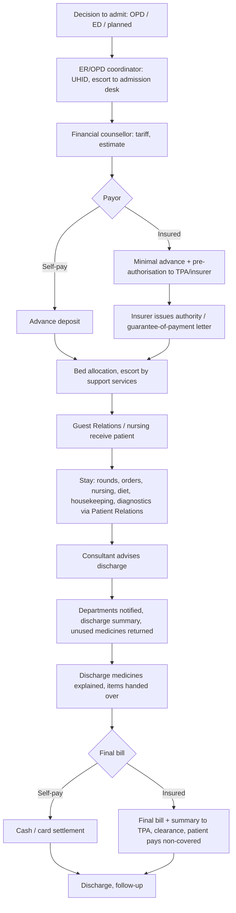
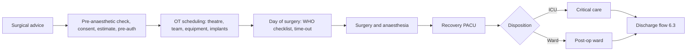
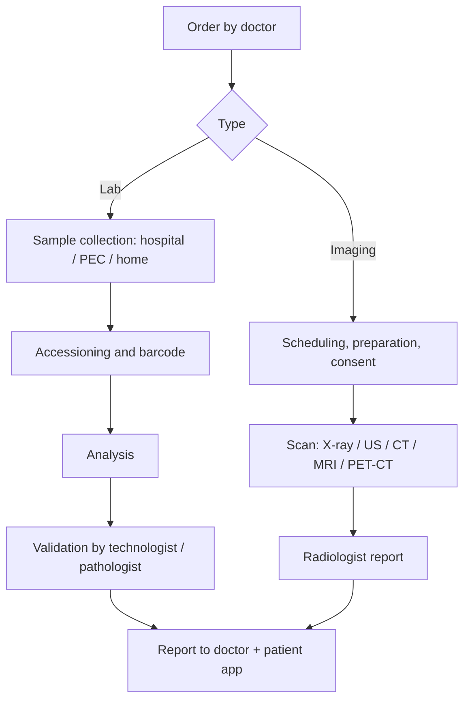
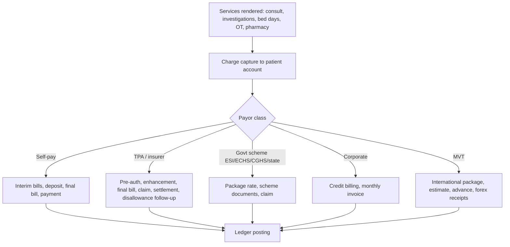
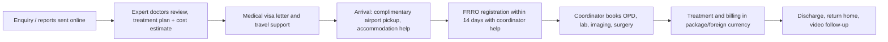

# Aster hospital group: operating structure, services and process flows
### Research report and build specification for a GNU Health demo

Prepared 2026-10-01 from public sources. **Read section 0 first: it states what is and is not known.**

---

## 0. How to read this report (scope and confidence)

**What this is.** A structured description of how the Aster hospital group is organised and how a patient moves through
its hospitals, written so it can be turned into demo data and demo workflows in GNU Health.

**What it is not.** Aster's internal SOPs, tariffs, doctor contracts and HIS configuration are not public. Where the
public record stops, this report says so and fills the gap with *standard Indian tertiary-hospital practice*, clearly
labelled. Nothing here is Aster-confidential, and none of the data may be presented as Aster's real tariffs, rosters
or patients.

**Confidence tags used throughout**

| Tag | Meaning |
|---|---|
| **[S]** | Stated by Aster in its own filings, investor deck or website (sources in section 11) |
| **[P]** | Reported by press, analysts or a rating agency (HDFC Securities, ICRA, news) |
| **[I]** | Inferred, or standard hospital practice in India. *Not* published by Aster. Validate before relying on it |
| **[D]** | A demo design decision made for this build. Change freely |

**Two entities called "Aster".** Since 3 April 2024 the listed company covers **India only**; the Gulf (GCC) business was
segregated into a separate entity **[S]**. In 2025-26 the Indian listed company merged with Quality Care India (CARE
Hospitals, KIMS Health, Evercare) and now trades as **Aster DM Quality Care Ltd** **[S][P]**. This report treats **Aster
India** as the primary model (richest public data) and gives the **GCC** operation a shorter section for completeness.

**Figures differ by source and date.** Aster India's own website lists nominal bed counts that are higher than the
investor deck's census figures (sections 3.2, 10). The report keeps both and says which to use for what.

---

## 1. Group structure

### 1.1 Corporate timeline and entities
- Founded **1987** by Dr Azad Moopen as a single clinic (Al Rafa Poly Clinic, Bur Dubai); India operations started
  **2001 in Kerala** **[S]**. Founder: Chairman and Managing Director **[S]**.
- **April 2024:** GCC and India segregated; the listed entity is India-only **[S]**.
- **2025-26:** merger with Quality Care India (CARE Hospitals, KIMS Health, Evercare). Combined network: **39 hospitals,
  10,600+ beds, 45,000+ professionals, 28 cities, 9 states, 7,400+ doctors, 7.7M+ patients a year**; headquarters in
  Hyderabad **[S]**. Analysts expect 14,000+ beds within 2-3 years and 10-15% EBITDA synergies; QCIL runs a
  **cluster-based management model** **[P]**.
- Subsidiaries of note (ICRA): Malabar Institute of Medical Sciences Ltd (MIMS, 79% held), Aster Clinical Lab LLP (100%),
  Alfaone Retail Pharmacies Pvt Ltd (48%, equity-accounted; runs the pharmacies under an Aster brand licence) **[P]**.

### 1.2 Business segments (Aster India, H1 FY25, 30 Sep 2024) **[S]**

| Segment | Footprint | Share of revenue | Operating EBITDA margin |
|---|---|---|---|
| **Hospitals and clinics** (core) | 19 hospitals (incl. 4 asset-light O&M hospitals = 539 beds), 13 clinics, 4,994 capacity beds | 94% | 22.4% |
| **Labs and pharmacies** (growth) | 232 labs and Patient Experience Centres (PECs), 212 pharmacies | 6% | 2.5% |
| **Total India** | 15 cities, 5 states, **476 facilities** | INR 2,088 cr for H1 (+18% YoY) | 19.6% |

Later figures: ICRA (mid-2025) cites 19 hospitals, 10 clinics, 203 pharmacies and **259 labs** and 5,197 beds at 30 June
2025 **[P]**; capacity reached 5,449 beds in FY26 per press **[P]**.

### 1.3 How the hospitals are held and run **[S]** unless tagged
- **Ownership models:** *Owned*, *Leased* and **O&M asset-light** (Aster operates a hospital for a fee; four such hospitals,
  539 beds). The growth plan leans on brownfield additions and leased or O&M sites.
- **Maturity bands (H1 FY25):** hospitals open more than 6 years (10 hospitals, 70% of beds, ARPOB INR 45,100, 69%
  occupancy, 24.6% EBITDA, ROCE 32%); 3-6 years (Aster RV, MIMS Kannur: 85% occupancy); 0-3 years (Mother Areekode,
  Whitefield Women and Children, Narayanadri, Ramesh (IB), G Madegowda, PMF: 60% occupancy, margins still ramping).
- **Cluster management:** three clusters (Kerala; Karnataka and Maharashtra; Andhra and Telangana), each reported on
  its own occupancy, ARPOB, ALOS and EBITDA (section 3.3).
- **Doctor remuneration (inference [I]):** "Doctors cost" is a separate P&L line (INR 462 cr of INR 2,088 cr revenue,
  22%) distinct from employee cost (INR 384 cr), which points to fee-share or revenue-share arrangements for
  consultants rather than salary alone. Billing therefore needs a **per-doctor fee attribution**.
- **Shared services (inferred from the roles named in filings [I]):** central CRM (11,800 doctors onboarded at QCIL **[P]**),
  group CHRO, digital health function (a dedicated CEO, Aster Digital Health **[S]**), medical value travel (MVT)
  organisation (restructured, per HDFC **[P]**), Aster Academy for training (GDA programme **[S]**), Aster Volunteers (CSR) **[S]**.

### 1.4 Brands and patient-facing channels
| Channel | What it is |
|---|---|
| **Aster / MIMS / Ramesh / Prime / PMF / Aadhar / CMI / RV** hospitals | Multispecialty hospitals, mostly branded "Aster ..." **[S]** |
| **Aster Clinics** | Primary-care clinics, 13 in India **[S]** |
| **Aster Labs** | Diagnostic labs and PECs, **NABL-accredited (ISO 15189) since April 2020**, 2,500+ tests, home collection **[S]** |
| **Aster Pharmacy** | 212 India pharmacies run by Alfaone under brand licence **[S]**; hospital pharmacies are separate |
| **Aster@Home / Home care** | Home sample collection and home healthcare, e.g. "Lab Tests@Home" at Medcity **[S]** |
| **OneAster** and **Aster Health** apps | Appointment booking, health records, e-consultation, payments, reminders **[S]** |
| **Aster Volunteers** | Mobile medical units (21 in H1 FY25), 1,962 camps, ~135k beneficiaries; subsidised dialysis in Kerala; tele-medicine centres (AVCMS) in Rajasthan **[S]** |

---

## 2. Geography: clusters and hospitals

### 2.1 Clusters (H1 FY25 investor deck, 30 Sep 2024) **[S]**

| Cluster | States and hospitals | Capacity beds | Census beds | ARPOB (INR/day) | ALOS (days) | IP visits | OP visits | Revenue share |
|---|---|---|---|---|---|---|---|---|
| **Kerala** | 6 hospitals | 2,501 | 1,898 | 41,200+ | 3.1 | 82,900+ | ~1.10 M | 54% |
| **Karnataka and Maharashtra** | Karnataka 4 (1,192 beds) + Maharashtra 1 (254 beds) | 1,446 | 1,010 | 58,600+ | 3.1 | 37,980+ | ~0.39 M | 34% |
| **Andhra and Telangana** | Andhra Pradesh 6 (889 beds) + Telangana 1 (158 beds) | 1,047 | 781 | 29,100+ | 3.9 | 20,130+ | ~0.19 M | 12% |
| **Total** | 15 cities, 5 states | **4,994** | **3,689** | **43,600+** | **3.2** | **140,970** | **1.70 M** | 100% |

"Census beds" are staffed and operational; "non-census" (1,124 beds) are capacity not counted in occupancy
(e.g. day care, dialysis, observation); 181 beds were still available to commission. Occupancy is measured on census beds.

### 2.2 Hospital roster
Beds below are the **website's nominal figures** unless marked; the deck's cluster totals are lower because they are
census/at-date figures. See `data/facilities.csv` for the machine-readable roster.

| Cluster | Hospital | City | Nominal beds | Notes |
|---|---|---|---|---|
| Kerala | **Aster Medcity** | Kochi | 800 (700 inpatient + 100 day care) | Flagship; **14 centres of excellence**; JCI, NABH, NABL, Green OT; ECMO; PET-CT; multi-organ transplant; 5,000+ robotic procedures; Level-1 trauma ED **[S]** |
| Kerala | Aster MIMS | Calicut | 673 | 131 doctors, 30 specialisations **[S]** |
| Kerala | Aster MIMS | Kannur | 300 | 97 doctors, 26 specialisations; 100 beds added Q2 FY25 **[S]** |
| Kerala | Aster MIMS | Kottakkal | 200 | **[S]** |
| Kerala | Aster PMF | Kollam | 100 | 55 doctors **[S]** |
| Kerala | Aster Mother | Areekode | n/a | 0-3 year hospital **[S]** |
| Kerala (pipeline) | Aster MIMS | Kasaragod | 150 | Under construction (FY26) **[S]** |
| Karnataka | **Aster CMI** | Bangalore | ~500 | 38+ specialities; JCI, NABH, NABH Nursing; first South-India NABH **Digital Platinum** **[S]** |
| Karnataka | Aster RV | Bangalore | 250 | 26 specialisations **[S]** |
| Karnataka | Aster Whitefield | Bangalore | n/a | Block D under construction **[S]** |
| Karnataka | Aster Women and Children | Bangalore | 49 | **[S]** |
| Karnataka | Aster G Madegowda | (Karnataka) | n/a | 0-3 year hospital **[S]** |
| Maharashtra | Aster Aadhar | Kolhapur | 157 | 55 doctors, 31 specialisations; deck shows 254 beds for the state **[S]** |
| Andhra Pradesh | **Aster Ramesh** (Main Centre, MG Road/Labbipet) | Vijayawada | 150 + 50 | **[S]** |
| Andhra Pradesh | Aster Ramesh | Guntur | 350 | **[S]** |
| Andhra Pradesh | Aster Ramesh | Ongole | 150 | New, in construction at deck date **[S]** |
| Andhra Pradesh | Aster Narayanadri | Tirupati | n/a | 0-3 year hospital **[S]** |
| Andhra Pradesh | Ramesh Sanghamitra, Ramesh Adiran (IB) | (AP) | n/a | Named in the deck's cluster slide **[S]** |
| Telangana | Aster Prime | Hyderabad (Ameerpet) | 204 (deck: 158) | Aster Women and Children Hyderabad (300 beds) planned **[S]** |

**Pipeline:** about 1,800 beds by FY27 (Medcity Tower 4, Whitefield block D, Ramesh Ongole, MIMS Kasaragod, MIMS Calicut
extension, Aster Women and Children Hyderabad, CMI, Medcity PMR block, Aster Capital Trivandrum) **[S]**.

### 2.3 Gulf (GCC) operation, for completeness **[S]**
Pre-segregation: 15 hospitals, ~126-128 clinics, ~338-345 pharmacies, across UAE, Oman, Qatar, Saudi Arabia, Bahrain
(and pharmacies in Jordan and Kuwait). Three brands: **Aster** (mid), **Medcare** (premium) and **Access** (value clinics,
launched 2013). UAE: Aster Hospital Mankhool (100 beds, 5 ORs, 5 ICU, NICU), Al Qusais (150 beds, 36 specialities,
5 OTs, cath lab, 10-bed ICU, 9-bed NICU, 10-bed ED, 4-bed dialysis), Sharjah (4 OTs, 7 NICU, 7-bed critical care),
Cedars Jebel Ali (50+ beds); Medcare hospitals (e.g. Women and Children, Orthopaedics and Spine, Royal Specialty);
50+ Aster Clinics and 170+ pharmacies in the Emirates. The GCC patient app is **myAster**. *Regulators there differ
(DHA/DoH/MOHAP, Dubai insurance rules); model GCC separately if a GCC demo is needed.*

---

## 3. Service model

### 3.1 Service lines and revenue weights (hospitals and clinics, H1 FY25) **[S]**

| Service line | Revenue share |
|---|---|
| Multi-speciality (general medicine, surgery, ENT, etc.) | 18% |
| Cardiac sciences | 14% |
| Neurosciences | 11% |
| Oncology | 10% |
| Gastroenterology and integrated liver care | 8% |
| Orthopaedics | 7% |
| Nephrology and urology | 7% |
| Women's health | 6% |
| Child and adolescent health | 6% |
| OP pharmacy, anaesthesiology and other | 13% |

**57% of revenue is "niche" specialties** (cardiac, neuro, oncology, liver, nephrology/urology, orthopaedics) **[S]**.
Strategy: grow niche and high-end procedures to lift ARPOB; build the continuity-of-care ecosystem (labs, pharmacies,
home care); lean on technology **[S]**.

### 3.2 Clinical capability (public claims) **[S]**
- **Transplant and robotics:** 500+ transplants and 1,600+ robotic surgeries in the trailing 12 months; Medcity
  multi-organ transplant (kidney, liver, bone marrow) and 5,000+ robotic procedures; paediatric kidney transplant
  with very low age/weight cut-offs; Deep Brain Stimulation among India's top 3 centres.
- **Critical care and emergency:** PICU, NICU, ECMO; Level-1 trauma ED with resuscitation bay; 24x7 stroke unit;
  Rapid Access Chest Pain Clinic in the ED; ACLS/ATLS/PALS-certified staff; 24x7 ambulance; dedicated 24x7 ED pharmacy.
- **Diagnostics:** PET-CT, MRI, CT, interventional radiology and neuroradiology, cath labs; blood bank; NABL lab.
- **Quality:** JCI, NABH, NABL, NABH Nursing, NABH Digital Platinum (CMI), Green OT (Medcity).

### 3.3 Service channels
OPD (in person and video), emergency, inpatient and day care, health-check packages, corporate health, international
patients (MVT), home care and home sample collection, tele-medicine, e-pharmacy, mobile medical units.

### 3.4 Payor mix (hospitals and clinics, H1 FY25) **[S]**

| Payor class | Share | Notes |
|---|---|---|
| Walk-in (self-pay cash/card) | 58% | |
| TPA / insurance | 30% | Rising (27% a year earlier); HDFC puts cash + insurance at ~85% for FY25 **[P]** |
| Medical value travel (MVT) | 4% | International patients |
| ESI / ECHS / CGHS | 3% | Central government schemes; lower tariff |
| Corporate | 2% | |
| State / central schemes | 2% | |
| Others | 1% | |

Scheme business "comes at a much lower tariff" **[P]**, so payor class must change the price list in the demo.

---

## 4. Operating metrics (use these to calibrate synthetic volumes)

| Metric | Value | Basis |
|---|---|---|
| Occupancy (census beds) | 69% overall (hospitals >6 yrs old 69%; 3-6 yrs 85%; 0-3 yrs 60%); cluster occupancy is not published | H1 FY25 **[S]** |
| ALOS | 3.2 days (Kerala 3.1, K'taka/Maha 3.1, AP/Telangana 3.9) | H1 FY25 **[S]** |
| ARPOB | INR 43,600+/day (cluster range 29,100 to 58,600) | H1 FY25 **[S]** |
| Admissions | 140,970 in H1 (~770/day group-wide) | **[S]** |
| OPD visits | 1.70 M in H1 (~9,300/day group-wide) | **[S]** |
| Avg occupied beds | 2,491 | **[S]** |
| Patients served (merged group) | 7.7 M a year | **[S]** |
| Cost structure (H1 FY25) | Material 22%, doctors 22%, employees 18%, other 18%, operating EBITDA 20% | **[S]** derived |
| Cash conversion cycle | ~10 days | Q1 FY26 **[P]** |

**Derived per-hospital throughput (model, [I]):** a hospital's daily admissions ≈ occupied beds / ALOS. Medcity
(~800 beds at ~69% in the Kerala cluster) ≈ 550 occupied beds ≈ **~175 admissions and ~2,100 OPD visits a day**
(assuming it carries volume in proportion to its beds). Section 9 turns this into scaled demo numbers.

---

## 5. Roles and organisation inside a hospital
Public sources name only senior titles, so the structure below is the **standard tertiary-hospital model [I]**, with
the named Aster elements tagged.

| Function | Typical roles | GNU Health user group (`res.group`) |
|---|---|---|
| Leadership | Hospital CEO / Cluster head, Medical Director, Chief of Nursing, Quality head (NABH/JCI) | Health Administration |
| Consultants | Specialist consultants by department (fee-share model **[I]**), residents, interns | Health Doctor |
| Nursing | Nursing superintendent, ward/ICU/OT nurses, triage nurses | Health Nurse |
| Front office | UHID/registration, appointment desk, **Patient Relations / Guest Relations** **[S]**, **Financial Counsellor** **[S]**, admission desk | Health Front Desk |
| Insurance desk | **Insurance desk** and TPA coordinators **[S]** | Account / Front Desk |
| Diagnostics | Lab technologists, pathologists, radiographers, radiologists, blood bank | Health Lab / Health Imaging |
| Pharmacy | Pharmacists (OP, IP, ED 24x7 **[S]**) | (Health Doctor / Account) |
| Billing and finance | Cashier, billing executives, accountants, insurance claims | Account |
| Support | Housekeeping, F&B, transport, security (coordinated by Patient Relations **[S]**) | n/a |
| International | International patient coordinators **[S]** | Front Desk |
| Digital | Aster Digital Health team **[S]** | n/a |

The application maps Tryton groups to personas in `frontend/src/lib/access-control.ts` (`reception`, `nursing`, `physician`,
`lab`, `radiology`, `cashier`, `accountant`, `admin`). Aster's roles above collapse into those eight personas.

---

## 6. Operational process flows

Each flow lists: steps, actors, documents, timings, then the **GNU Health mapping** (native / partial / gap).
Mermaid diagrams render on GitHub and most Markdown viewers.

### 6.1 Outpatient (OPD) visit

| # | Step | Actor | Output | Source / note |
|---|---|---|---|---|
| 1 | Appointment (app, web, phone) or walk-in | Patient, appointment desk | Appointment | OneAster books appointments, e-consults **[S]** |
| 2 | Registration; **unique ID (UHID)** assigned by ER/OPD coordinator | Registration | UHID, demographics, ID proof | UHID assignment **[S]** |
| 3 | Payor and eligibility check | Front desk / insurance desk | Payor class | **[I]** |
| 4 | Triage: vitals, complaint | Nurse | Vitals, acuity | **[I]** |
| 5 | Consultation | Consultant | Evaluation note, ICD-10 diagnosis | **[I]** |
| 6 | Investigations ordered; results returned | Doctor, lab, radiology | Orders, reports | **[I]** |
| 7 | Prescription | Doctor | Rx | **[I]** |
| 8 | Billing and payment (cash/card/UPI; or insurer) | Cashier | Invoice, receipt | **[I]** |
| 9 | Pharmacy dispensing | Pharmacist | Dispensed items | **[I]** |
| 10 | Follow-up (in person or **video consultation**) | Doctor | Next appointment | video follow-up **[S]** |

**GNU Health mapping**
- Registration: `party.party` + `gnuhealth.patient` (PUID = UHID). *Native.*
- Appointment: `gnuhealth.appointment` (professional, specialty, institution, date, state). *Native.*
- Consultation: `gnuhealth.patient.evaluation` with diagnosis from `gnuhealth.pathology` (ICD-10). *Native.*
- Orders: `gnuhealth.patient.lab.test` and `gnuhealth.lab` (results with `gnuhealth.lab.test_type`/criteria);
  `gnuhealth.imaging.test.request` and `...result`. *Native.*
- Prescription: `gnuhealth.prescription.order`/`.line` with `gnuhealth.medicament`. *Native.*
- Billing: `account.invoice` and `account.invoice.line` with `product.product` services, paid through the
  `account.invoice.pay` wizard (the app already does this). *Native.*
- Payor class per visit and per-doctor fee attribution: *Partial* (use insurance/plan party on the invoice; doctor fee
  as a product line or note; a revenue-share ledger is a gap).

### 6.2 Emergency (ED)

**[S]** for Level-1 trauma bay, 24x7 stroke unit, Rapid Access Chest Pain Clinic, ACLS/ATLS/PALS staff, ambulance and
24x7 ED pharmacy. Steps inside each pathway are standard **[I]** (e.g. door-to-needle for stroke, door-to-balloon for STEMI).

*GNU Health:* ED visit as `gnuhealth.patient.evaluation` (urgency/priority fields) then `gnuhealth.inpatient.registration`
when admitted. A formal triage-acuity queue and time-stamped pathway milestones are *Partial/Gap* (use evaluation
fields and a documented convention).

### 6.3 Inpatient admission, stay and discharge (with cashless insurance)

| Step | Detail | Source |
|---|---|---|
| ID and escort | ER/OPD coordinator assigns **UHID**; assistant escorts patient to the admission desk | **[S]** |
| Financial counselling | Counsellor explains procedure and room tariff for the categories, gives a cost **estimate** | **[S]** |
| Insured patients | **Minimal advance**; **pre-authorisation request** sent to the insurer/TPA in its prescribed format | **[S]** |
| Authority letter | TPA/insurer issues the **authority letter (Guarantee of Payment)** per policy cover; the hospital will not extend credit without it | **[S]** |
| Bed allocation | Support services escorts the patient to the allocated bed; Guest Relations/nursing receive | **[S]** |
| In-stay coordination | **Patient Relations** coordinates food and beverage, housekeeping, diagnostics | **[S]** |
| Discharge start | Starts after **consultant** advises discharge; nurse/Guest Relations initiates; departments notified | **[S]** |
| Discharge paperwork | Summary prepared; unused medicines returned; discharge medicines explained; items handed over | **[S]** |
| Final settlement | Cash/card, or final bill + summary to TPA for clearance coordinated by Patient Relations | **[S]** |
| **Timing** | Discharge takes **2-6 hours** (cash vs insurance); TPA reply takes **at least ~4 hours** after the summary and bill | **[S]** |
| Room categories | General ward, semi-private, private, deluxe/suite, ICU (names and price bands are not published) | **[I]** |

*GNU Health:* `gnuhealth.inpatient.registration` (patient, bed, ward, institution, admission/discharge, discharge
reason) with `gnuhealth.hospital.ward` and `gnuhealth.hospital.bed`; nursing and ICU modules where installed.
**Gap:** TPA pre-authorisation, authority-letter amount, claim status and discharge-to-clearance tracking are not native.
Model them as a documented extension (a small custom model linked to the registration and invoice, or invoice
states plus notes) and keep the *insurer as the invoice party* for cashless cases (`gnuhealth.insurance` holds the
patient's policy). Do not invent a parallel accounting store.

### 6.4 Surgery and procedures (OT)

**[S]:** robotic surgery at scale (1,600+ in 12 months), multi-organ transplant, Green OT certification. The sequence above
is standard **[I]**; transplants additionally follow national organ-donation law and a transplant-committee
authorisation **[I]**.

*GNU Health:* `gnuhealth.surgery` with `gnuhealth.hospital.or` (operating room), surgeon/anaesthetist, procedure from
`gnuhealth.procedure`; `gnuhealth.patient.procedure` for the record. *Native.* Implants/consumables billing and
instrument counts are *Partial/Gap* (products on the invoice).

### 6.5 Diagnostics: laboratory and imaging

**[S]:** Aster Labs (NABL ISO 15189, 2,500+ tests, 232 labs and PECs, home collection, reports as PDF in the Aster Labs
app, prescription upload and test scheduling in the app); hospital imaging incl. PET-CT, MRI, CT, interventional
radiology, cath labs. Turnaround targets are **[I]**.

*GNU Health:* lab = `gnuhealth.patient.lab.test` request, `gnuhealth.lab` result, `gnuhealth.lab.test_type` with
`gnuhealth.lab.test.critearea` analytes; imaging = `gnuhealth.imaging.test.request`/`.result` over
`gnuhealth.imaging.test` catalogue. *Native.* Home collection routing and PEC network are *Gap* (model as a collection
location/source on the request).

### 6.6 Pharmacy (outpatient, inpatient, emergency, retail)
Sub-flows: OP prescription dispensing; IP medication issue against orders; **24x7 ED pharmacy [S]**; retail Aster
Pharmacy for continuing care (separate entity, 212 pharmacies **[S]**); e-pharmacy via the apps **[S]**. Controlled drugs
follow Schedule H/H1/X and narcotics rules **[I]**.

*GNU Health:* `gnuhealth.medicament` (+ `product.product`), prescriptions as above. Stock, batches/expiry and
returns need the stock module (check it is installed) or are *Partial*. The repo already seeds a formulary
(`scripts/seed_medicament_formulary.py`, `seed_medical_test_catalogs.py`).

### 6.7 Billing, insurance and schemes

Facts: TPA/insurance 30% of revenue, walk-in 58%, MVT 4%, ESI/ECHS/CGHS 3%, corporate 2% **[S]**; ~10-day cash
conversion cycle **[P]**. Pre-auth and guarantee-of-payment are described in 6.3 **[S]**. Package rates for schemes,
disallowances and receivable ageing are **[I]**.

*GNU Health:* invoices in `account.invoice`, lines on `product.product`, moves in `account.move`; the app's billing screen
and ledger already work. **Gaps for a credible demo:** payor-specific price lists, TPA claim lifecycle and receivable
ageing by insurer, doctor fee-share statements. Plan them as configuration (price lists per payor party) plus a small,
clearly separated extension, not a shadow ledger.

### 6.8 International patients (medical value travel)

All steps **[S]** (Aster Medcity international patients page). MVT is 4% of revenue **[S]**.
*GNU Health:* patient nationality/country on `party.party`, visa/FRRO dates as notes or custom fields (*Gap*), coordinator
as a role; estimate to invoice flow reuses 6.7.

### 6.9 Health-check packages and corporate health
Packages (executive, cardiac, diabetic, women's etc.) are offered at hospitals and labs and as corporate partnerships
**[S]**; contents and prices vary by site **[I]**. *GNU Health:* represent a package as a bundle of `product.product`
services invoiced together, with the component tests ordered as lab/imaging requests. *Partial.*

### 6.10 Home care and digital channels
Home sample collection ("Aster@Home", Lab Tests@Home) **[S]**; OneAster and Aster Health apps for booking, records,
e-consultation, payments, reminders **[S]**; standalone tele-medicine centres (AVCMS) **[S]**. *GNU Health:* the
Next.js front end is the staff and patient-facing layer; online booking creates `gnuhealth.appointment`. Payment gateway,
app login and reminders are out of scope for the demo (*Gap*, simulated).

### 6.11 Supporting flows (standard, for completeness) **[I]**
Blood bank and transfusion; central sterile supply; dietary; housekeeping and bio-medical waste; biomedical engineering;
infection control; medical records and ABDM linking; quality (NABH indicators); materials and stores; HR and
credentialing. None are needed for a first demo; list them as "out of scope, referenced".

---

## 7. Regulatory hooks that shape the flows (India) **[I]**
General knowledge, not Aster-specific; verify with Aster's compliance team before showing them as facts.

| Area | Why it matters for the flow |
|---|---|
| NABH / JCI / NABL standards | Consent, patient identification, handover, indicators; shapes forms and audit trail |
| ABDM (ABHA ID, health facility and professional registries) | Optional ABHA capture at registration; record linking |
| Ayushman Bharat PM-JAY, CGHS/ECHS/ESI | Package-rate billing and claim documents for scheme patients |
| Telemedicine practice guidelines | Video consult records and prescriptions |
| Transplantation of Human Organs and Tissues Act | Transplant authorisation and donor records |
| PCPNDT, MTP Acts | Restrictions on fetal sex disclosure; reporting for terminations |
| Drugs rules (Schedule H/H1/X), narcotics | Dispensing records for controlled drugs |
| Bio-medical waste rules | Waste segregation logs (out of scope for demo) |
| GST on healthcare | Tax treatment per service (mostly exempt for clinical care, taxable for some items) |
| Digital personal data protection law | Consent, retention, access logging for synthetic-or-real data |

---

## 8. Mapping to GNU Health (summary)

Verified against the models this system already uses (`frontend/src`), except where marked "check".

| Aster process element | GNU Health model(s) | Fit |
|---|---|---|
| Hospital / institution | `gnuhealth.institution`; one **database per hospital** (see `docs/TENANT_ONBOARDING.md`) | Native |
| Wards, beds, operating rooms | `gnuhealth.hospital.ward`, `.bed`, `.or` | Native |
| Departments / specialities | `gnuhealth.specialty`, `gnuhealth.hp_specialty` | Native |
| Doctors, nurses | `gnuhealth.healthprofessional` (+ `party.party`, `res.user`, groups) | Native |
| Patient + UHID | `party.party`, `gnuhealth.patient` (PUID) | Native |
| Appointment | `gnuhealth.appointment` | Native |
| Consultation / ED note | `gnuhealth.patient.evaluation`, `gnuhealth.pathology` (ICD-10) | Native |
| Lab | `gnuhealth.lab.test_type`, `gnuhealth.patient.lab.test`, `gnuhealth.lab` | Native |
| Imaging | `gnuhealth.imaging.test`, `.test.request`, `.test.result` | Native |
| Prescription / formulary | `gnuhealth.prescription.order/.line`, `gnuhealth.medicament` | Native |
| Inpatient stay | `gnuhealth.inpatient.registration` | Native |
| Surgery | `gnuhealth.surgery`, `gnuhealth.procedure`, `gnuhealth.patient.procedure` | Native |
| Insurance policy | `gnuhealth.insurance` | Native |
| Billing and ledger | `account.invoice/.line`, `account.move`, `product.product` | Native |
| Obstetrics, paediatrics | `gnuhealth.patient.pregnancy` etc.; paediatrics/NICU module (check installed) | Native/check |
| ICU / nursing charts | ICU and nursing modules (check installed on the VM) | Check |
| Pharmacy stock | stock module (check installed) | Check |
| TPA pre-auth and claim lifecycle | none | **Gap** |
| Payor-specific price lists | `product.price_list` configuration (check) | Partial |
| Doctor fee-share statements | none | **Gap** |
| Packages (health checks) | product bundles | Partial |
| MVT / visa / FRRO | notes or custom fields | **Gap** |
| Home collection routing, PEC network | request source/location | **Gap** |

**Directive reminder (CLAUDE.md):** all business logic dispatches to native Tryton models; seed files in this folder are
*inputs to loader scripts*, not a parallel store; use synthetic identities only (e.g. "Alexander Wright"); never touch
real patient records.

---

## 9. Demo build specification

### 9.1 What to build
Three demo hospitals (one per cluster) as three tenants, each seeded at scale and populated with synthetic
activity, so a viewer sees a realistic group:

| Demo tenant code | Models real hospital | Cluster | Nominal beds (real) | Demo beds ([D] 1:10) |
|---|---|---|---|---|
| `astermedcity` | Aster Medcity, Kochi | Kerala | 800 | 80 |
| `asterblr` | Aster CMI, Bangalore | Karnataka | ~500 | 50 |
| `asterhyd` | Aster Prime, Hyderabad | Andhra and Telangana | 204 | 20 |

Create them through the Platform screen (one-click provisioning, `docs/TENANT_ONBOARDING.md`), then run seed loaders per
database. *Using Aster's real hospital names is a branding decision: confirm Aster agrees before any external demo.*

### 9.2 Scale and generator parameters ([I]/[D], derived from section 4)
| Parameter | Value | Derivation |
|---|---|---|
| Bed scale | 1:10 | [D] |
| Occupancy target | 69% (Hyd 60% as a younger unit) | **[S]** |
| ALOS | 3.1 (Kerala, K'taka), 3.9 (Hyd); draw from a right-skewed distribution (e.g. lognormal, cap 21 days) | **[S]** + [D] |
| Admissions/day | occupied beds / ALOS (Medcity demo ≈ 18 admissions and ~215 OPD visits per day) | derived |
| OPD visits/day | admissions/day × ~12 (group ratio 1.70 M OP : 141 k IP = 12.1) | **[S]** ratio |
| Specialty weights | section 3.1 | **[S]** |
| Payor weights | section 3.4 | **[S]** |
| ARPOB | INR 41,200 (Medcity), 58,600 (CMI), 29,100 (Prime) average revenue per occupied bed-day, as a calibration target for inpatient billing totals | **[S]** |
| Day-of-week/time shape | weekday heavy OPD, evening ED peak | [D] |

### 9.3 Seed tables delivered with this report (`docs/aster-demo/data/`)
| File | Content |
|---|---|
| `facilities.csv` | Hospital roster with cluster, nominal beds, doctors, specialisations, accreditations, source, confidence |
| `specialties.csv` | Service lines, centres of excellence and revenue weights, mapped to GNU Health specialty names |
| `payor_mix.csv` | Payor classes, weights and how to represent each in GNU Health |
| `ward_bed_template.csv` | Ward types and bed-class ratios for a tertiary hospital, with public anchor facts ([I], illustrative) |
| `kpi_baselines.csv` | Cluster and group KPIs for generator calibration |
| `journeys.json` | Ten scripted synthetic patient journeys (steps, GNU Health records, expected outcomes) |

**Everything in those files is synthetic or illustrative** except the figures marked **[S]/[P]**, which restate public data.
Tariffs are intentionally absent: any prices must be invented and labelled "illustrative".

### 9.4 Loader plan (follows the existing seed pattern)
1. Provision tenant database (Platform screen) -> clean template, admin login shown once.
2. Run existing catalogue seeds: `scripts/seed_reference_catalogs.py` (wards, beds, ORs), `seed_medicament_formulary.py`,
   `seed_medical_test_catalogs.py` (lab panels, imaging studies, vaccines).
3. New loaders to write (one script each, same pattern: run as the `gnuhealth` user with `TRYTOND_CONFIG`, one database
   at a time, query ids live, idempotent):
   - `seed_aster_institution.py` -> `gnuhealth.institution`, wards/beds/ORs from `ward_bed_template.csv` scaled by 1:10.
   - `seed_aster_staff.py` -> `party.party` + `gnuhealth.healthprofessional` + `res.user` + groups; **synthetic names only**.
   - `seed_aster_activity.py` -> appointments, evaluations, orders, prescriptions, admissions, surgeries, invoices drawn
     from the generator parameters and `journeys.json`; marks everything with a `DEMO` tag in a free-text field.
4. Verify: row counts vs targets, occupancy, ALOS, payor and specialty mix within tolerance, ledger balances.

### 9.5 Acceptance checks for the demo
- Bed census equals the demo bed count; midnight occupancy within +-5 points of target.
- Mean ALOS within 0.3 days; admissions/day within 15%.
- Specialty and payor mixes within 3 points of weights (large sample).
- Every journey in `journeys.json` can be replayed end to end by a persona using the live UI.
- No real names, IDs or tariffs; every record flagged synthetic.

---

## 10. Gaps, discrepancies and questions for Aster

**Discrepancies in public data (kept, not resolved)**
- Website nominal beds vs deck census beds (e.g. Kolhapur 157 vs Maharashtra 254; Hyderabad 204 vs Telangana 158).
- Hospital counts: 19 (deck, Sep 2024, includes Wayanad WIMS), 6 hospitals in Kerala vs 7 on the website (Kasaragod is under
  construction). Clinics 13 (Sep 2024) vs 10 (mid-2025); labs 232 vs 259; pharmacies 212 vs 203.
- Two groups of figures for the merged entity (HDFC FY25 pro forma vs company site); the company site is used for headline numbers.
- Figures for FY26 come from press summaries and should be checked against the filed results.

**Not public; ask Aster before any claim of fidelity**
1. Actual HIS/EMR vendor and module list per hospital (Aster is consolidating several HIS vendors **[P]**).
2. Tariff structure, room categories, package contents, scheme package rates.
3. Doctor remuneration and fee-share rules; consultant scheduling and slot lengths.
4. Which four hospitals are O&M asset-light, and room/bed class counts per hospital.
5. TPA/insurer empanelment list and claim SLAs; pre-auth and enhancement workflow in the HIS.
6. ED triage scale used, stroke/STEMI time targets, OT utilisation, ICU bed mix.
7. Whether the GCC entity is in scope for the demo (different regulator and payor model).

---

## 11. Sources

**Aster / company (primary)**
- Aster India investor presentation, quarter ended 30 Sep 2024 (NSE): `nsearchives.nseindia.com/corporate/ASTERDM_23102024222058_Asterinvestorpresentationq2fy25signed.pdf`
- Aster DM Quality Care Ltd corporate site: https://asterqualitycare.com/
- Aster Hospitals (India): https://www.asterhospitals.in/ , Admission and discharge: https://www.asterhospitals.in/admission-discharge , Aster Medcity Kochi: https://www.asterhospitals.in/hospitals/aster-medcity-kochi , Aster CMI Bangalore: https://www.asterhospitals.in/hospitals/aster-cmi-bangalore , Medcity international patients: https://www.asterhospitals.in/hospitals/aster-medcity-kochi/international-patients , Emergency medicine: https://www.asterhospitals.in/hospitals/aster-medcity-kochi/specialities/emergency-medicine
- Aster Labs: https://www.asterlabs.in/about-us
- Aster DM Healthcare (GCC): https://www.asterdmhealthcare.com/about-us/gcc-network , https://www.asterhospitals.ae/locations/hospital-detail/aster-hospital-al-qusais
- About Aster DM Healthcare: https://www.asterdmhealthcare.in/about-us

**Analyst, rating and press (secondary)**
- HDFC Securities, Aster DM Healthcare company update, 8 Sep 2025 (merger, payor mix, cash conversion)
- ICRA rating rationale, Aster DM Healthcare (mid-2025): https://www.icra.in/Rating/GetRationalReportFilePdf?id=138196
- Digital health: https://www.cio.com/article/191070/inside-aster-dm-s-new-patient-platform.html , https://www.digitalhealthnews.com/aster-dm-healthcare-rolls-out-phase-1-of-aster-health-app

**Repository references:** `frontend/src/lib/access-control.ts`, `docs/TENANT_ONBOARDING.md`, `scripts/seed_*.py`.
