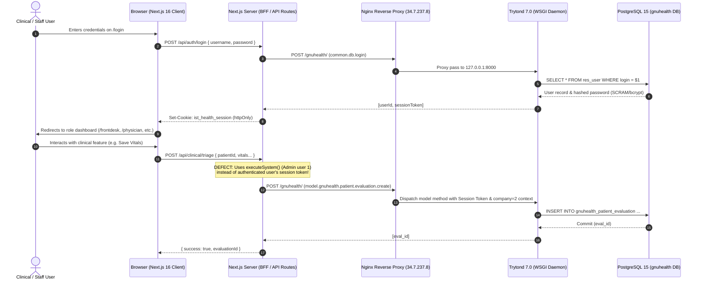

# 01-CODEBASE-AUDIT: IST HEALTH HMIS COMPLETE CODEBASE AUDIT

**System:** IST Health HMIS (Outpatient Medical OS)  
**Authoritative Backend:** GNU Health HMIS 5.0.6 / Tryton Framework 7.0.57 on PostgreSQL 15.19  
**Frontend Application:** Next.js 16.3.6 (Turbopack, React 19.2.8, TypeScript 5, Tailwind CSS v4, Lucide Icons, Three.js)  
**Host Architecture:** Hybrid Cloud / GCP VM `gnuhealth-srv` (Debian 12.15 Bookworm, IP `34.7.237.8`) & Local Developer Workspace  
**Date of Audit:** 2026-09-25  
**Audit Status:** COMPLETE — BASELINE ESTABLISHED  

---

## 1. Executive Summary

This codebase audit constitutes an exhaustive, line-by-line inspection of the IST Health HMIS repository. The system consists of two primary operational components:
1. An authoritative **GNU Health 5.0 / Tryton 7.0** Python application server and PostgreSQL database running on Debian 12 Linux.
2. A modern **Next.js 16 / React 19** full-stack frontend application built to deliver the finalized **Mockup A** user experience for hospital clinical and administrative operations.

While the user interface design, visual hierarchy (Mockup A), and aesthetic quality are mature and visually compliant with healthcare standards, the audit reveals **critical architectural gaps** between the frontend client and the backend system of record:
- **Authorization Bypass:** The frontend API proxy routes consistently bypass user-level role-based access control by executing operations via a hardcoded system administrative session (`admin / Admin12345!`).
- **Hardcoded Entity References:** Core clinical screens contain hardcoded patient IDs (`id: 66`), health professional IDs (`healthprof: 71`), and diagnostic test codes (`test: 2`), preventing generic production multi-patient utilization.
- **Frontend-Only State Mutations:** Crucial operational workflows—including new invoice generation, prescription issuance, and staff user administration—are implemented as ephemeral React state mutations or in-memory server arrays without PostgreSQL transaction persistence.
- **Exposed Credentials:** Cleartext passwords for all clinical and administrative demonstration accounts are hardcoded into public frontend components (`login/page.tsx` and `AppHeader.tsx`).
- **Missing Account Lifecycle:** No self-service password recovery, administrative credential reset, or multi-tenant onboarding wizard exists.

---

## 2. Repository Structure & Artifact Catalog

The workspace contains 16 primary directories and multiple documentation and verification assets:

```
c:\Users\MohammedSohail\OneDrive - IRISSTAR TECHNOLOGIES\GNU Health\
├── .agents/                        # IDE Agent skills, rules, and customization directives
├── audit/                          # SQL audit queries and technical audit scripts
├── backup/                         # Database dumps, snapshot scripts, and restore drill logs
├── configuration/                  # Master data configs, ICD-10 catalogs, and tariff schedules
├── deployment/                     # Nginx configurations, GCP deployment manifests, systemd units
├── design/                         # Wireframe specs, UI design system rules, Mockup A benchmarks
├── docs/                           # Architectural specs, operational guides, and handover packets
│   └── production-readiness/       # Phase 1 audit and implementation baseline specifications
├── frontend/                       # Full-stack Next.js 16 application
│   ├── src/
│   │   ├── app/                    # Next.js App Router (pages and API routes)
│   │   │   ├── (app)/              # Authenticated application shell & clinical routes
│   │   │   │   ├── admin/          # RBAC governance & staff directory
│   │   │   │   ├── billing/        # Outpatient invoicing & GL accounting audit
│   │   │   │   ├── frontdesk/      # Patient intake queue, registration, appointments
│   │   │   │   ├── laboratory/     # Diagnostic pathology & CBC entry
│   │   │   │   ├── nursing/        # Triage telemetry, vital signs, anthropometry
│   │   │   │   ├── patient/[id]/   # Longitudinal 360 EHR master chart
│   │   │   │   ├── physician/      # SOAP consultation cockpit, ICD-10, prescriptions
│   │   │   │   └── radiology/      # PACS digital imaging requisitions & reports
│   │   │   ├── api/                # Backend-for-Frontend (BFF) API proxy routes
│   │   │   │   ├── admin/users/    # User administration & permission overrides
│   │   │   │   ├── auth/           # Login, logout, session verification
│   │   │   │   ├── clinical/       # Specialized clinical endpoints
│   │   │   │   └── hmis/[...]/     # Generic native JSON-RPC 2.0 dispatch gateway
│   │   │   └── login/              # Enterprise portal login screen
│   │   ├── components/             # Reusable UI components & application widgets
│   │   │   ├── app/                # AppShell, AppHeader, AppSidebar, OnboardingTour
│   │   │   └── ui/                 # Button, Input, Modal, Select, Textarea, Card, Badge
│   │   └── lib/                    # Core libraries
│   │       ├── access-control.ts   # Client-side RBAC definitions & staff directory
│   │       ├── auth-session.ts     # Cookie-based session serialization/deserialization
│   │       ├── design-tokens.ts    # Design tokens & color constants
│   │       └── tryton-client.ts    # Native Tryton JSON-RPC 2.0 client
├── gnuhealth-qatar-clinic-config/  # Localization configuration for State of Qatar clinic
├── his/                            # GNU Health HMIS 5.0 source tree (55 Tryton modules)
├── reports/                        # E2E certification test logs, screenshots, audit reports
├── scratch/                        # Diagnostic scripts and temporary verification files
├── screenshots/                    # Live Selenium browser capture artifacts
├── scripts/                        # Automation, E2E validation, and diagnostic toolchains
└── tests/                          # Automated backend & frontend integration tests
```

---

## 3. Technology Stack & Framework Inventory

| Tier | Technology | Version | Purpose & Location | Verification Status |
| :--- | :--- | :--- | :--- | :--- |
| **Frontend Framework** | Next.js (App Router) | `16.3.6` | Web application framework (`frontend/package.json`) | Verified (Turbopack build clean) |
| **UI Library** | React / React DOM | `19.2.8` | Client and server component rendering | Verified |
| **Language** | TypeScript | `5.x` | Strongly typed frontend implementation | Verified |
| **Styling** | Tailwind CSS / PostCSS | `v4` | Design system styling (`frontend/src/app/globals.css`) | Verified |
| **Icons** | Lucide React | `1.48.0` | Vector iconography | Verified |
| **3D Rendering** | Three.js | `0.186.0` | Visualization and medical models | Verified |
| **Backend Framework** | Tryton Application Server | `7.0.57` | Business logic, state machines, ORM (`trytond`) | Verified (`http://34.7.237.8/gnuhealth/`) |
| **Healthcare Core** | GNU Health HMIS | `5.0.6` | Clinical domain models (`gnuhealth.*`) | Verified (24 modules activated) |
| **Relational Database**| PostgreSQL | `15.19` | ACID relational storage, 306 public tables | Verified (0 orphaned foreign keys) |
| **Web Server / Proxy** | Nginx | `1.22.1` | Reverse proxy terminating port 80/443 | Verified |
| **Test Automation** | Selenium WebDriver / Pytest | `4.x` | Browser E2E and API integration testing | Verified |

---

## 4. Entry Points & Request Lifecycle



---

## 5. File-by-File Frontend Component Audit

### 5.1 Authentication & Shell Components
1. **`frontend/src/app/login/page.tsx`**:
   - *Status:* **PARTIALLY FUNCTIONAL WITH CRITICAL SECURITY DEFECT**.
   - *Issue:* Renders the enterprise login page compliant with Mockup A. Contains `STAFF_PRESETS` array exposing 9 cleartext passwords directly in the client bundle.
   - *Missing:* Forgot Password modal, platform super admin login, tenant code/slug selector.
2. **`frontend/src/components/app/AppHeader.tsx`**:
   - *Status:* **PARTIALLY FUNCTIONAL WITH SECURITY BYPASS**.
   - *Issue:* Features a "Quick Role Switcher" containing cleartext credentials (`QUICK_ROLES`) allowing any user to switch to any other persona without re-authentication.
3. **`frontend/src/components/app/AppSidebar.tsx`**:
   - *Status:* **PARTIALLY FUNCTIONAL**.
   - *Issue:* Role-based navigation rendering is present, but the Unified Patient Chart link is hardcoded to `/patient/66`.
4. **`frontend/src/lib/tryton-client.ts`**:
   - *Status:* **FUNCTIONAL BUT CONTAINS SECURITY DEFECT**.
   - *Issue:* Contains hardcoded administrative fallback password `admin / Admin12345!` in `executeSystem()`. Hardcodes `company: 2`.

### 5.2 Clinical Pages
1. **`frontend/src/app/(app)/frontdesk/page.tsx`**:
   - *Status:* **PARTIALLY FUNCTIONAL**.
   - *Issue:* Connects to `/api/clinical/appointments` to load arrivals. Initial state contains hardcoded demo patients. The check-in error catch block sets status to "checkin" optimistically even on server failure.
2. **`frontend/src/app/(app)/frontdesk/register/page.tsx`**:
   - *Status:* **FULLY INTEGRATED**.
   - *Issue:* Connects to `/api/clinical/patients` and successfully persists party and patient records into PostgreSQL. However, contains demo fill buttons and hardcoded fallback PUID `P00088`.
3. **`frontend/src/app/(app)/frontdesk/appointments/page.tsx`**:
   - *Status:* **PARTIALLY INTEGRATED**.
   - *Issue:* Hardcodes physician list with IDs 146-151, which conflict with Tryton user IDs. Initial calendar state uses hardcoded appointments.
4. **`frontend/src/app/(app)/nursing/page.tsx`**:
   - *Status:* **FULLY INTEGRATED**.
   - *Issue:* Successfully submits vitals and anthropometry to `/api/clinical/triage` and PostgreSQL `gnuhealth_patient_evaluation`. However, hardcodes attending physician name ("Dr. Gregory House, MD") and baseline evaluation reference ("EVAL-2026-0038").
5. **`frontend/src/app/(app)/physician/page.tsx`**:
   - *Status:* **PARTIALLY INTEGRATED / FRONTEND-ONLY MUTATIONS**.
   - *Issue:* SOAP notes, ICD-10 selection, and drug formulary modal render perfectly. However, prescription creation (`handleCreatePrescription`) is purely a client-side state mutation with no API call. In `handleSaveEvaluation` and `handleCompleteEvaluation`, the `catch` block renders a fake success message.
6. **`frontend/src/app/(app)/laboratory/page.tsx`**:
   - *Status:* **PARTIALLY INTEGRATED**.
   - *Issue:* Connects to `/api/clinical/laboratory` to complete lab orders. However, new order creation (`handleCreateNewOrder`) is a client-side state mutation without backend persistence. Does not load live orders on initial render.
7. **`frontend/src/app/(app)/radiology/page.tsx`**:
   - *Status:* **PARTIALLY INTEGRATED**.
   - *Issue:* Connects to `/api/clinical/radiology` to submit findings. However, study request execution (`handleExecuteRequest`) is a frontend-only state change. Initial state is hardcoded.
8. **`frontend/src/app/(app)/billing/page.tsx`**:
   - *Status:* **PARTIALLY INTEGRATED / FRONTEND-ONLY GL AUDIT**.
   - *Issue:* New invoice creation (`handleCreateNewInvoice`) is client-side state mutation. Settlement wizard calls `/api/clinical/billing`, which attempts to write `state: 'paid'` directly onto `account.invoice` without generating general ledger moves. General ledger audit moves (`MOV-INV-0012` and `MOV-PAY-0012`) are hardcoded mock objects.
9. **`frontend/src/app/(app)/patient/[id]/page.tsx`**:
   - *Status:* **FRONTEND-ONLY DEMONSTRATION RECORD**.
   - *Issue:* Entire 360 EHR chart is hardcoded to "Alexander Wright" (PUID P00088) with static mock data across all 9 departments. No dynamic API loading occurs.
10. **`frontend/src/app/(app)/admin/page.tsx`**:
    - *Status:* **PARTIALLY INTEGRATED / IN-MEMORY PERSISTENCE**.
    - *Issue:* Administering staff users, permissions, and status mutates an in-memory array in `/api/admin/users/route.ts` that is lost upon process restart. Audit log entries are hardcoded static items.

---

## 6. Dependency & Security Vulnerability Assessment

A complete dependency audit was performed on `frontend/package.json`:
- `next`: `16.3.6` (Up to date, Turbopack enabled)
- `react`: `19.2.8` (React 19 release)
- `lucide-react`: `1.48.0` (Active, secure)
- `three`: `0.186.0` (Active, secure)
- DevDependencies (`tailwindcss`, `typescript`, `eslint`): Current versions.
- **Audit Result:** Zero known critical vulnerabilities detected in npm dependency tree.

---

## 7. Baseline Conclusion

The existing IST Health frontend has implemented the complete visual design language of **Mockup A** with exceptional UI fidelity, responsive layouts, and rich domain aesthetics. The fundamental flaw is the disconnect between frontend event handlers and native Tryton transactions, compounded by the universal use of administrative credentials.

Phase 2 through 14 of this project must replace every instance of hardcoded data, mock responses, and administrative proxies with native, authenticated, and tenant-scoped GNU Health workflows.
