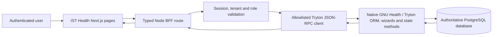

# Complete GNU Health Frontend Implementation Blueprint

**Project:** IST Health HMIS  
**Authority:** GNU Health/Tryton backend and its installed modules remain the sole system of record.  
**Purpose:** Define the audit and delivery work required to expose the agreed GNU Health backend functionality through a production-ready IST Health frontend, with native APIs and complete persisted workflows.  
**Baseline date:** 2026-09-26  
**Status:** Implementation blueprint; not a declaration of completed work or production certification.

## 1. Executive decision

The current frontend is an outpatient-focused integration, not a complete frontend for the GNU Health source tree. The workspace contains 54 directories under `his/tryton` (excluding `LICENSES`); that is a source-code inventory, not proof that each package is installed, enabled, licensed for this deployment, configured, or clinically required. The current frontend contains 13 page files and 15 Node/Next API route files. That count also does not prove which screens/actions work.

The production objective should be **complete, safe frontend coverage of every approved backend capability in the target deployment**, not a blind one-for-one clone of every model or administrative screen. If “every original GNU Health function” is truly required, each source module and every installed model/method must be inventoried and dispositioned. Features that have no approved use, required data, role, or operational owner must be explicitly deferred or excluded with sign-off. No capability can be called complete until a real user action reaches a native Tryton method, persists, is read back, obeys ACLs and state transitions, and has positive and negative test evidence.

**Current readiness based on source inspection:** not production ready for this objective. The frontend resolver defines one workspace; billing write API returns 501; test-mode lab and radiology workflows are disabled pending verification; older project documents contain conflicting completion claims; live authenticated workflows were not executed in the preceding audit.

## 2. Terms and evidence rules

- **Source package:** a directory in `his/tryton`. It may be upstream code only; it does not prove deployment or activation.
- **Installed module:** a module reported installed by the target Tryton database and verified against its actual model registry.
- **Frontend capability:** a user-facing page and actions that provide the workflow for one or more backend capabilities.
- **Node API:** a server-side IST Health BFF route. It validates identity, tenant, permissions, inputs, and invokes a bounded native Tryton operation. It does not create shadow business logic or database tables.
- **Complete workflow:** authorized action, valid native state transition, persisted result, read-after-write confirmation, audit trail, and failure/rollback behavior verified with synthetic data.
- **Evidence levels:** (1) source inspection, (2) build/static analysis, (3) authenticated API integration, (4) live browser E2E with synthetic data, (5) database integrity/accounting audit, (6) deployment/recovery evidence. Reports must label which level supports each claim.

No SQL writes are permitted for business workflows. Native Tryton ORM methods/wizards are authoritative. No real patient or posted financial records may be used as test fixtures.

## 3. Complete discovery before implementation

### 3.1 Establish the target baseline

Create a signed, timestamped environment baseline for each target environment:

1. GNU Health release, Tryton release, PostgreSQL release, OS, package/source commit hashes, and deployed frontend build ID.
2. Installed modules and versions from the live Tryton module registry, not a markdown list or source folder count.
3. Live model registry: model name, description, installed module, fields, field types/relations, required/read-only flags, selection values, domains, states, buttons/methods, constraints, and access rules.
4. Native workflow transitions and wizard/action signatures from installed code and model metadata. Never infer RPC arguments solely from labels or old examples.
5. Roles, groups, implied groups, model ACLs, record rules, company permissions, and test personas.
6. Company, branches/facilities, operating currency, fiscal year, periods, journals, accounts, taxes, payment terms, products/services, stock locations, and configured external interfaces.
7. Frontend routes/components, API routes, backend methods called, forms/actions not connected, static fixtures, error handling, and existing test coverage.
8. Deployment topology and tenant boundary: domains, routing, backend databases, company context, secret stores, session/revocation store, storage, backups, monitoring, and disaster recovery.

The discovery artifact is `docs/production-readiness/evidence/target-baseline-<environment>-<date>/` (create when implementation begins). It must contain sanitized JSON/CSV catalogs and command/API evidence. Do not include passwords, session tokens, patient data, private keys, or database dumps.

### 3.2 Generate the module/model/method manifest

Build a read-only catalog collector against the authenticated Tryton API and source metadata. For each installed module, enumerate every model and public RPC method callable by the frontend roles; capture field schemas and access constraints. Compare that manifest to `his/tryton` source and classify:

| Disposition | Required meaning |
|---|---|
| Frontend required | Approved use case, accountable role, designed route, API contract, and E2E acceptance criteria exist. |
| Native client retained | Deliberately remains in Sao/Tryton client; business owner accepts this boundary. |
| Backend integration only | Used by an approved external/automated process without a human frontend workflow. |
| Deferred | Named owner, reason, risk, dependency, and target release recorded. |
| Excluded | Explicitly out of product scope, with business/security/regulatory approval. |

Unclassified modules, models, methods, buttons, and installed states are a release blocker for a claim of complete coverage. Keep upstream GNU/Tryton ERP dependencies distinct from GNU Health modules; “every GNU Health function” does not automatically mean rebuilding all generic Tryton ERP screens.

### 3.3 Workspace module source inventory

These are the 54 package directories currently present under `his/tryton`, grouped for discovery. This is not a live installed-module list.

| Domain | Source directories |
|---|---|
| Core and records | `health`, `health_archives`, `health_history`, `health_reporting`, `health_qrcodes` |
| Scheduling, contact and exchange | `health_calendar`, `health_caldav`, `health_contact_tracing`, `health_federation`, `health_webdav3_server` |
| Clinical specialties | `health_dentistry`, `health_disability`, `health_ems`, `health_gyneco`, `health_icu`, `health_inpatient`, `health_inpatient_calendar`, `health_nursing`, `health_ophthalmology`, `health_pediatrics`, `health_pediatrics_growth_charts`, `health_pediatrics_growth_charts_who`, `health_surgery`, `health_surgery_protocols` |
| Diagnostics and coding | `health_lab`, `health_imaging`, `health_imaging_worklist`, `health_services_imaging`, `health_services_lab`, `health_icd10`, `health_icd10pcs`, `health_icd11`, `health_icd9procs`, `health_icpm` |
| Medicines, stock and services | `health_stock`, `health_stock_inpatient`, `health_stock_nursing`, `health_stock_surgery`, `health_services`, `health_who_essential_medicines` |
| Longitudinal, population and research | `health_genetics`, `health_genetics_uniprot`, `health_crypto`, `health_crypto_lab`, `health_lifestyle`, `health_socioeconomics`, `health_mdg6`, `health_ntd`, `health_ntd_chagas`, `health_ntd_dengue`, `health_iss` |
| Payers and imaging integration | `health_insurance`, `health_orthanc` |
| Documentation | `doc` |

The module list itself must be validated against Tryton's installed registry and package dependencies. It does not include all generic Tryton modules (party, account, product, company, currency, users, and framework packages), which also require frontend coverage where the approved workflows depend on them.

## 4. Frontend and Node API target architecture

### 4.1 Request path

The browser must never receive database credentials or backend service secrets. Do not add a generic unrestricted `model/method/context` proxy. Keep routes domain-oriented, typed, allowlisted, and versioned. The signed-in user's native Tryton session must be used; never replace it with a shared administrator account. Keep transaction rules, calculated totals, clinical constraints, and state transitions in native Tryton.

### 4.2 API contract standard

Every Node route must define:

- HTTP method and path, API version, owner, supported role/groups, tenant binding, company context, and audit event.
- Zod or equivalent server-side input/output schemas; IDs, date ranges, enums, pagination, text lengths, files, money, and state transitions are validated server-side.
- Native Tryton model/method and exact parameter shape sourced from the target manifest; explicit allowed context keys.
- Success response containing authoritative IDs, state, timestamps, totals, and server-derived display data; no success response before backend commit.
- Stable error mapping: unauthenticated `401`, authenticated but forbidden `403`, invalid input `400/422`, state conflict `409`, unavailable backend `502/503`, and sanitized internal `500` with correlation ID.
- Idempotency key for retry-sensitive creates/payments/provisioning; duplicate submission behavior and compensation for multi-step operations.
- Pagination/filter limits, timeouts, cancellation, safe logging, and no PHI/secret data in logs.
- Read-after-write refresh or server-returned record so the page reflects persisted state. No optimistic success on errors.

The API catalog must include every UI operation and every exposed model method. “One endpoint per model” is not a requirement; complete, safe business actions are. Prefer narrow operations such as `POST /api/v1/encounters/:id/sign` over arbitrary JSON-RPC dispatch.

### 4.3 API domains and minimum route family

Names below are a target organization, not a claim that routes currently exist. Preserve compatible current routes or version them deliberately.

| API domain | Minimum operations (as required by installed/approved modules) |
|---|---|
| Auth/session | login, logout, current profile, session expiry/revocation, tenant-bound reauthentication; optional MFA/reset only after real delivery and recovery controls exist. |
| Tenant/platform | list only authorized workspaces, select/re-authenticate, tenant status; privileged provisioning lifecycle kept separate from clinic operations. |
| Reference/catalog | specialties, departments, professionals, patients, diagnoses/codes, medicaments, dosage forms/routes/units, lab panels/analytes, imaging services, products, currencies, countries, locations, wards/beds, payers, accounts/journals where authorized. |
| Patients/party | search, demographics, identifiers, contacts/addresses, create/update with duplicate check, merge/correction through native workflow, patient summary, consent/privacy flags, history. |
| Scheduling | appointment list/search, availability, create/reschedule/cancel/confirm/check-in/complete, waiting lists and calendar where installed. |
| Encounters/clinical | encounter lifecycle, triage/vitals, history, allergies, diagnoses, SOAP notes, procedures, orders, sign/amend/close according to native state machine. |
| Medication | prescription create/update/sign/cancel, line validation, dispensing, stock/lot/expiry where installed, medication history, interaction/safety checks supported by native modules. |
| Laboratory | requisition, specimen collection/label/status, worklist, populate criteria from native template, result entry, validation/sign-off, corrections/amendment, result retrieval. |
| Imaging | order, scheduling/worklist, study status, findings in native fields, result/signoff, attachment/PACS link if installed and configured. |
| Inpatient/specialty | admissions/transfers/discharge, wards/beds, operation/pre/post-op, pediatrics growth, pregnancy/perinatal, dentistry, ophthalmology, EMS, ICU and each other approved specialty. |
| Billing/accounting | price/service resolution, invoice draft, native validate/post, native payment wizard, refund/credit note, reconciliation, balances, ledger reports, period/fiscal controls and audit exports. Never direct-write invoice state. |
| Insurance | payer/policy/coverage, eligibility, authorization, claim/submission/status/remittance/denial per installed native workflow and approved external contract. |
| Inventory/procurement | stock balance/lot/expiry, requisition, dispense, purchase/RFQ/vendor receipt/return, ward/OR replenishment where modules are installed. |
| Admin/audit | native user/group administration, least-privilege grants, password lifecycle via supported methods, audit trail, configuration/catalog administration, system health; protected platform administration separated from tenant administration. |
| Documents/interoperability | archive/consent/attachment access, imports/exports, HL7/FHIR or other interfaces only when installed, specified, secured, and accepted. |

## 5. Module-to-frontend coverage blueprint

For every installed module discovered in §3.2, create one row per user task and model lifecycle. The following domain matrix is the minimum starting structure. It is not a substitute for the generated installed-model manifest.

| Domain / source modules | Frontend workspaces to deliver | Required workflow evidence |
|---|---|---|
| Identity/core: `health`, party/company/res/currency/country | patient directory, registration, longitudinal chart, organizations, user/profile and clinic configuration | create/search/update with uniqueness constraints; identity and role/tenant boundaries; read-after-write. |
| Calendar: `health_calendar`, `health_caldav`, inpatient calendar | scheduling, availability, clinic and inpatient calendars | create/change/cancel/confirm/check-in/complete; timezone, conflict and concurrency cases. |
| Nursing/encounters: `health_nursing`, `health` | nursing queue, triage, observations, encounter timeline | assigned professional, vitals validation, native save/sign/state transitions, role denials. |
| Diagnostics: `health_lab`, `health_imaging`, worklist and service modules | lab worklist/results and radiology worklist/reporting | native order, criteria/result persistence, validate/sign, amended result, failed backend behavior. |
| Coding/specialties: ICD families, `health_dentistry`, `health_ophthalmology` | diagnosis/procedure search and specialty workspaces | codes from live catalogs; coding permissions; exact native links and supported lifecycle. |
| Inpatient/surgery: inpatient, surgery, protocols, stock variants | admission dashboard, bed/ward/transfer, operation list, pre/post-op, discharge | occupancy invariants, transfer conflicts, surgical events, medicines/supplies, audit. |
| Maternal/pediatric: `health_gyneco`, pediatrics/growth modules | prenatal, pregnancy, delivery/perinatal, growth charts | guardian/consent, gestational calculations from approved backend fields, growth records and role checks. |
| Population/research: genetics, lifestyle, socioeconomic, NTD/MDG6/ISS, contact tracing, disability | risk/family history, social/lifestyle assessment, surveillance/reporting | data minimization, sensitive-field ACLs, provenance, aggregation and export permissions. |
| Pharmacy/supply: stock, essential medicines, nursing/inpatient/surgery stock | catalogue, availability, dispensing, ward stock, procurement if required | lot/expiry/quantity controls, stock move state, prescription-to-dispense linkage, no negative stock unless native rules allow. |
| Finance/payers: account, invoice, services, insurance, products | billing, cashier, accounting, payer/claims | QAR display and rounding, native invoice/payment/refund, balanced move per move, reconciliation, fiscal controls. |
| Integration/content: orthanc, federation, webdav, archives, QR, crypto | image/document/import/export/admin surfaces only for approved use | attachment authorization, malware/file validation, DICOM/interface contract, audit and privacy. |

**Coverage is not complete** until the manifest links each installed model, field, method, wizard, and access rule to a page/action, API operation, test ID, or formally signed disposition.

## 6. Required end-to-end workflow suites

All journeys use synthetic data in a dedicated test tenant/database. Each test records role, tenant, input fixture ID, UI path, API method/status, native record IDs/state, read-after-write result, negative case, and timestamp. Screenshots must come from genuine browser sessions and contain no secrets/real PHI.

### 6.1 Outpatient journey

1. Reception searches for existing patient before creating; verifies identifier/name duplicate behavior; creates synthetic party/patient through native ORM.
2. Reception creates appointment with a live professional, service and time; confirms, reschedules, cancels and checks in using permitted native transitions.
3. Nurse opens the right encounter, records vitals/triage with validation and professional attribution; unauthorized user cannot edit or sign.
4. Physician reviews chart/history/allergies, records SOAP/diagnosis, saves and signs with correct attribution and state; retry/double submit is safe.
5. Physician places medication, laboratory, imaging, and procedure orders from live catalogs. Native catalog/template methods populate lines and criteria; every order links to the encounter/patient.
6. Lab and imaging staff receive worklists, collect/complete studies, record criteria/findings, validate/sign, and physician sees persisted results. Unauthorized read/write attempts are denied.
7. Pharmacy dispenses against the prescription using supported native stock operations; cancellation/return and out-of-stock/expired lot cases follow backend rules.
8. Cashier creates invoice using server-resolved QAR service/catalog prices, validates/posts via native methods, records payment via native wizard, returns receipt and verifies reconciliation. A posted invoice cannot be “paid” by direct state write.
9. Patient chart reloads and reflects the same native event trail; audit and ledger reports agree with transaction records.

### 6.2 Additional module journeys

- Inpatient admission → bed allocation → transfer → orders/medication → surgery if applicable → discharge → final invoice/claim.
- Pregnancy/perinatal and pediatric growth journeys with specialty permissions, validated age/date calculations, and longitudinal chart views.
- Dental/ophthalmology/EMS/ICU workflows for every installed and in-scope specialty lifecycle.
- Insurance policy/eligibility/authorization → claim → response/remittance/denial and financial reconciliation when contracted interfaces/configuration exist.
- Stock receipt/lot traceability → dispense/ward/OR issue → returns/adjustments with audit and inventory consistency.
- Document/archive/PACS/federation flows with tenant-aware access, attachment lifecycle, and external system outage handling.
- User lifecycle (create/disable/group assignment/role removal), reset/recovery if supported, logout, revocation, expiry, and least-privilege negative tests.

## 7. Multi-tenancy and Qatar currency requirements

### 7.1 Tenant isolation

If multi-tenancy is a product requirement, approve a threat model and choose explicit tenant isolation. Preferred baseline for clinical separation is database-per-tenant, with backend credentials/database privileges scoped to each database. A shared database/company context requires a separate review and must not be called isolated solely because `company` is passed in a request.

Requirements:

- Server-side authoritative registry maps opaque tenant ID to approved database, company/facility context, country, currency, status, and routing policy. Browser cannot submit arbitrary database/company IDs.
- Resolve tenant only after validating host/selector against allowlist; bind encrypted session to user, tenant, database, company, and expiry. Tenant switch requires fresh authentication.
- Every API, RPC context, file/object path, cache key, job, report, export, audit record, and notification carries tenant identity and is checked server-side.
- Credentials, encryption keys, backup paths, revocation, monitoring, and rate limits have tenant-aware controls. Shared revocation must work across all app instances.
- Provisioning/offboarding is privileged, audited, idempotent, failure-safe, and has retention/deletion approval; tenant is unroutable until health gates pass.
- Test two or more synthetic tenants for cross-tenant patient search/read/write, guessed IDs, stale tokens, swapped tenant header/subdomain, exports, attachments, cache leakage, jobs and admin APIs. Expect explicit denial and zero data leakage.

Current inspected resolver supports one workspace only. Multiple PostgreSQL databases existing on a host, if verified, do not by themselves deliver frontend tenant selection or isolation.

### 7.2 QAR and financial correctness

- Confirm native `currency.currency` QAR code/symbol/digits/rounding and selected company currency in every tenant database.
- Configure and review QAR prices, taxes, products/services, accounts, journals, fiscal year/periods, payment terms, and invoice sequence with finance owner approval.
- Use Tryton's currency/money calculations and server totals; do not hardcode `$`, USD, example prices, or trust browser totals. Display `QAR`/approved symbol and locale consistently; persist native Decimal precision and rounding.
- Test zero/decimal/boundary amounts, tax-inclusive/exclusive amounts, partial payment, full payment, refund/credit, foreign-currency rate, rounding, void/cancel, duplicate submit, and reconciliation.
- Assert every posted move is balanced **per move and currency**, invoice totals equal native lines/taxes, payment allocations equal receivable reduction, and reconciliations close as expected. Aggregate debits equaling credits alone is not sufficient.
- No live accounting configuration, chart, fiscal or posted records are changed by implementation tests without required approval; use a synthetic isolated database.

## 8. Security, privacy and reliability acceptance

- Native user session for every action; no shared admin bypass. Verify ACL and record rules with at least one authorized and one unauthorized persona for each sensitive API/action.
- Remove demo credentials and account presets from production bundles. Store secrets only in approved secret manager/environment; rotate any real exposed credentials.
- Enforce HTTPS externally, secure HttpOnly SameSite cookies, CSRF/origin review, rate limits/lockouts, CSP/security headers, session expiry/revocation, and secure error messages.
- Validate and authorize every identifier and nested relation to prevent insecure direct object references, cross-tenant access, mass assignment, unsafe domains/context, and arbitrary model RPC.
- Define minimum necessary PHI in responses/logs, audit who accessed/changed records, retention, privacy disclosures, exports, and breach response with clinic owner/legal input.
- Treat file upload, DICOM/PACS, document storage, QR, federation and external interfaces as separate threat surfaces: size/type validation, malware scanning, authorization, secrets, retries and audit.
- Add concurrency/idempotency, timeout, backend outage, partial-write, rollback/compensation, stale-session, and retry handling. Never show success after catching a backend failure.
- Define backups, encrypted offsite copies, restore drills to isolated environment, RPO/RTO, monitoring/alert ownership, incident response and disaster-recovery signoff.

## 9. Delivery plan and gates

Work proceeds only after the prior gate's evidence is accepted. Each phase has a named clinical/product owner and technical lead; clinical states and accounting behavior require corresponding domain-owner signoff.

| Phase | Deliverable | Exit gate |
|---|---|---|
| 0. Scope & evidence reset | Target baseline, installed module/model/method catalog, conflicts register, role/tenant map, signed scope dispositions, synthetic test plan | No unknown installed module; no contradictory “passed” claims without traceable evidence. |
| 1. Architecture/security foundation | Typed BFF contract, native session-only RPC, explicit allowlist, tenant threat model/registry, audit/error/idempotency framework, QAR design | Security review accepts auth, tenancy, PHI, and deployment boundaries; demo secrets removed. |
| 2. Core identity and outpatient | Patient/party, catalogues, schedule, front desk, triage, encounter, diagnosis, prescription | Outpatient synthetic E2E passes with native IDs and negative role tests. |
| 3. Diagnostics and pharmacy | Lab, imaging, medication/dispensing/stock installed workflows | Orders/results/dispensing persist natively, signoff and correction behavior verified. |
| 4. Finance and payer | QAR billing, native invoice/post/payment/refund/reconciliation, insurance if in scope | Per-move balance, invoice-payment reconciliation and finance approval pass in synthetic tenant. |
| 5. Remaining installed specialties | Inpatient, surgery, pediatrics, gynecology, dentistry, ophthalmology, EMS, ICU, population/research modules, documents/integrations as signed in scope | Each installed/in-scope model lifecycle has mapped UI/API/test or signed native-client disposition. |
| 6. Production hardening | Load/performance, accessibility, security review, observability, restore drill, deployment pipeline, operator runbooks | Release checklist passes with evidence; no critical/high findings; owners accept residual risks. |
| 7. Controlled rollout | Tenant-by-tenant deployment, monitoring, support, rollback plan | Pilot acceptance and rollback readiness; go-live approval from clinical, finance, security and operations. |

Do not estimate calendar duration until phase 0 establishes scope, dependencies, stakeholders, existing data/configuration, and staffing. Time estimates before this are guesses.

## 10. Test and evidence strategy

The project-wide verification suite must combine:

1. Static contract checks: every frontend operation resolves to a cataloged route and allowlisted native operation; schema/state names match installed model metadata.
2. Unit/component checks: input validation, money/date formatting, state handling, accessible forms, loading/empty/error states.
3. API integration tests: valid/invalid session, all roles, model ACLs, record rules, tenant/company boundaries, bad schema, invalid state transition, backend outage, retries/idempotency.
4. Browser E2E: full workflow suites in §6, synthetic records only, screenshots/logs with secrets/PHI masked.
5. Data integrity audits: constraints/orphans/sequences, encounter/order linkage, per-move accounting balance, invoice settlement/reconciliation, tenant boundary.
6. Operational checks: build, lint/type checks, dependency/security scan, secret scan, HTTPS/cookie headers, service health, backup/restore and rollback.

Every evidence item records commit/build ID, environment/database identifier (non-secret), test ID, start/end timestamp and result. A test is **blocked** if prerequisites are missing, not “passed.” Never rely on report prose without underlying sanitized request/response, log, screenshot, or query output.

## 11. Required project artifacts

Maintain these controlled deliverables, linking each requirement to acceptance evidence:

- Installed module/model/method/field/role manifest.
- Requirements and scope traceability matrix, with explicit deferred/excluded entries and approvals.
- Frontend route/component inventory and route-to-API-to-Tryton operation matrix.
- API schemas, error codes, pagination, idempotency, tenant context and audit event contract.
- Native workflow state diagrams verified against installed source and live model metadata.
- Data dictionary/relationship map and clinical/financial invariants.
- RBAC/record-rule matrix with positive and negative tests.
- Tenant isolation threat model and onboarding/offboarding/recovery operations.
- QAR configuration and finance reconciliation signoff.
- Synthetic E2E test cases, execution results, screenshot/log evidence index.
- Security, performance/accessibility, backup/restore, deployment/rollback runbooks.
- Open findings/risk register and release acceptance signatures.

## 12. Production release criteria

Production is **NO-GO** until all mandatory criteria are evidenced:

- Approved scope has zero unclassified installed modules/models/methods.
- Every in-scope user operation has a frontend path, secured Node API, native operation, owner, and passed acceptance test; unsupported actions are unavailable and clearly communicated.
- All agreed end-to-end workflow suites pass in a production-like isolated synthetic environment, including negative RBAC and tenant isolation tests.
- No demo credentials, mock business data, fabricated success, unrestricted RPC proxy, unreviewed admin bypass, or client-trusted price/state remains in production artifacts.
- QAR/company/fiscal/accounting configuration and per-move reconciliation are signed off by finance; no fake USD labels/prices remain.
- Clinical and privacy owners approve workflows, roles, audit, retention, patient safety, and downtime behavior.
- Security review has no unresolved critical/high issue; dependency/secret scan and type/build checks pass.
- Performance/capacity, monitoring/alerts, backup/restore, rollback, support and incident runbooks are proven and staffed.
- Public production routing, TLS, secrets, session store and tenant topology are approved.
- Dated evidence is attached, reproducible, and refers to the exact deployed commit/build.

Until these gates pass, describe the work as a partial integration or controlled test deployment; do not claim “fully implemented,” “100% end to end,” “multi-tenant,” or “production ready.”

## 13. Immediate first actions

1. Freeze promotional/certification language that says production-ready or 100% verified until reconciled against current source and dated evidence.
2. Obtain an authorized read-only target baseline and install registry export; do not print credentials/tokens in terminal logs or reports.
3. Remove/secure frontend demo login presets before any public or production build; assess whether those credentials were real and rotate when applicable.
4. Create the installed module/model/method coverage manifest and signed scope decision for all 54 source package directories plus generic Tryton dependencies.
5. Establish a synthetic isolated test tenant/database and authorized test personas; run the first reproducible outpatient workflow end to end.
6. Fix the production blockers in priority order: user-scoped auth/ACL, patient chart and fixture elimination, native prescriptions, diagnostics, billing/accounting, tenant isolation (if required), then remaining approved specialties.

